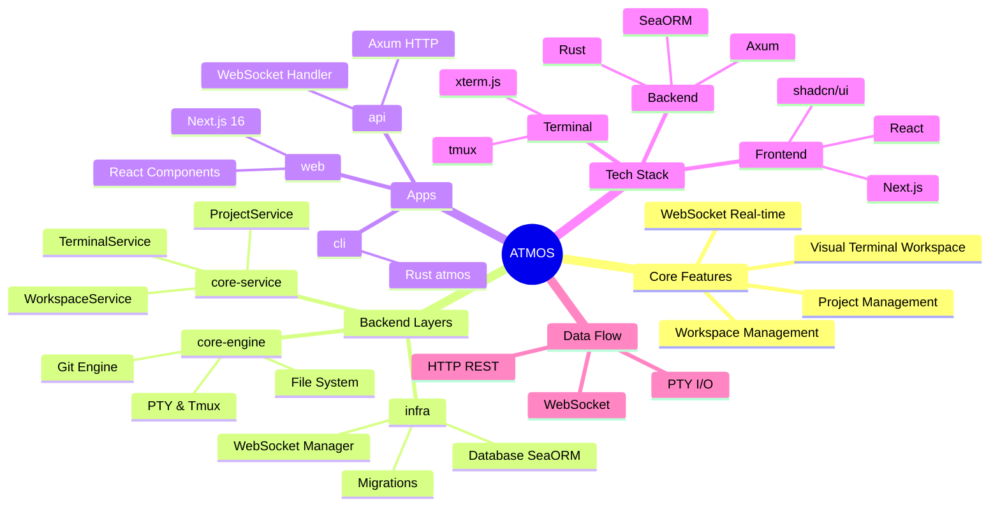

# ATMOS 项目架构思维导图

```mermaid
mindmap
  root((ATMOS))
    Core Features
      Visual Terminal Workspace
      Project Management
      Workspace Management
      WebSocket Real-time
    Backend Layers
      infra
        Database SeaORM
        WebSocket Manager
        Migrations
      core-engine
        PTY & Tmux
        Git Engine
        File System
      core-service
        ProjectService
        WorkspaceService
        TerminalService
    Apps
      api
        Axum HTTP
        WebSocket Handler
      web
        Next.js 16
        React Components
      cli
        Rust atmos
    Tech Stack
      Backend
        Rust
        Axum
        SeaORM
      Frontend
        Next.js
        React
        shadcn/ui
      Terminal
        tmux
        xterm.js
    Data Flow
      HTTP REST
      WebSocket
      PTY I/O
```
