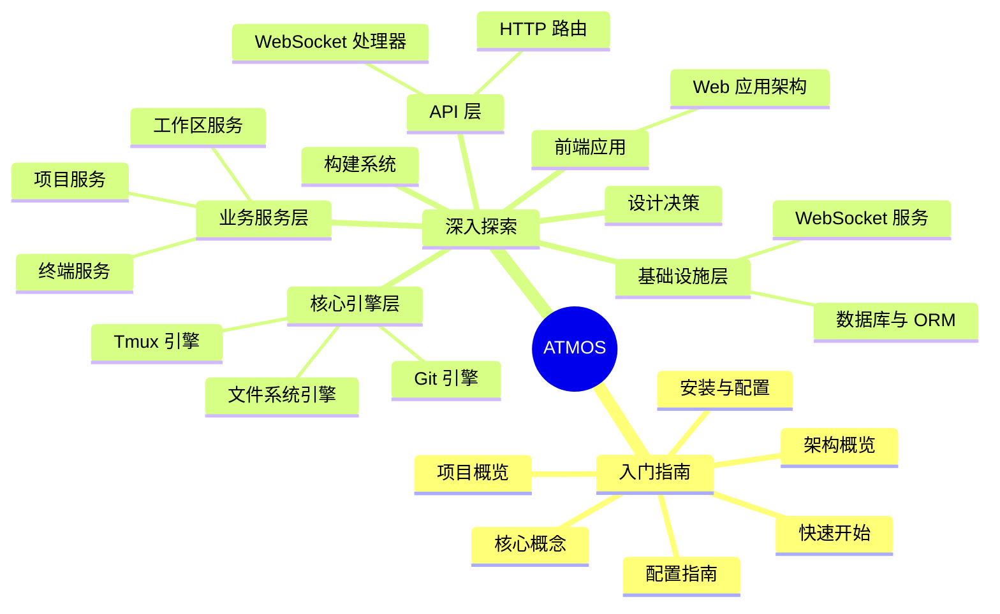

# ATMOS 项目架构思维导图

```mermaid
mindmap
  root((ATMOS))
    入门指南
      项目概览
      快速开始
      安装与配置
      架构概览
      核心概念
      配置指南
    深入探索
      基础设施层
        数据库与 ORM
        WebSocket 服务
      核心引擎层
        Tmux 引擎
        Git 引擎
        文件系统引擎
      业务服务层
        工作区服务
        终端服务
        项目服务
      API 层
        HTTP 路由
        WebSocket 处理器
      前端应用
        Web 应用架构
      构建系统
      设计决策
```
