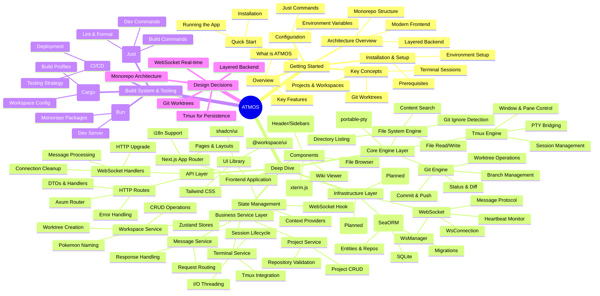

# ATMOS Architecture Mindmap

```mermaid
mindmap
  root((ATMOS))
    Getting Started
      Overview
        What is ATMOS
        Key Features
      Quick Start
        Installation
        Running the App
      Installation & Setup
        Prerequisites
        Environment Setup
      Architecture Overview
        Monorepo Structure
        Layered Backend
        Modern Frontend
      Key Concepts
        Projects & Workspaces
        Git Worktrees
        Terminal Sessions
      Configuration
        Environment Variables
        Just Commands
    Deep Dive
      Infrastructure Layer
        Database (SeaORM)
          SQLite
          Entities & Repos
          Migrations
        WebSocket
          WsManager
          WsConnection
          Message Protocol
          Heartbeat Monitor
        Jobs (Planned)
        Cache (Planned)
      Core Engine Layer
        Tmux Engine
          Session Management
          Window & Pane Control
          PTY Bridging
        Git Engine
          Worktree Operations
          Status & Diff
          Commit & Push
          Branch Management
        File System Engine
          Directory Listing
          File Read/Write
          Git Ignore Detection
          Content Search
        PTY (portable-pty)
      Business Service Layer
        Workspace Service
          CRUD Operations
          Worktree Creation
          Pokemon Naming
        Terminal Service
          Session Lifecycle
          Tmux Integration
          I/O Threading
        Project Service
          Project CRUD
          Repository Validation
        Message Service
          Request Routing
          Response Handling
      API Layer
        HTTP Routes
          Axum Router
          DTOs & Handlers
          Error Handling
        WebSocket Handlers
          HTTP Upgrade
          Message Processing
          Connection Cleanup
      Frontend Application
        Next.js App Router
          Pages & Layouts
          i18n Support
        Components
          Layout (Header/Sidebars)
          Terminal (xterm.js)
          Wiki Viewer
          File Browser
        State Management
          Zustand Stores
          WebSocket Hook
          Context Providers
        UI Library
          @workspace/ui
          shadcn/ui
          Tailwind CSS
    Build System & Tooling
      Rust (Cargo)
        Workspace Config
        Build Profiles
      JavaScript (Bun)
        Monorepo Packages
        Dev Server
      Task Runner (Just)
        Dev Commands
        Build Commands
        Lint & Format
      CI/CD
        Testing Strategy
        Deployment
    Design Decisions
      Monorepo Architecture
      Git Worktrees
      Tmux for Persistence
      Layered Backend
      WebSocket Real-time
```
