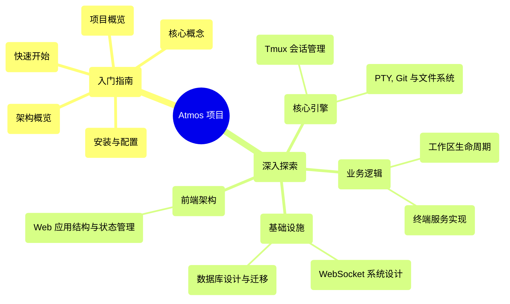

# Atmos 项目架构脑图

```mermaid
mindmap
  root((Atmos 项目))
    Getting Started(入门指南)
      Overview(项目概览)
      QuickStart(快速开始)
      Installation(安装与配置)
      Architecture(架构概览)
      KeyConcepts(核心概念)
    Deep Dive(深入探索)
      Core Engine(核心引擎)
        PTY_Git_FS(PTY, Git 与文件系统)
        Tmux(Tmux 会话管理)
      Core Service(业务逻辑)
        Workspace(工作区生命周期)
        Terminal(终端服务实现)
      Infrastructure(基础设施)
        WebSocket(WebSocket 系统设计)
        Database(数据库设计与迁移)
      Frontend(前端架构)
        WebApp(Web 应用结构与状态管理)
```
