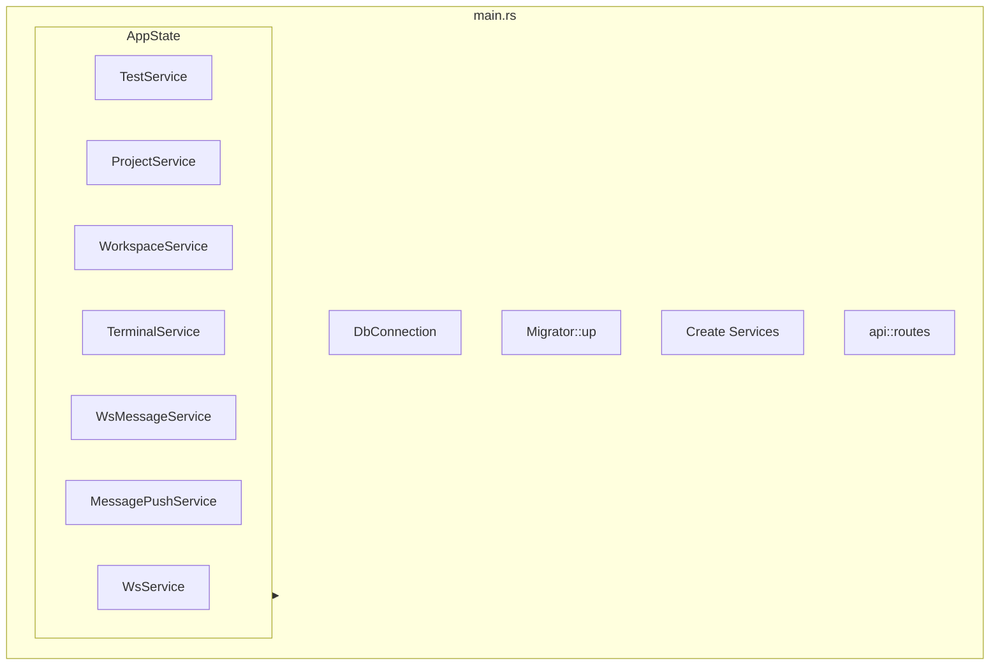

# API 入口

## Overview

`apps/api` 是 Axum 服务器，将 core-service 逻辑通过 HTTP 与 WebSocket 暴露。AppState 作为 DI 容器持有所有服务。Handler 应保持薄层，仅提取请求数据并调用 core-service。

## Architecture



## 启动流程

```rust
let db_connection = DbConnection::new().await?;
Migrator::up(&db_connection.conn, None).await?;

let test_service = Arc::new(TestService::new(...));
let project_service = Arc::new(ProjectService::new(Arc::clone(&db)));
let workspace_service = Arc::new(WorkspaceService::new(Arc::clone(&db)));
let ws_message_service = Arc::new(WsMessageService::new(...));
let terminal_service = Arc::new(TerminalService::new());
terminal_service.cleanup_stale_client_sessions();

let app_state = AppState::new(
    test_service,
    project_service,
    workspace_service,
    ws_message_service.clone(),
    message_push_service,
    terminal_service,
    ws_config,
);

let app = api::routes()
    .with_state(app_state)
    .layer(TraceLayer::new_for_http())
    .layer(cors);
```

> **Source**: [apps/api/src/main.rs](../../../apps/api/src/main.rs#L36-L105)

## AppState 结构

```rust
#[derive(Clone)]
pub struct AppState {
    pub test_service: Arc<TestService>,
    pub project_service: Arc<ProjectService>,
    pub workspace_service: Arc<WorkspaceService>,
    pub message_push_service: Arc<MessagePushService>,
    pub terminal_service: Arc<TerminalService>,
    pub ws_service: Arc<WsService>,
}
```

> **Source**: [apps/api/src/app_state.rs](../../../apps/api/src/app_state.rs#L6-L14)

## 相关链接

- [HTTP 路由与 WebSocket](routes.md)
- [业务服务层](../core-service/index.md)
- [基础设施层](../infra/index.md)
