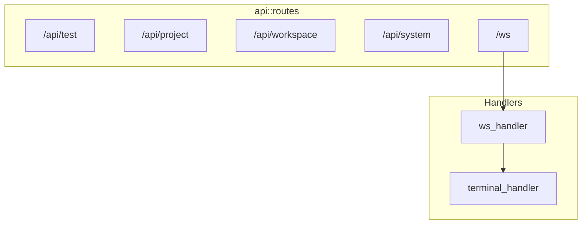

# HTTP 路由与 WebSocket

## Overview

API 路由按领域划分：`/api/test`、`/api/project`、`/api/workspace`、`/api/system`、`/ws`。WebSocket 通过 `/ws` 建立连接，升级后由 infra::WsService 处理消息，终端 I/O 通过 ws 模块的 terminal_handler 桥接。

## Architecture



## 路由注册

```rust
pub fn routes() -> Router<AppState> {
    Router::new()
        .nest("/api/test", test::routes())
        .nest("/api/project", project::routes())
        .nest("/api/workspace", workspace::routes())
        .nest("/api/system", system::routes())
        .nest("/ws", ws::routes())
}
```

> **Source**: [apps/api/src/api/mod.rs](../../../apps/api/src/api/mod.rs#L13-L21)

## WebSocket 升级

```rust
pub async fn ws_handler(
    ws: WebSocketUpgrade,
    Query(params): Query<WsQueryParams>,
    State(state): State<AppState>,
) -> Response {
    let client_type = ClientType::from_str(&params.client_type);
    ws.on_upgrade(move |socket| handle_socket(socket, state, client_type))
}
```

> **Source**: [apps/api/src/api/ws/handlers.rs](../../../apps/api/src/api/ws/handlers.rs#L33-L40)

## WebSocket 连接流程

1. 升级完成后创建 `mpsc::channel`
2. 调用 `state.ws_service.register(client_type, tx)` 注册连接
3. 启动 send_task：从 channel 转发到 WebSocket
4. 主循环：接收 WebSocket 消息，委托给 WsService 处理

## 相关链接

- [API 入口](index.md)
- [WebSocket 服务](../infra/websocket.md)
- [终端服务](../core-service/terminal.md)
