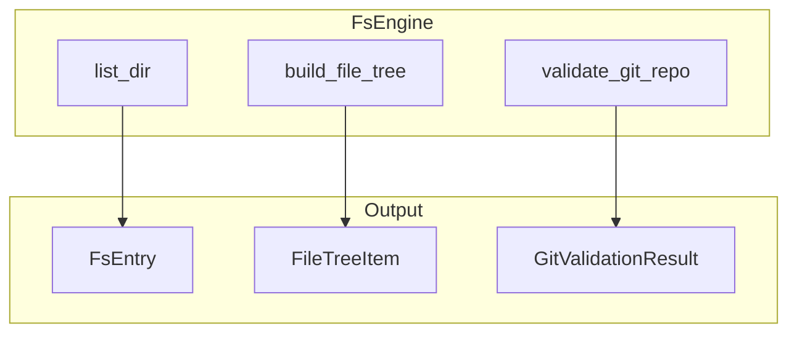

# 文件系统引擎

## Overview

FsEngine 提供目录浏览与文件校验能力。支持列出目录、构建文件树、检测 Git 仓库、校验工作区等。用于项目文件浏览与工作区创建前的路径验证。

## Architecture



## 数据结构

```rust
#[derive(Debug, Clone)]
pub struct FsEntry {
    pub name: String,
    pub path: PathBuf,
    pub is_dir: bool,
    pub is_symlink: bool,
    pub is_ignored: bool,
    pub symlink_target: Option<String>,
    pub is_git_repo: bool,
}

#[derive(Debug, Clone)]
pub struct FileTreeItem {
    pub name: String,
    pub path: PathBuf,
    pub is_dir: bool,
    pub is_symlink: bool,
    pub is_ignored: bool,
    pub symlink_target: Option<String>,
    pub children: Option<Vec<FileTreeItem>>,
}
```

> **Source**: [crates/core-engine/src/fs/mod.rs](../../../crates/core-engine/src/fs/mod.rs#L12-L34)

## 核心方法

```rust
pub fn list_dir(&self, path: &Path, dirs_only: bool, show_hidden: bool) -> Result<Vec<FsEntry>>
```

- `path`：目录路径
- `dirs_only`：是否仅返回目录
- `show_hidden`：是否包含隐藏文件

> **Source**: [crates/core-engine/src/fs/mod.rs](../../../crates/core-engine/src/fs/mod.rs#L55-L69)

## 相关链接

- [核心引擎索引](index.md)
- [Git 引擎](git.md)
- [工作区服务](../core-service/workspace.md)
