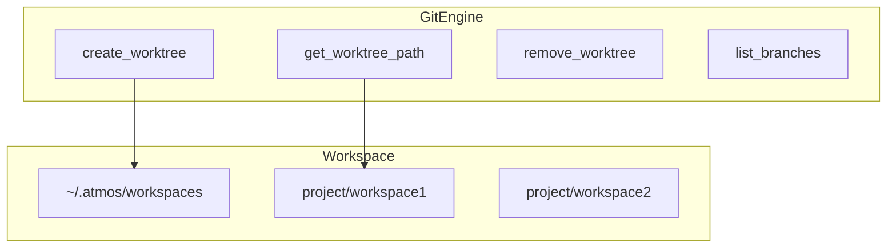

# Git 引擎

## Overview

GitEngine 提供 Git 仓库操作能力，主要服务于工作区管理。工作区基于 `~/.atmos/workspaces/{workspace_name}` 的 worktree 实现。支持创建 worktree、获取默认分支、列出分支、删除 worktree 等。

## Architecture



## 核心 API

```rust
pub struct GitEngine;

impl GitEngine {
    pub fn new() -> Self {
        Self
    }

    /// ~/.atmos/workspaces
    pub fn get_workspaces_base_dir(&self) -> Result<PathBuf> {
        let home = dirs::home_dir()
            .ok_or_else(|| EngineError::Git("Unable to determine home directory".to_string()))?;
        Ok(home.join(".atmos").join("workspaces"))
    }

    /// ~/.atmos/workspaces/{workspace_name}
    pub fn get_worktree_path(&self, workspace_name: &str) -> Result<PathBuf> {
        let base = self.get_workspaces_base_dir()?;
        Ok(base.join(workspace_name))
    }

    /// git worktree add -b <new_branch> <path> <base_branch>
    pub fn create_worktree(
        &self,
        repo_path: &Path,
        workspace_name: &str,
        base_branch: &str,
    ) -> Result<PathBuf> { /* ... */ }
}
```

> **Source**: [crates/core-engine/src/git/mod.rs](../../../crates/core-engine/src/git/mod.rs#L10-L48)

## Worktree 流程

1. `get_worktree_path` 确定 `~/.atmos/workspaces/{name}`
2. `create_worktree` 执行 `git worktree add -b {name} {path} {base_branch}`
3. `remove_worktree` 删除 worktree 并清理

## 相关链接

- [核心引擎索引](index.md)
- [工作区服务](../core-service/workspace.md)
- [Tmux 引擎](tmux.md)
