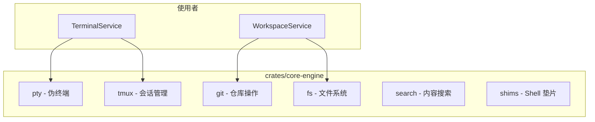

# 核心引擎层 (L2)

## Overview

核心引擎层将复杂技术能力封装为可复用模块。提供 PTY、Git、Tmux、FS、搜索等能力。引擎不感知业务逻辑或用户身份，仅负责技术操作；错误需映射为 domain-specific engine errors。

## Architecture

## 核心模块

| 模块 | 职责 |
|------|------|
| **pty/** | 伪终端与进程池（占位） |
| **tmux/** | 基于 tmux 的会话管理 |
| **git/** | clone、commit、worktree 等 |
| **fs/** | 目录浏览、文件树、校验 |
| **search/** | 内容搜索 |
| **shims/** | Shell 垫片（动态标题等） |

> **Source**: [crates/core-engine/src/lib.rs](../../../crates/core-engine/src/lib.rs)

## 工作模式

- **解耦**：引擎不应知晓业务逻辑或具体用户身份
- **错误处理**：将 OS 级错误映射为领域级 engine errors

## 相关链接

- [Tmux 引擎](tmux.md)
- [Git 引擎](git.md)
- [文件系统引擎](fs.md)
- [业务服务层](../core-service/index.md)
