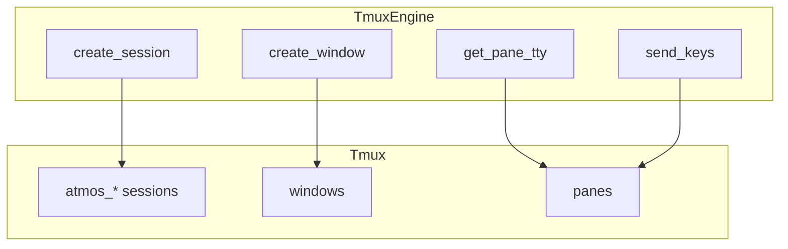

# Tmux 引擎

## Overview

TmuxEngine 管理 tmux 会话，实现终端持久化。每个 ATMOS 工作区对应一个 tmux session，每个终端 pane 对应一个 tmux window。使用独立 socket 路径 `~/.atmos/tmux.sock` 隔离。

## Architecture



## 核心数据结构

```rust
#[derive(Debug, Clone)]
pub struct TmuxSessionInfo {
    pub name: String,
    pub windows: u32,
    pub created: String,
    pub attached: bool,
}

#[derive(Debug, Clone)]
pub struct TmuxWindowInfo {
    pub index: u32,
    pub name: String,
    pub active: bool,
    pub panes: u32,
}

pub struct TmuxEngine {
    socket_path: PathBuf,
}
```

> **Source**: [crates/core-engine/src/tmux/mod.rs](../../../crates/core-engine/src/tmux/mod.rs#L22-L56)

## 关键方法

- `create_session` / `create_session_with_names`：创建 session，支持 shim 注入
- `create_window`：创建 window，可选 cwd 和 shell 命令
- `create_grouped_session`：创建与目标 session 共享窗口的 grouped session
- `get_pane_tty`：获取 pane 的 PTY 设备路径，用于 PTY I/O 桥接
- `send_keys` / `resize_pane`：输入与尺寸控制
- `session_exists` / `list_windows`：查询

## 配置选项

- `status off`：隐藏状态栏
- `allow-passthrough on`：允许 Shell shim OSC 序列透传
- `mouse on`：启用鼠标滚轮滚动
- `aggressive-resize on`：按实际 viewing client 调整尺寸
- `allow-rename off` / `automatic-rename off`：禁止窗口重命名

## 相关链接

- [核心引擎索引](index.md)
- [终端服务](../core-service/terminal.md)
- [Git 引擎](git.md)
