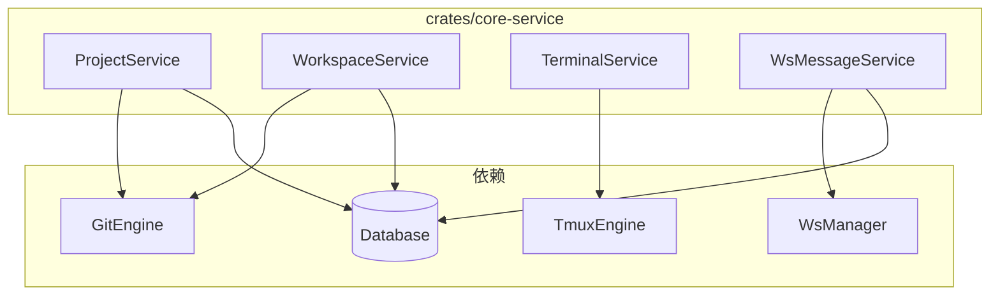

# 业务服务层 (L3)

## Overview

业务服务层实现 ATMOS 的核心业务逻辑。包含 ProjectService、WorkspaceService、TerminalService、WsMessageService、MessagePushService 等。服务层编排 Engine（L2）与 Repo（L1）完成业务目标。

## Architecture

## 服务一览

| 服务 | 职责 |
|------|------|
| **ProjectService** | 项目 CRUD、颜色、目标分支 |
| **WorkspaceService** | 工作区 CRUD、worktree 创建 |
| **TerminalService** | PTY 会话、tmux 窗口、输入/尺寸 |
| **WsMessageService** | WebSocket 消息处理与路由 |
| **MessagePushService** | 最新消息状态推送 |

## 工作模式

- **编排**：服务调用多个 Engine 与 Repo 达成业务目标
- **类型安全**：`types.rs` 定义跨服务 domain 类型
- **错误处理**：使用 `error.rs` 的 `ServiceError` 包装 engine/repo 错误

## 相关链接

- [工作区服务](workspace.md)
- [终端服务](terminal.md)
- [项目服务](project.md)
- [API 入口](../api/index.md)
