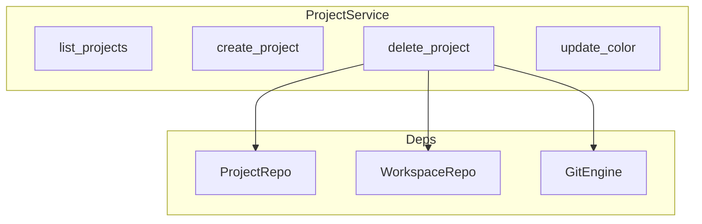

# 项目服务

## Overview

ProjectService 管理项目实体。项目以 Git 仓库的主路径（main_file_path）为核心。支持列表、创建、删除、更新颜色、更新目标分支等。删除项目时会清理所有关联 worktree 并软删除工作区。

## Architecture



## 核心 API

```rust
pub struct ProjectService {
    db: Arc<DatabaseConnection>,
    git_engine: GitEngine,
}

impl ProjectService {
    pub fn new(db: Arc<DatabaseConnection>) -> Self {
        Self { 
            db,
            git_engine: GitEngine::new(),
        }
    }

    pub async fn list_projects(&self) -> Result<Vec<project::Model>>
    pub async fn create_project(&self, name: String, main_file_path: String, sidebar_order: i32, border_color: Option<String>) -> Result<project::Model>
    pub async fn delete_project(&self, guid: String) -> Result<()>
    pub async fn check_can_delete_from_archive_modal(&self, guid: String) -> Result<ProjectCanDeleteResponse>
    pub async fn update_color(&self, guid: String, color: Option<String>) -> Result<()>
    pub async fn update_target_branch(&self, guid: String, target_branch: Option<String>) -> Result<()>
}
```

> **Source**: [crates/core-service/src/service/project.rs](../../../crates/core-service/src/service/project.rs#L8-L80)

## 删除流程

1. 查找项目及其所有工作区
2. 对每个工作区调用 `GitEngine::remove_worktree`
3. 批量软删除所有工作区
4. 软删除项目

## 相关链接

- [业务服务索引](index.md)
- [工作区服务](workspace.md)
- [Git 引擎](../core-engine/git.md)
- [API 路由](../api/routes.md)
