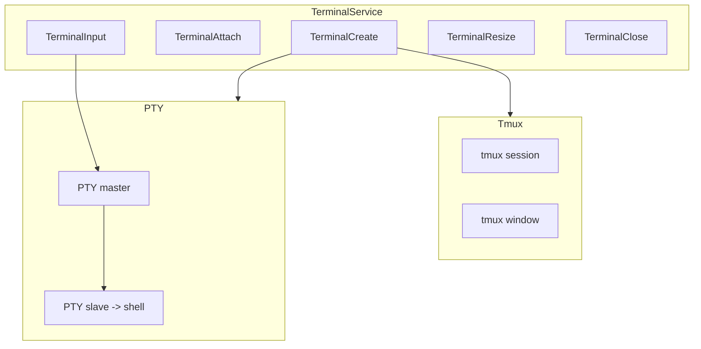

# 终端服务

## Overview

TerminalService 管理 PTY 会话，结合 tmux 实现持久化。每个终端会话对应一个 tmux window，PTY 在专用线程中运行并通过 channel 通信。关闭会话时 detach PTY，tmux window 保持存活。

## Architecture



## 消息类型

```rust
#[derive(Debug, Clone, serde::Serialize, serde::Deserialize)]
#[serde(tag = "type", rename_all = "snake_case")]
pub enum TerminalMessage {
    TerminalCreate { workspace_id: String, shell: Option<String> },
    TerminalAttach { session_id: String, workspace_id: String },
    TerminalInput { session_id: String, data: String },
    TerminalResize { session_id: String, cols: u16, rows: u16 },
    TerminalClose { session_id: String },
    TerminalDestroy { session_id: String },
}
```

> **Source**: [crates/core-service/src/service/terminal.rs](../../../crates/core-service/src/service/terminal.rs#L82-L105)

## 会话类型

```rust
#[derive(Debug, Clone, serde::Serialize)]
#[serde(rename_all = "snake_case")]
pub enum SessionType {
    Tmux,   // tmux 持久化终端
    Simple, // 简单 PTY（如 Run Script）
}
```

> **Source**: [crates/core-service/src/service/terminal.rs](../../../crates/core-service/src/service/terminal.rs#L39-L46)

## 设计要点

- **Grouped sessions**：每个 viewing client 有独立 client session，共享 tmux windows
- **Shim 注入**：支持 `shell_command` 注入 shim 实现动态标题
- **Graceful shutdown**：SIGTERM/SIGINT 时清理 tmux client sessions 与 PTY

## 相关链接

- [业务服务索引](index.md)
- [Tmux 引擎](../core-engine/tmux.md)
- [WebSocket 服务](../infra/websocket.md)
- [HTTP 路由与 WebSocket](../api/routes.md)
