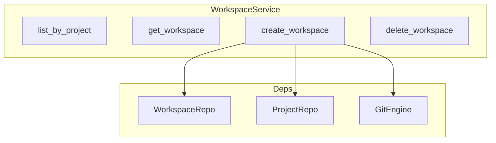

# 工作区服务

## Overview

WorkspaceService 管理项目下的工作区。工作区基于 Git worktree 实现，每个工作区对应 `~/.atmos/workspaces/{workspace_name}` 下的一个 worktree。支持列表、创建、删除、归档、固定等操作。

## Architecture



## 核心 API

```rust
pub struct WorkspaceService {
    db: Arc<DatabaseConnection>,
    git_engine: GitEngine,
}

impl WorkspaceService {
    pub fn new(db: Arc<DatabaseConnection>) -> Self {
        Self { 
            db,
            git_engine: GitEngine::new(),
        }
    }

    pub async fn list_by_project(&self, project_guid: String) -> Result<Vec<WorkspaceDto>>
    pub async fn get_workspace(&self, guid: String) -> Result<Option<WorkspaceDto>>
    pub async fn create_workspace(
        &self,
        project_guid: String,
        name: String,
        _branch: String,
        sidebar_order: i32,
    ) -> Result<WorkspaceDto>
}
```

> **Source**: [crates/core-service/src/service/workspace.rs](../../../crates/core-service/src/service/workspace.rs#L19-L74)

## 创建流程

1. 从 ProjectRepo 获取项目主仓库路径
2. 获取默认分支、已有分支和 DB 中的工作区名称
3. 若 `name` 为空，使用 Pokemon 风格名称生成器生成唯一名称
4. 调用 `GitEngine::create_worktree` 创建 worktree
5. 将工作区记录写入 WorkspaceRepo

## 相关链接

- [业务服务索引](index.md)
- [项目服务](project.md)
- [终端服务](terminal.md)
- [Git 引擎](../core-engine/git.md)
