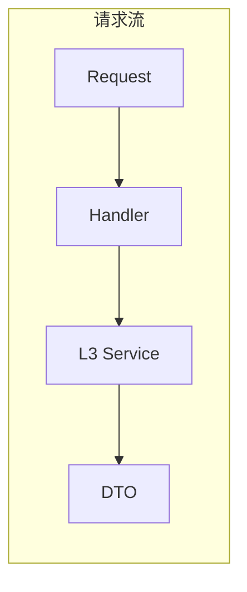

# API 层

API 层是 ATMOS 的 HTTP 与 WebSocket 入口，基于 Axum 暴露 REST 与 WS 路由。本文概述路由结构、AppState 装配、CORS 与中间件，以及 Handler 与 L3 的协作规范。

## Overview

`apps/api` 是 Rust 二进制入口，启动时创建 DbConnection、执行迁移、装配各 L3 服务到 AppState，并注册路由。路由分为 REST（`/api/*`）和 WebSocket（`/ws`、`/ws/terminal/:session_id`）。Handler 应保持薄逻辑，提取参数后委托给 L3。

## Architecture

```mermaid
graph TB
    subgraph 路由
        Test[/api/test]
        Project[/api/project]
        Workspace[/api/workspace]
        System[/api/system]
        Ws[/ws]
        WsTerminal[/ws/terminal/:id]
    end

    subgraph AppState
        TestService[TestService]
        ProjectService[ProjectService]
        WorkspaceService[WorkspaceService]
        WsMsgService[WsMessageService]
        TerminalService[TerminalService]
    end

    Test --> TestService
    Project --> ProjectService
    Workspace --> WorkspaceService
    Ws --> WsMsgService
    WsTerminal --> TerminalService
```



## 路由结构

| 前缀 | 模块 | 用途 |
|------|------|------|
| `/api/test` | test | 测试接口 |
| `/api/project` | project | 项目 CRUD |
| `/api/workspace` | workspace | 工作区 CRUD |
| `/api/system` | system | 系统接口 |
| `/ws` | ws | WebSocket 主连接 |
| `/ws/terminal/:session_id` | ws | 终端 WebSocket |

## Key Source Files

| File | Purpose |
|------|---------|
| `apps/api/src/api/mod.rs` | 路由聚合 |
| `apps/api/src/app_state.rs` | AppState 定义与注入 |
| `apps/api/src/main.rs` | 启动逻辑 |

## Next Steps

- **[HTTP 路由与处理器](routes.md)** — REST 端点详情
- **[WebSocket 处理器](websocket-handlers.md)** — WS 路由与终端桥接
