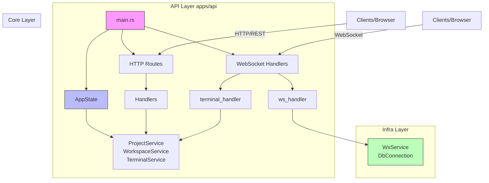

# API Layer Architecture

> **Reading Time**: 8 minutes
> **Difficulty**: Intermediate
> **Related Topics**: [Infrastructure Layer](../infra/index.md), [Core Service](../core-service/index.md)

The API Layer (`apps/api/`) is the entry point for all client interactions with the ATMOS backend. Built on [Axum](https://github.com/tokio-rs/axum), it provides both HTTP REST endpoints and WebSocket connections, serving as the bridge between the frontend and the backend services.

## Table of Contents

1. [Architecture Overview](#architecture-overview)
2. [Server Initialization](#server-initialization)
3. [Dependency Injection](#dependency-injection)
4. [Configuration](#configuration)
5. [Error Handling](#error-handling)
6. [Graceful Shutdown](#graceful-shutdown)

## Architecture Overview



The API layer follows a clean separation of concerns:

- **Entry Point**: [`main.rs`](https://github.com/lurunrun/atmos/blob/main/apps/api/src/main.rs) - Server startup, graceful shutdown
- **State Management**: [`app_state.rs`](https://github.com/lurunrun/atmos/blob/main/apps/api/src/app_state.rs) - Dependency injection container
- **HTTP Routes**: [`api/mod.rs`](https://github.com/lurunrun/atmos/blob/main/apps/api/src/api/mod.rs) - REST endpoint definitions
- **WebSocket Handlers**: [`api/ws/handlers.rs`](https://github.com/lurunrun/atmos/blob/main/apps/api/src/api/ws/handlers.rs) - WebSocket upgrade and connection handling
- **Configuration**: [`config/mod.rs`](https://github.com/lurunrun/atmos/blob/main/apps/api/src/config/mod.rs) - Server configuration and CORS

## Server Initialization

The server initialization process in [`main.rs`](https://github.com/lurunrun/atmos/blob/main/apps/api/src/main.rs) follows a careful sequence to ensure all dependencies are properly wired:

```rust
#[tokio::main]
async fn main() -> Result<(), Box<dyn std::error::Error>> {
    // 1. Load environment variables
    dotenvy::from_filename("apps/api/.env").ok();
    dotenvy::dotenv().ok();

    // 2. Initialize tracing
    tracing_subscriber::registry()
        .with(tracing_subscriber::EnvFilter::try_from_default_env()
            .unwrap_or_else(|_| "api=debug,infra=debug,core_service=debug,core_engine=debug,tower_http=debug".into()))
        .with(tracing_subscriber::fmt::layer())
        .init();

    // 3. Connect to database and run migrations
    let db_connection = DbConnection::new().await?;
    Migrator::up(&db_connection.conn, None).await?;
    let db = Arc::new(db_connection.conn.clone());

    // 4. Create services with dependency injection
    let test_engine = Arc::new(TestEngine::new());
    let message_push_service = Arc::new(MessagePushService::new());
    let test_service = Arc::new(TestService::new(Arc::clone(&test_engine), (*db).clone()));
    let project_service = Arc::new(ProjectService::new(Arc::clone(&db)));
    let workspace_service = Arc::new(WorkspaceService::new(Arc::clone(&db)));
    let terminal_service = Arc::new(TerminalService::new());

    // 5. Clean up stale tmux sessions (CRITICAL for development)
    terminal_service.cleanup_stale_client_sessions();
```

### Critical Session Cleanup

Lines 65-70 contain a critical piece of code for development environments:

```rust
// CRITICAL: Clean up stale tmux client sessions from previous crashes/hot-reloads.
// During development with hot-reload, the process may be killed before cleanup.
// This leaves orphaned tmux "grouped sessions" (atmos_client_*) that each hold
// a PTY device. Without this cleanup, PTY devices accumulate and eventually
// cause "unable to allocate pty: Device not configured" system-wide.
terminal_service.cleanup_stale_client_sessions();
```

This cleanup is essential because:
1. Hot-reload during development can kill the process before cleanup runs
2. Orphaned tmux sessions hold PTY devices
3. Accumulated PTY devices eventually cause system-wide failures

## Dependency Injection

The [`AppState`](https://github.com/lurunrun/atmos/blob/main/apps/api/src/app_state.rs) struct serves as the dependency injection container for the entire API:

```rust
#[derive(Clone)]
pub struct AppState {
    pub test_service: Arc<TestService>,
    pub project_service: Arc<ProjectService>,
    pub workspace_service: Arc<WorkspaceService>,
    pub message_push_service: Arc<MessagePushService>,
    pub terminal_service: Arc<TerminalService>,
    pub ws_service: Arc<WsService>,
}

impl AppState {
    pub fn new(
        test_service: Arc<TestService>,
        project_service: Arc<ProjectService>,
        workspace_service: Arc<WorkspaceService>,
        ws_message_service: Arc<WsMessageService>,
        message_push_service: Arc<MessagePushService>,
        terminal_service: Arc<TerminalService>,
        ws_service_config: WsServiceConfig,
    ) -> Self {
        // Create WsService with injected message handler (dependency inversion)
        let ws_service = WsService::with_config(ws_service_config)
            .with_message_handler(ws_message_service);

        Self {
            test_service,
            project_service,
            workspace_service,
            message_push_service,
            terminal_service,
            ws_service: Arc::new(ws_service),
        }
    }
}
```

Key design decisions:
- **Arc Wrapping**: All services are wrapped in `Arc` for thread-safe sharing across handlers
- **Clone-based State**: Axum requires state to be `Clone`, so `Arc` enables cheap cloning
- **Dependency Inversion**: `WsService` accepts a message handler trait, allowing injection of business logic

## Configuration

Server configuration is managed through [`config/mod.rs`](https://github.com/lurunrun/atmos/blob/main/apps/api/src/config/mod.rs), supporting environment-based configuration:

```rust
pub struct ServerConfig {
    pub host: String,
    pub port: u16,
    pub cors_origins: CorsOriginConfig,
}

impl ServerConfig {
    pub fn from_env() -> Self {
        let host = env::var("SERVER_HOST").unwrap_or_else(|_| "0.0.0.0".to_string());
        let port = env::var("SERVER_PORT")
            .ok()
            .and_then(|p| p.parse().ok())
            .unwrap_or(8080);

        let is_production = env::var("RUST_ENV")
            .map(|v| v == "production")
            .unwrap_or(false);

        let cors_origins = match env::var("CORS_ORIGIN") {
            Ok(val) if val == "*" => CorsOriginConfig::Any,
            Ok(val) if !val.is_empty() => {
                let origins: Vec<String> = val.split(',')
                    .map(|s| s.trim().to_string())
                    .collect();
                CorsOriginConfig::List(origins)
            }
            _ if is_production => {
                panic!("CORS_ORIGIN must be explicitly set in production (do not use \"*\")");
            }
            _ => CorsOriginConfig::Any,
        };

        Self { host, port, cors_origins }
    }
}
```

### Environment Variables

| Variable | Default | Description |
|----------|---------|-------------|
| `SERVER_HOST` | `0.0.0.0` | Server bind address |
| `SERVER_PORT` | `8080` | Server port |
| `CORS_ORIGIN` | `*` (dev only) | Comma-separated list of allowed origins |
| `RUST_ENV` | - | Set to `production` for production mode |

### CORS Configuration

The CORS layer is built using `tower-http`:

```rust
pub fn cors_layer(&self) -> CorsLayer {
    let layer = CorsLayer::new()
        .allow_methods(Any)
        .allow_headers(Any);

    match &self.cors_origins {
        CorsOriginConfig::Any => layer.allow_origin(Any),
        CorsOriginConfig::List(origins) => {
            let origins: Vec<_> = origins
                .iter()
                .map(|o| o.parse().expect("Invalid CORS origin"))
                .collect();
            layer.allow_origin(AllowOrigin::list(origins))
        }
    }
}
```

## Error Handling

The API layer uses a unified error type defined in [`error.rs`](https://github.com/lurunrun/atmos/blob/main/apps/api/src/error.rs):

```rust
#[derive(Debug)]
pub enum ApiError {
    InternalError(String),
    BadRequest(String),
    NotFound(String),
    ServiceError(core_service::ServiceError),
    InfraError(infra::InfraError),
}

impl IntoResponse for ApiError {
    fn into_response(self) -> Response {
        let (status, message) = match self {
            ApiError::InternalError(msg) => (StatusCode::INTERNAL_SERVER_ERROR, msg),
            ApiError::BadRequest(msg) => (StatusCode::BAD_REQUEST, msg),
            ApiError::NotFound(msg) => (StatusCode::NOT_FOUND, msg),
            ApiError::ServiceError(e) => (StatusCode::INTERNAL_SERVER_ERROR, e.to_string()),
            ApiError::InfraError(e) => (StatusCode::INTERNAL_SERVER_ERROR, e.to_string()),
        };

        let body = Json(json!({ "error": message }));
        (status, body).into_response()
    }
}

pub type ApiResult<T> = Result<T, ApiError>;
```

This design:
1. **Delegates to Lower Layers**: Wraps errors from `core_service` and `infra` layers
2. **Automatic Conversion**: Uses `From` traits for automatic error conversion
3. **HTTP Status Mapping**: Maps error types to appropriate HTTP status codes
4. **JSON Responses**: Returns consistent JSON error responses

## Graceful Shutdown

Graceful shutdown is critical for PTY resource cleanup. The implementation in lines 112-122 ensures proper cleanup:

```rust
// Serve with graceful shutdown — ensures PTY resources are cleaned up
// when the process receives SIGTERM/SIGINT (e.g., during hot-reload).
// Without this, each restart leaks PTY devices until the system runs out.
axum::serve(listener, app)
    .with_graceful_shutdown(shutdown_signal())
    .await?;

// Graceful shutdown: clean up all terminal sessions and PTY resources
info!("Shutdown signal received, cleaning up terminal sessions...");
terminal_service_shutdown.shutdown().await;
info!("Server shutdown complete");

async fn shutdown_signal() {
    let ctrl_c = async {
        tokio::signal::ctrl_c()
            .await
            .expect("failed to install Ctrl+C handler");
    };

    #[cfg(unix)]
    let terminate = async {
        tokio::signal::unix::signal(tokio::signal::unix::SignalKind::terminate())
            .expect("failed to install SIGTERM handler")
            .recv()
            .await;
    };

    #[cfg(not(unix))]
    let terminate = std::future::pending::<()>();

    tokio::select! {
        _ = ctrl_c => {
            warn!("Received Ctrl+C, initiating graceful shutdown...");
        }
        _ = terminate => {
            warn!("Received SIGTERM, initiating graceful shutdown...");
        }
    }
}
```

### Why This Matters

1. **PTY Leaks**: Without cleanup, PTY devices accumulate until the system runs out
2. **Hot Reload**: Development tools like `cargo watch` send SIGTERM on reload
3. **User Experience**: Graceful shutdown prevents terminal corruption

## Related Articles

- [HTTP Routes & Handlers](./routes.md) - REST API endpoints
- [WebSocket Handlers](./websocket-handlers.md) - WebSocket connection handling
- [Infrastructure Layer](../infra/index.md) - Database and WebSocket infrastructure
- [Core Service](../core-service/index.md) - Business logic layer

## Source Files

- [`apps/api/src/main.rs`](https://github.com/lurunrun/atmos/blob/main/apps/api/src/main.rs) - Server entry point
- [`apps/api/src/app_state.rs`](https://github.com/lurunrun/atmos/blob/main/apps/api/src/app_state.rs) - Dependency injection
- [`apps/api/src/config/mod.rs`](https://github.com/lurunrun/atmos/blob/main/apps/api/src/config/mod.rs) - Configuration
- [`apps/api/src/error.rs`](https://github.com/lurunrun/atmos/blob/main/apps/api/src/error.rs) - Error handling
- [`apps/api/src/api/mod.rs`](https://github.com/lurunrun/atmos/blob/main/apps/api/src/api/mod.rs) - Route definitions
