# HTTP Routes & Handlers

> **Reading Time**: 12 minutes
> **Difficulty**: Intermediate
> **Prerequisites**: [API Layer Architecture](./index.md)

The API Layer exposes REST endpoints through Axum's routing system. This document covers all HTTP routes, their handlers, request/response formats, and the patterns used across the API.

## Table of Contents

1. [Route Architecture](#route-architecture)
2. [Test Endpoints](#test-endpoints)
3. [Project Endpoints](#project-endpoints)
4. [Workspace Endpoints](#workspace-endpoints)
5. [System Endpoints](#system-endpoints)
6. [Handler Patterns](#handler-patterns)

## Route Architecture

```mermaid
graph TB
    subgraph "API Router api/mod.rs"
        ROOT["/api"]
        ROOT --> TEST["/api/test"]
        ROOT --> PROJ["/api/project"]
        ROOT --> WS["/api/workspace"]
        ROOT --> SYS["/api/system"]
        ROOT --> WSS["/ws - WebSocket"]
    end

    TEST --> HELLO["GET /hello"]
    PROJ --> PLIST["GET /"]
    PROJ --> PCREATE["POST /"]
    PROJ --> PDEL["DELETE /:guid"]
    PROJ --> PCOLOR["PUT /:guid/color"]
    PROJ --> PVALID["POST /validate-git"]

    WS --> WSLIST["GET /project/:guid"]
    WS --> WSCREATE["POST /"]
    WS --> WSGET["GET /:guid"]
    WS --> WSDEL["DELETE /:guid"]
    WS --> WSNAME["PUT /:guid/name"]
    WS --> WSBRANCH["PUT /:guid/branch"]
    WS --> WSORDER["PUT /:guid/order"]
    WS --> WSLAYOUT["GET/PUT /:guid/terminal-layout"]

    SYS --> STMUX["GET /tmux-status"]
    SYS --> SSESS["GET /tmux-sessions"]
    SYS --> SKILL["POST /tmux-kill-server"]

    style ROOT fill:#f9f,stroke:#333,stroke-width:3px
    style PROJ fill:#bbf,stroke:#333
    style WS fill:#bfb,stroke:#333
```



All routes are defined in [`apps/api/src/api/mod.rs`](https://github.com/lurunrun/atmos/blob/main/apps/api/src/api/mod.rs):

```rust
pub fn routes() -> Router<AppState> {
    Router::new()
        .nest("/api/test", test::routes())
        .nest("/api/project", project::routes())
        .nest("/api/workspace", workspace::routes())
        .nest("/api/system", system::routes())
        .nest("/ws", ws::routes())
}
```

Axum's `nest()` method creates route groups with common prefixes, keeping the API organized and maintainable.

## Test Endpoints

The test endpoints provide basic API functionality checks. They're defined in [`apps/api/src/api/test/mod.rs`](https://github.com/lurunrun/atmos/blob/main/apps/api/src/api/test/mod.rs):

### GET /api/test/hello

A simple hello endpoint that demonstrates the request/response flow:

**Handler Definition**:
```rust
// apps/api/src/api/test/mod.rs
pub fn routes() -> Router<AppState> {
    Router::new().route("/hello", get(handlers::hello))
}
```

**Handler Implementation** ([`handlers.rs`](https://github.com/lurunrun/atmos/blob/main/apps/api/src/api/test/handlers.rs)):
```rust
pub async fn hello(State(state): State<AppState>) -> ApiResult<Json<HelloResponse>> {
    let message = "Hello ATMOS!".to_string();
    let processed = state.test_service.process_hello(&message).await?;

    Ok(Json(HelloResponse { message, processed }))
}
```

**Response** ([`dto.rs`](https://github.com/lurunrun/atmos/blob/main/apps/api/src/api/test/dto.rs)):
```rust
#[derive(Debug, Serialize, Deserialize)]
pub struct HelloResponse {
    pub message: String,
    pub processed: String,
}
```

**Example**:
```bash
curl http://localhost:8080/api/test/hello
```

**Response**:
```json
{
  "message": "Hello ATMOS!",
  "processed": "Processed: Hello ATMOS!"
}
```

## Project Endpoints

Project management endpoints are defined in [`apps/api/src/api/project/mod.rs`](https://github.com/lurunrun/atmos/blob/main/apps/api/src/api/project/mod.rs):

```rust
pub fn routes() -> Router<AppState> {
    Router::new()
        .route("/", get(handlers::list_projects).post(handlers::create_project))
        .route("/{guid}", delete(handlers::delete_project))
        .route("/{guid}/color", put(handlers::update_color))
        .route("/validate-git", post(handlers::validate_git))
}
```

### GET /api/project

List all projects.

**Handler** ([`handlers.rs`](https://github.com/lurunrun/atmos/blob/main/apps/api/src/api/project/handlers.rs)):
```rust
pub async fn list_projects(State(state): State<AppState>) -> ApiResult<Json<ApiResponse<Value>>> {
    let projects = state.project_service.list_projects().await?;
    Ok(Json(ApiResponse::success(json!(projects))))
}
```

**Response**:
```json
{
  "success": true,
  "data": [
    {
      "guid": "550e8400-e29b-41d4-a716-446655440000",
      "name": "My Project",
      "main_file_path": "/path/to/project",
      "sidebar_order": 1,
      "border_color": "#ff0000",
      "created_at": "2024-01-17T00:00:00Z"
    }
  ],
  "error": null
}
```

### POST /api/project

Create a new project.

**Request Payload**:
```rust
#[derive(Deserialize)]
pub struct CreateProjectPayload {
    pub name: String,
    pub main_file_path: String,
    pub sidebar_order: i32,
    pub border_color: Option<String>,
}
```

**Handler**:
```rust
pub async fn create_project(
    State(state): State<AppState>,
    Json(payload): Json<CreateProjectPayload>,
) -> ApiResult<Json<ApiResponse<Value>>> {
    let project = state.project_service.create_project(
        payload.name,
        payload.main_file_path,
        payload.sidebar_order,
        payload.border_color,
    ).await?;
    Ok(Json(ApiResponse::success(json!(project))))
}
```

**Example Request**:
```bash
curl -X POST http://localhost:8080/api/project \
  -H "Content-Type: application/json" \
  -d '{
    "name": "My New Project",
    "main_file_path": "/path/to/project",
    "sidebar_order": 1,
    "border_color": "#00ff00"
  }'
```

### DELETE /api/project/:guid

Delete a project by GUID.

**Handler**:
```rust
pub async fn delete_project(
    State(state): State<AppState>,
    Path(guid): Path<String>,
) -> ApiResult<Json<ApiResponse<Value>>> {
    state.project_service.delete_project(guid).await?;
    Ok(Json(ApiResponse::success(json!({ "message": "Project deleted" }))))
}
```

**Example**:
```bash
curl -X DELETE http://localhost:8080/api/project/550e8400-e29b-41d4-a716-446655440000
```

### PUT /api/project/:guid/color

Update a project's border color.

**Request Payload**:
```rust
#[derive(Deserialize)]
pub struct UpdateColorPayload {
    pub border_color: Option<String>,
}
```

**Handler**:
```rust
pub async fn update_color(
    State(state): State<AppState>,
    Path(guid): Path<String>,
    Json(payload): Json<UpdateColorPayload>,
) -> ApiResult<Json<ApiResponse<Value>>> {
    state.project_service.update_color(guid, payload.border_color).await?;
    Ok(Json(ApiResponse::success(json!({ "message": "Color updated" }))))
}
```

### POST /api/project/validate-git

Validate if a path is a git repository.

**Handler**:
```rust
pub async fn validate_git(Json(payload): Json<Value>) -> ApiResult<Json<ApiResponse<Value>>> {
    let path = payload["path"].as_str().unwrap_or("");
    let is_git = std::path::Path::new(path).join(".git").exists();

    if is_git {
        let name = std::path::Path::new(path)
            .file_name()
            .and_then(|n| n.to_str())
            .unwrap_or("New Project");
        Ok(Json(ApiResponse::success(json!({ "isValid": true, "name": name }))))
    } else {
        Ok(Json(ApiResponse::success(json!({ "isValid": false }))))
    }
}
```

## Workspace Endpoints

Workspace endpoints provide comprehensive workspace management. Defined in [`apps/api/src/api/workspace/mod.rs`](https://github.com/lurunrun/atmos/blob/main/apps/api/src/api/workspace/mod.rs):

```rust
pub fn routes() -> Router<AppState> {
    Router::new()
        .route("/project/{project_guid}", get(handlers::list_workspaces_by_project))
        .route("/", post(handlers::create_workspace))
        .route("/{guid}", get(handlers::get_workspace).delete(handlers::delete_workspace))
        .route("/{guid}/name", put(handlers::update_name))
        .route("/{guid}/branch", put(handlers::update_branch))
        .route("/{guid}/order", put(handlers::update_order))
        .route("/{guid}/terminal-layout", get(handlers::get_terminal_layout).put(handlers::update_terminal_layout))
        .route("/{guid}/maximized-terminal-id", put(handlers::update_maximized_terminal_id))
}
```

### GET /api/workspace/project/:project_guid

List all workspaces for a project.

**Handler** ([`handlers.rs`](https://github.com/lurunrun/atmos/blob/main/apps/api/src/api/workspace/handlers.rs)):
```rust
pub async fn list_workspaces_by_project(
    State(state): State<AppState>,
    Path(project_guid): Path<String>,
) -> ApiResult<Json<ApiResponse<Value>>> {
    let workspaces = state.workspace_service.list_by_project(project_guid).await?;
    Ok(Json(ApiResponse::success(json!(workspaces))))
}
```

### POST /api/workspace

Create a new workspace.

**Request Payload**:
```rust
#[derive(Deserialize)]
pub struct CreateWorkspacePayload {
    pub project_guid: String,
    pub name: String,
    pub branch: String,
    pub sidebar_order: i32,
}
```

**Handler**:
```rust
pub async fn create_workspace(
    State(state): State<AppState>,
    Json(payload): Json<CreateWorkspacePayload>,
) -> ApiResult<Json<ApiResponse<Value>>> {
    let workspace = state.workspace_service.create_workspace(
        payload.project_guid,
        payload.name,
        payload.branch,
        payload.sidebar_order,
    ).await?;
    Ok(Json(ApiResponse::success(json!(workspace))))
}
```

### PUT /api/workspace/:guid/name

Update workspace name.

**Handler**:
```rust
pub async fn update_name(
    State(state): State<AppState>,
    Path(guid): Path<String>,
    Json(payload): Json<UpdateNamePayload>,
) -> ApiResult<Json<ApiResponse<Value>>> {
    state.workspace_service.update_name(guid, payload.name).await?;
    Ok(Json(ApiResponse::success(json!({ "message": "Workspace name updated" }))))
}
```

### GET /api/workspace/:guid/terminal-layout

Get terminal layout for a workspace.

**Handler**:
```rust
pub async fn get_terminal_layout(
    State(state): State<AppState>,
    Path(guid): Path<String>,
) -> ApiResult<Json<ApiResponse<Value>>> {
    let workspace = state.workspace_service.get_workspace(guid).await?;
    match workspace {
        Some(ws) => Ok(Json(ApiResponse::success(json!({
            "layout": ws.model.terminal_layout,
            "maximized_terminal_id": ws.model.maximized_terminal_id
        })))),
        None => Ok(Json(ApiResponse::success(json!({ "layout": null, "maximized_terminal_id": null })))),
    }
}
```

## System Endpoints

System endpoints provide tmux and terminal management utilities. Defined in [`apps/api/src/api/system/mod.rs`](https://github.com/lurunrun/atmos/blob/main/apps/api/src/api/system/mod.rs):

```rust
pub fn routes() -> Router<AppState> {
    Router::new()
        .route("/tmux-status", get(handlers::get_tmux_status))
        .route("/tmux-sessions", get(handlers::list_tmux_sessions))
        .route("/tmux-windows/{workspace_id}", get(handlers::list_tmux_windows))
        .route("/terminal-overview", get(handlers::get_terminal_overview))
        .route("/terminal-cleanup", post(handlers::cleanup_terminals))
        .route("/tmux-kill-server", post(handlers::kill_tmux_server))
        .route("/tmux-kill-session", post(handlers::kill_tmux_session))
        .route("/kill-orphaned-processes", post(handlers::kill_orphaned_processes))
}
```

### System Endpoint Examples

#### GET /api/system/tmux-status

Get tmux server status.

**Usage**:
```bash
curl http://localhost:8080/api/system/tmux-status
```

#### POST /api/system/tmux-kill-server

Kill the entire tmux server (emergency cleanup).

**Usage**:
```bash
curl -X POST http://localhost:8080/api/system/tmux-kill-server
```

#### POST /api/system/terminal-cleanup

Clean up orphaned terminal sessions.

**Usage**:
```bash
curl -X POST http://localhost:8080/api/system/terminal-cleanup
```

## Handler Patterns

### Standard Response Format

All API responses use a standard format defined in [`dto.rs`](https://github.com/lurunrun/atmos/blob/main/apps/api/src/api/dto.rs):

```rust
#[derive(Debug, Serialize, Deserialize)]
pub struct ApiResponse<T> {
    pub success: bool,
    pub data: Option<T>,
    pub error: Option<String>,
}

impl<T> ApiResponse<T> {
    pub fn success(data: T) -> Self {
        Self {
            success: true,
            data: Some(data),
            error: None,
        }
    }

    pub fn error(message: impl Into<String>) -> Self {
        Self {
            success: false,
            data: None,
            error: Some(message.into()),
        }
    }
}
```

### Handler Extraction Pattern

Axum's extractor system provides clean access to request data:

```rust
// Extract state (dependency injection)
State(state): State<AppState>

// Extract path parameters
Path(guid): Path<String>

// Extract JSON body
Json(payload): Json<CreateProjectPayload>

// Extract query parameters (for WebSocket)
Query(params): Query<WsQueryParams>
```

### Error Handling Pattern

Handlers use the `ApiResult` type for automatic error conversion:

```rust
pub type ApiResult<T> = Result<T, ApiError>;

// Handlers return ApiResult
pub async fn list_projects(State(state): State<AppState>) -> ApiResult<Json<ApiResponse<Value>>> {
    let projects = state.project_service.list_projects().await?; // ? operator converts errors
    Ok(Json(ApiResponse::success(json!(projects))))
}
```

## Route Summary Table

| Method | Path | Description |
|--------|------|-------------|
| GET | `/api/test/hello` | Test endpoint |
| GET | `/api/project` | List all projects |
| POST | `/api/project` | Create project |
| DELETE | `/api/project/:guid` | Delete project |
| PUT | `/api/project/:guid/color` | Update project color |
| POST | `/api/project/validate-git` | Validate git repository |
| GET | `/api/workspace/project/:guid` | List workspaces by project |
| GET | `/api/workspace/:guid` | Get workspace details |
| POST | `/api/workspace` | Create workspace |
| DELETE | `/api/workspace/:guid` | Delete workspace |
| PUT | `/api/workspace/:guid/name` | Update workspace name |
| PUT | `/api/workspace/:guid/branch` | Update workspace branch |
| PUT | `/api/workspace/:guid/order` | Update workspace order |
| GET | `/api/workspace/:guid/terminal-layout` | Get terminal layout |
| PUT | `/api/workspace/:guid/terminal-layout` | Update terminal layout |
| PUT | `/api/workspace/:guid/maximized-terminal-id` | Update maximized terminal |
| GET | `/api/system/tmux-status` | Get tmux status |
| GET | `/api/system/tmux-sessions` | List tmux sessions |
| POST | `/api/system/tmux-kill-server` | Kill tmux server |
| POST | `/api/system/terminal-cleanup` | Cleanup terminals |

## Related Articles

- [API Layer Architecture](./index.md) - Overall API architecture
- [WebSocket Handlers](./websocket-handlers.md) - WebSocket endpoint handling
- [Core Service](../core-service/index.md) - Business logic layer

## Source Files

- [`apps/api/src/api/mod.rs`](https://github.com/lurunrun/atmos/blob/main/apps/api/src/api/mod.rs) - Route definitions
- [`apps/api/src/api/test/handlers.rs`](https://github.com/lurunrun/atmos/blob/main/apps/api/src/api/test/handlers.rs) - Test handlers
- [`apps/api/src/api/project/handlers.rs`](https://github.com/lurunrun/atmos/blob/main/apps/api/src/api/project/handlers.rs) - Project handlers
- [`apps/api/src/api/workspace/handlers.rs`](https://github.com/lurunrun/atmos/blob/main/apps/api/src/api/workspace/handlers.rs) - Workspace handlers
- [`apps/api/src/api/dto.rs`](https://github.com/lurunrun/atmos/blob/main/apps/api/src/api/dto.rs) - Common DTOs
- [`apps/api/src/error.rs`](https://github.com/lurunrun/atmos/blob/main/apps/api/src/error.rs) - Error handling
