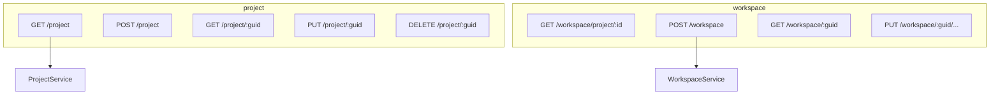
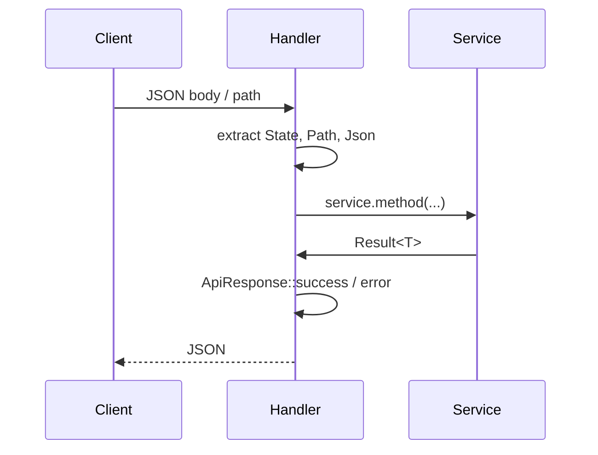

# HTTP 路由与处理器

本文详细列出 ATMOS 的 REST 端点、请求/响应格式、以及 Handler 如何提取参数并调用 L3 服务。遵循薄 Handler 原则，业务逻辑均在 core-service 中实现。

## Overview

REST 路由按领域分模块：project、workspace、system、test。每个模块定义自己的 handlers 和 routes，通过 `Router::nest` 挂载。响应统一使用 `ApiResponse<T>` 包装，包含 `code`、`msg`、`data` 字段。

## Architecture

## 端点概览

| 方法 | 路径 | 说明 |
|------|------|------|
| GET | `/api/project` | 项目列表 |
| POST | `/api/project` | 创建项目 |
| GET | `/api/project/:guid` | 项目详情 |
| PUT | `/api/project/:guid` | 更新项目 |
| DELETE | `/api/project/:guid` | 删除项目 |
| GET | `/api/workspace/project/:project_guid` | 工作区列表 |
| POST | `/api/workspace` | 创建工作区 |
| GET | `/api/workspace/:guid` | 工作区详情 |
| PUT | `/api/workspace/:guid/name` | 更新名称 |
| ... | ... | 更多见 handlers |

## Handler 模式

- 使用 `State<AppState>` 提取服务
- 使用 `Path<T>`、`Json<T>` 提取参数
- 调用 `service.xxx().await?`，错误通过 `ApiResult` 转换为 HTTP 状态码
- 成功时 `ApiResponse::success(data)` 包装返回

## Key Source Files

| File | Purpose |
|------|---------|
| `apps/api/src/api/project/handlers.rs` | 项目端点 |
| `apps/api/src/api/workspace/handlers.rs` | 工作区端点 |
| `apps/api/src/api/dto.rs` | 通用 DTO 与 ApiResponse |

## Next Steps

- **[WebSocket 处理器](websocket-handlers.md)** — 实时连接与终端
- **[工作区服务](../core-service/workspace.md)** — 业务逻辑细节
