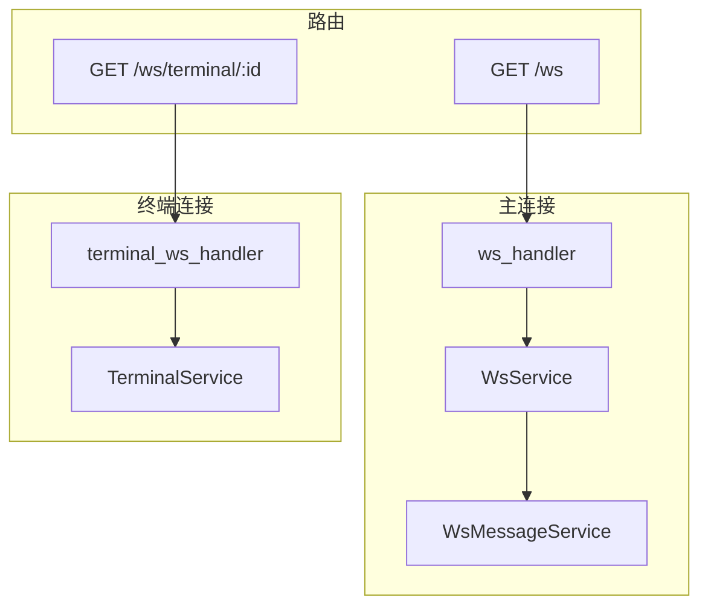
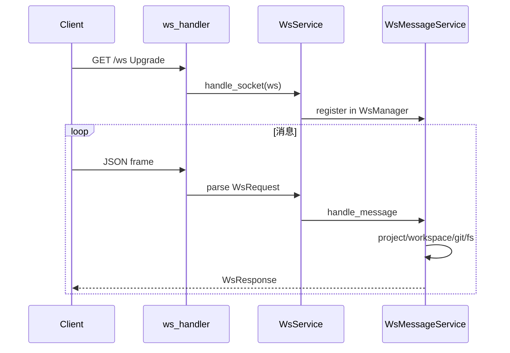
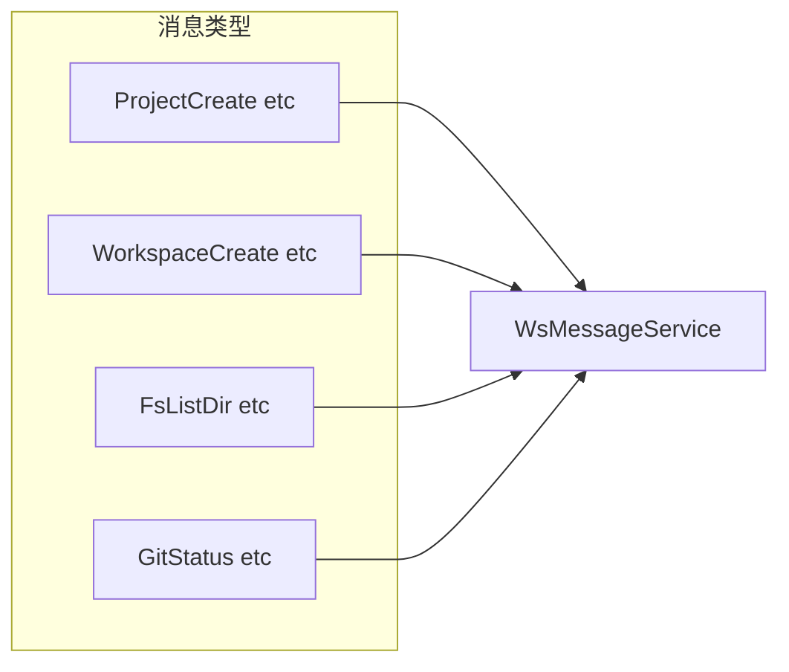

# WebSocket 处理器

WebSocket 处理器负责 HTTP 升级、主 WS 连接的消息路由，以及终端 WebSocket 的 PTY 桥接。本文介绍两条 WS 路由的职责划分、消息协议与 TerminalHandler 的数据流。

## Overview

存在两条 WebSocket 路由：`GET /ws` 主连接，处理项目、工作区、文件、Git 等业务消息；`GET /ws/terminal/:session_id` 终端连接，专门用于 PTY 输入输出流。主连接通过 `WsMessageHandler` trait 将业务消息委托给 `WsMessageService`；终端连接直接与 `TerminalService` 交互。

## Architecture

## 主连接协议

请求为 JSON，包含 `action` 和 `payload`。`WsMessageService` 根据 action 分发到 Project、Workspace、Git、Fs 等子模块，结果通过 `WsManager::send_to` 回传给对应 client。

## 终端连接

`/ws/terminal/:session_id` 用于附加到已有 PTY 会话。客户端需先通过主连接发送 `TerminalCreate` 获取 session_id，再建立终端 WS。消息类型包括 `TerminalInput`、`TerminalResize`、`TerminalClose` 等。

## Key Source Files

| File | Purpose |
|------|---------|
| `apps/api/src/api/ws/handlers.rs` | 主 WS 升级与 handle_socket |
| `apps/api/src/api/ws/terminal_handler.rs` | 终端 WS 与 TerminalService 桥接 |
| `crates/core-service/src/service/ws_message.rs` | WsMessageService 与 action 分发 |

## Next Steps

- **[WebSocket 服务](../infra/websocket.md)** — 连接管理与心跳
- **[终端服务](../core-service/terminal.md)** — PTY 与 Tmux 协作
