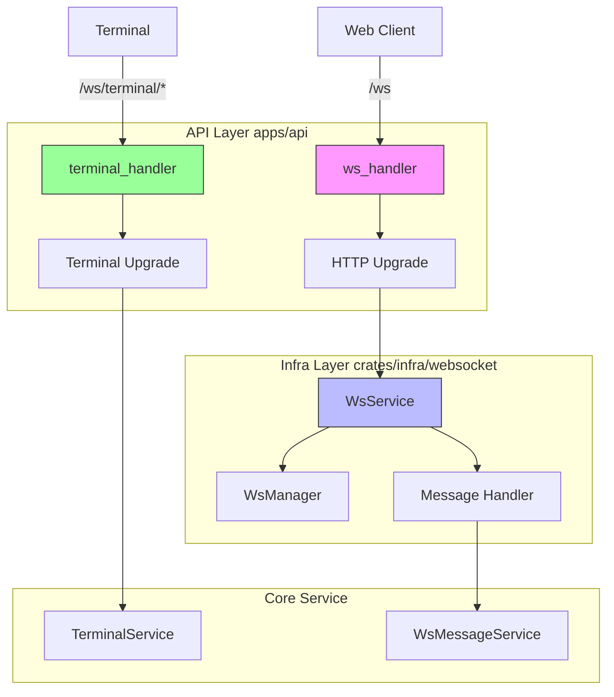
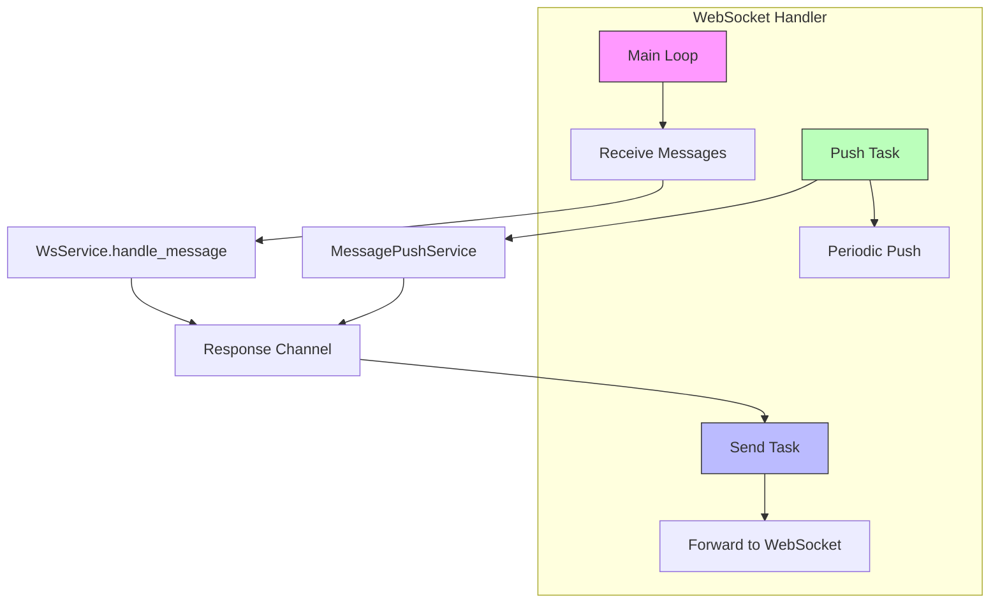
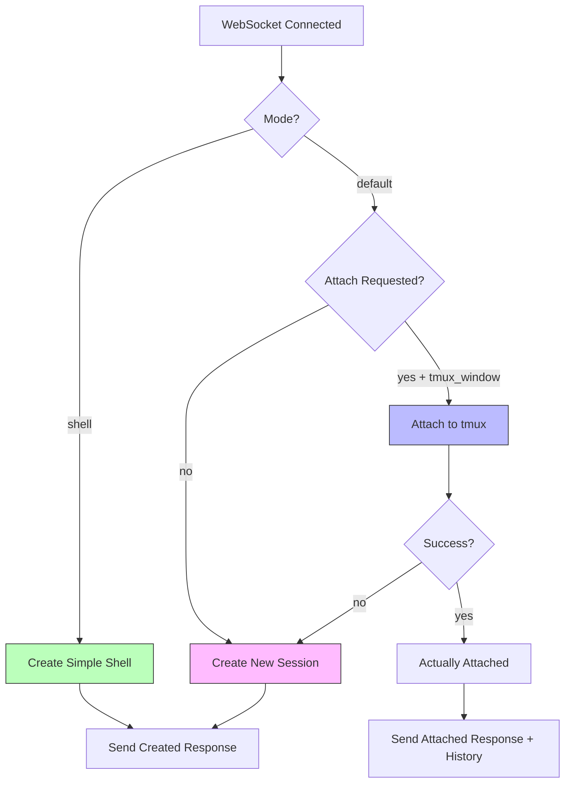

# WebSocket Handlers

> **Reading Time**: 10 minutes
> **Difficulty**: Advanced
> **Prerequisites**: [API Layer Architecture](./index.md), [Infrastructure Layer](../infra/index.md)

The API Layer manages two types of WebSocket connections: control WebSocket for general messaging and terminal WebSocket for PTY communication. This document covers the HTTP upgrade process, connection lifecycle, message handling, and the integration with the infrastructure layer's WebSocket service.

## Table of Contents

1. [WebSocket Architecture](#websocket-architecture)
2. [Control WebSocket Handler](#control-websocket-handler)
3. [Terminal WebSocket Handler](#terminal-websocket-handler)
4. [Message Processing](#message-processing)
5. [Connection Lifecycle](#connection-lifecycle)
6. [UTF-8 Handling](#utf-8-handling)

## WebSocket Architecture



The API layer provides two WebSocket endpoints:

1. **Control WebSocket** (`/ws`) - General messaging, project/workspace operations
2. **Terminal WebSocket** (`/ws/terminal/:session_id`) - PTY communication with tmux persistence

Both endpoints use the infrastructure layer's `WsService` for connection management and message handling.

## Control WebSocket Handler

The control WebSocket handler manages general application messaging. It's defined in [`apps/api/src/api/ws/handlers.rs`](https://github.com/lurunrun/atmos/blob/main/apps/api/src/api/ws/handlers.rs).

### Route Definition

From [`api/ws/mod.rs`](https://github.com/lurunrun/atmos/blob/main/apps/api/src/api/ws/mod.rs):

```rust
pub fn routes() -> Router<AppState> {
    Router::new()
        .route("/", get(handlers::ws_handler))
        .route("/terminal/{session_id}", get(terminal_handler::terminal_ws_handler))
}
```

### HTTP Upgrade Handler

```rust
#[derive(Debug, Deserialize)]
pub struct WsQueryParams {
    #[serde(default = "default_client_type")]
    pub client_type: String,
}

fn default_client_type() -> String {
    "web".to_string()
}

/// HTTP Upgrade handler - this is the only Axum-specific code
pub async fn ws_handler(
    ws: WebSocketUpgrade,
    Query(params): Query<WsQueryParams>,
    State(state): State<AppState>,
) -> Response {
    let client_type = ClientType::from_str(&params.client_type);
    ws.on_upgrade(move |socket| handle_socket(socket, state, client_type))
}
```

**Query Parameters:**
- `client_type` (optional): Type of client (`"web"` by default)

### Connection Handling

After the HTTP upgrade, `handle_socket` manages the WebSocket connection:

```rust
async fn handle_socket(socket: WebSocket, state: AppState, client_type: ClientType) {
    let (mut sender, mut receiver) = socket.split();

    // Create channel for sending messages
    let (tx, mut rx) = mpsc::channel::<String>(32);

    // Register connection with WsService (in infra layer)
    let conn_id = state.ws_service.register(client_type, tx.clone()).await;
    tracing::info!("WebSocket connection established: {}", conn_id);
```

### Task Architecture

The handler spawns three concurrent tasks:



#### 1. Send Task - Channel to WebSocket

```rust
let conn_id_send = conn_id.clone();
let send_task = tokio::spawn(async move {
    while let Some(msg) = rx.recv().await {
        if sender.send(Message::Text(msg.into())).await.is_err() {
            tracing::warn!("Failed to send message to {}", conn_id_send);
            break;
        }
    }
});
```

Forwards messages from the channel to the WebSocket connection.

#### 2. Push Task - Periodic Messages

```rust
let conn_id_push = conn_id.clone();
let tx_push = tx.clone();
let message_push_service = Arc::clone(&state.message_push_service);
let push_task = tokio::spawn(async move {
    let mut interval = tokio::time::interval(tokio::time::Duration::from_secs(3));
    loop {
        interval.tick().await;
        let latest = message_push_service.get_latest_message().await;
        if !latest.is_empty() {
            let msg = WsMessage::message(&conn_id_push, &latest);
            if let Ok(json) = msg.to_json() {
                if tx_push.send(json).await.is_err() {
                    break;
                }
            }
        }
    }
});
```

Periodically pushes updates to connected clients (e.g., workspace setup progress).

#### 3. Main Loop - Receive and Process

```rust
while let Some(result) = receiver.next().await {
    match result {
        Ok(msg) => {
            if !handle_incoming_message(msg, &tx, &state, &conn_id).await {
                break;
            }
        }
        Err(e) => {
            tracing::error!("WebSocket error: {}", e);
            break;
        }
    }
}
```

### Cleanup

```rust
// Cleanup
push_task.abort();
send_task.abort();
state.ws_service.unregister(&conn_id).await;
tracing::info!("WebSocket connection closed: {}", conn_id);
```

Ensures proper cleanup of all tasks and unregisters the connection.

## Terminal WebSocket Handler

The terminal WebSocket handler manages PTY communication with tmux-backed terminal sessions. It's defined in [`apps/api/src/api/ws/terminal_handler.rs`](https://github.com/lurunrun/atmos/blob/main/apps/api/src/api/ws/terminal_handler.rs) and is significantly more complex than the control handler.

### Query Parameters

```rust
#[derive(Debug, Deserialize)]
pub struct TerminalWsQuery {
    pub workspace_id: Option<String>,
    pub shell: Option<String>,
    /// Optional: tmux window index for reconnection (numeric)
    pub tmux_window: Option<u32>,
    /// Optional: tmux window name for reconnection (string, will be parsed to u32)
    pub tmux_window_name: Option<String>,
    /// If true, attach to existing session instead of creating new
    pub attach: Option<bool>,
    /// Optional: project name for human-readable session naming
    pub project_name: Option<String>,
    /// Optional: workspace name for human-readable session naming
    pub workspace_name: Option<String>,
    /// Optional: terminal/window name (e.g., "Claude", "Codex", or auto-incremented number)
    pub terminal_name: Option<String>,
    /// Optional: mode (e.g., "shell" to skip tmux persistence)
    pub mode: Option<String>,
    /// Optional: working directory
    pub cwd: Option<String>,
    /// Optional: initial terminal columns (from frontend fitAddon)
    pub cols: Option<u16>,
    /// Optional: initial terminal rows (from frontend fitAddon)
    pub rows: Option<u16>,
}
```

### HTTP Upgrade Handler

```rust
pub async fn terminal_ws_handler(
    Path(session_id): Path<String>,
    State(state): State<AppState>,
    axum::extract::Query(query): axum::extract::Query<TerminalWsQuery>,
    ws: WebSocketUpgrade,
) -> Response {
    let workspace_id = query.workspace_id.clone().unwrap_or_else(|| "default".to_string());
    let shell = query.shell.clone();
    let tmux_window = query.tmux_window;
    let tmux_window_name = query.tmux_window_name.clone();

    // Only auto-attach if an index OR name is provided explicitly
    let attach = query.attach.unwrap_or(false) || tmux_window.is_some() || tmux_window_name.is_some();

    ws.on_upgrade(move |socket| {
        handle_terminal_socket(
            socket,
            session_id,
            workspace_id,
            shell,
            tmux_window,
            tmux_window_name,
            attach,
            query.project_name.clone(),
            query.workspace_name.clone(),
            query.terminal_name.clone(),
            query.mode,
            query.cwd,
            query.cols,
            query.rows,
            state,
        )
    })
}
```

### Terminal Session Creation Flow



```rust
let (output_rx, history) = if mode.as_deref() == Some("shell") {
    // Simple shell session (NO tmux)
    match terminal_service.create_simple_session(...).await {
        Ok(rx) => (rx, None),
        Err(e) => {
            error!("Failed to create simple terminal session: {}", e);
            // Send error response and return
            return;
        }
    }
} else if attach_requested && (tmux_window.is_some() || tmux_window_name.is_some()) {
    // Attach to existing tmux window
    match terminal_service.attach_session(...).await {
        Ok((rx, hist)) => {
            actually_attached = true;
            (rx, hist)
        }
        Err(e) => {
            warn!("Failed to attach terminal session ({}). Falling back to creating a new one.", e);
            // Fallback: Create new session
            match terminal_service.create_session(...).await {
                Ok(rx) => {
                    actually_attached = false;
                    (rx, None)
                }
                Err(e) => {
                    error!("Failed to create terminal session after attach failure: {}", e);
                    // Send error response and return
                    return;
                }
            }
        }
    }
} else {
    // Create new session
    match terminal_service.create_session(...).await {
        Ok(rx) => (rx, None),
        Err(e) => {
            error!("Failed to create terminal session: {}", e);
            // Send error response and return
            return;
        }
    }
};
```

### Terminal Response Messages

```rust
#[derive(Debug, Deserialize)]
#[serde(tag = "type", rename_all = "snake_case")]
enum ClientTerminalMessage {
    TerminalCreate {
        workspace_id: String,
        shell: Option<String>,
    },
    TerminalAttach {
        workspace_id: String,
        tmux_window: u32,
    },
    TerminalInput {
        data: String,
    },
    TerminalResize {
        cols: u16,
        rows: u16,
    },
    TerminalClose,
    TerminalDestroy,
    TmuxCancelCopyMode,
    TmuxCheckCopyMode,
}
```

## Message Processing

### Control WebSocket Messages

Control WebSocket messages are delegated to the infrastructure layer:

```rust
async fn handle_incoming_message(
    msg: Message,
    tx: &mpsc::Sender<String>,
    state: &AppState,
    conn_id: &str,
) -> bool {
    match msg {
        Message::Text(text) => {
            // Unified message handling - infra layer handles both control and business messages
            if let Some(response) = state.ws_service.handle_message(conn_id, text.as_ref()).await {
                if let Err(e) = tx.send(response).await {
                    tracing::warn!("Failed to send response to {}: {}", conn_id, e);
                    return false;
                }
            }
            true
        }
        Message::Close(_) => false,
        _ => true,
    }
}
```

The `WsService.handle_message()` method (in the infra layer) processes:
- Control messages (ping, pong, register, etc.)
- Business messages (project/workspace CRUD, git operations, etc.)

### Terminal WebSocket Messages

Terminal messages are handled in the API layer:

```rust
async fn handle_terminal_message(
    msg: Message,
    session_id: &str,
    workspace_id: &str,
    terminal_service: &Arc<TerminalService>,
    ws_tx: &mpsc::UnboundedSender<String>,
    destroy_requested: &Arc<AtomicBool>,
) -> bool {
    match msg {
        Message::Text(text) => {
            if let Ok(terminal_msg) = serde_json::from_str::<ClientTerminalMessage>(text.as_ref()) {
                match terminal_msg {
                    ClientTerminalMessage::TerminalInput { data } => {
                        terminal_service.send_input(session_id, &data).await?;
                    }
                    ClientTerminalMessage::TerminalResize { cols, rows } => {
                        terminal_service.resize(session_id, cols, rows).await?;
                    }
                    ClientTerminalMessage::TerminalClose => {
                        // Send close response and return false to close connection
                        return false;
                    }
                    ClientTerminalMessage::TerminalDestroy => {
                        destroy_requested.store(true, Ordering::SeqCst);
                        terminal_service.destroy_session(session_id).await?;
                        return false;
                    }
                    // ... other message types
                }
            }
            true
        }
        Message::Close(_) => false,
        _ => true,
    }
}
```

## Connection Lifecycle

### Registration

```rust
// Register connection with WsService (in infra layer)
let conn_id = state.ws_service.register(client_type, tx.clone()).await;
tracing::info!("WebSocket connection established: {}", conn_id);
```

The `WsService.register()` method:
1. Generates a unique connection ID
2. Stores the sender channel in the connection map
3. Returns the connection ID for message routing

### Heartbeat

The infrastructure layer's `WsService` manages heartbeat monitoring (configured in [`main.rs`](https://github.com/lurunrun/atmos/blob/main/apps/api/src/main.rs)):

```rust
let ws_config = WsServiceConfig {
    heartbeat_interval_secs: 10,
    connection_timeout_secs: 30,
};

// Start heartbeat monitor
let _heartbeat_task = app_state.ws_service.start_heartbeat();
info!("WebSocket service started with heartbeat (timeout: 30s)");
```

### Unregistration

```rust
// Cleanup
state.ws_service.unregister(&conn_id).await;
tracing::info!("WebSocket connection closed: {}", conn_id);
```

Removes the connection from the `WsManager` and cleans up resources.

## UTF-8 Handling

The terminal WebSocket handler includes sophisticated UTF-8 handling to prevent multi-byte character corruption:

```rust
let mut carry: Vec<u8> = Vec::new();
while let Some(data) = output_rx.recv().await {
    carry.extend_from_slice(&data);

    let valid_up_to = match std::str::from_utf8(&carry) {
        Ok(_) => carry.len(),
        Err(e) => {
            let up_to = e.valid_up_to();
            let remaining = carry.len() - up_to;
            // Check if trailing bytes are incomplete multi-byte sequence
            if remaining <= 3 && e.error_len().is_none() {
                // Incomplete sequence — keep for next chunk
                up_to
            } else {
                // Invalid bytes — skip past them
                up_to + e.error_len().unwrap_or(1)
            }
        }
    };

    if valid_up_to == 0 {
        continue;
    }

    // SAFETY: verified bytes are valid UTF-8
    let text = unsafe { std::str::from_utf8_unchecked(&carry[..valid_up_to]) }.to_owned();
    carry.drain(..valid_up_to);

    // Send text response
}
```

**Why This Matters:**
- PTY output arrives in chunks that may split multi-byte characters
- Without proper handling, CJK characters and emoji display as `���`
- The carry buffer preserves incomplete sequences for the next chunk

## Related Articles

- [API Layer Architecture](./index.md) - Overall API architecture
- [HTTP Routes & Handlers](./routes.md) - REST endpoints
- [Infrastructure Layer - WebSocket](../infra/websocket.md) - WebSocket infrastructure

## Source Files

- [`apps/api/src/api/ws/handlers.rs`](https://github.com/lurunrun/atmos/blob/main/apps/api/src/api/ws/handlers.rs) - Control WebSocket handler
- [`apps/api/src/api/ws/terminal_handler.rs`](https://github.com/lurunrun/atmos/blob/main/apps/api/src/api/ws/terminal_handler.rs) - Terminal WebSocket handler
- [`apps/api/src/api/ws/mod.rs`](https://github.com/lurunrun/atmos/blob/main/apps/api/src/api/ws/mod.rs) - WebSocket routes
- [`apps/api/src/main.rs`](https://github.com/lurunrun/atmos/blob/main/apps/api/src/main.rs) - WebSocket service configuration
- [`crates/infra/src/websocket/service.rs`](https://github.com/lurunrun/atmos/blob/main/crates/infra/src/websocket/service.rs) - WsService implementation
