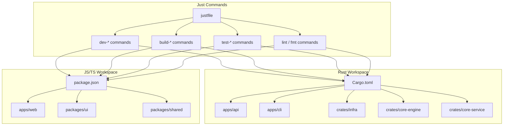
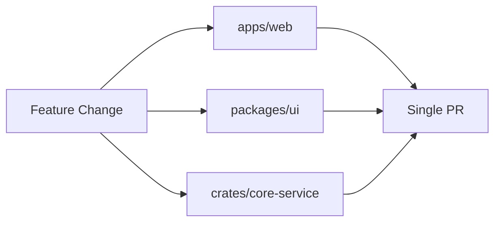

# Build System & Tooling

ATMOS is a polyglot monorepo that combines Rust and JavaScript/TypeScript projects. The build system is designed to handle both languages efficiently, providing unified commands for development, building, testing, and code quality checks. This article explores the tooling that makes the development workflow smooth and productive.

## Overview

The ATMOS build system uses **Just** as a unified task runner, coordinating commands for both Rust (Cargo) and JavaScript/TypeScript (Bun) ecosystems. This approach provides:

- **Single entry point** for all common tasks via `just <command>`
- **Hot reload** for both frontend and backend during development
- **Parallel execution** of development servers
- **Unified linting and formatting** across languages
- **Type-safe monorepo** with workspace dependencies

The justfile contains 100+ lines of commands covering development, building, testing, and code quality operations.



## Rust Build System

### Cargo Workspace Structure

The Rust workspace is defined in the root `Cargo.toml`:

```toml
[workspace]
resolver = "2"
members = [
    "apps/api",
    "apps/cli",
    "crates/infra",
    "crates/core-engine",
    "crates/core-service",
]
```

> **Source**: [Cargo.toml](../../../../Cargo.toml#L1-L10)

Each crate can depend on workspace members using the path syntax:

```toml
[dependencies]
core-engine = { path = "../../../crates/core-engine" }
infra = { path = "../../../crates/infra" }
```

### Development Commands

```justfile
# Start API server with hot reload
dev-api:
    cargo watch -x 'run --bin api' -w apps/api -w crates
```

> **Source**: [justfile](../../../../justfile#L33-L35)

The `cargo watch` command monitors files and automatically recompiles when changes are detected. Only the API binary and crates are watched to minimize rebuild times.

### Build Commands

```justfile
# Build API in release mode
build-api:
    cargo build --release --bin api

# Build CLI in release mode
build-cli:
    cargo build --release --bin atmos

# Build entire Rust workspace
build-rust:
    cargo build --release --workspace
```

> **Source**: [justfile](../../../../justfile#L54-L64)

Release builds enable optimizations (LTO, codegen-units) and strip debug symbols for smaller binary sizes.

### Binary Outputs

| Binary | Source | Output Location |
|--------|--------|-----------------|
| `api` | `apps/api/src/main.rs` | `target/release/api` |
| `atmos` | `apps/cli/src/main.rs` | `target/release/atmos` |

### Testing Rust Code

```bash
# Run all tests
cargo test --workspace

# Run tests for specific crate
cargo test -p core-engine

# Run tests with output
cargo test --workspace -- --nocapture
```

## JavaScript/TypeScript Build System

### Bun Workspace

The JavaScript/TypeScript workspace uses **Bun** as the package manager and runtime, configured in the root `package.json`:

```json
{
  "name": "atmos-workspace",
  "private": true,
  "workspaces": [
    "apps/*",
    "packages/*"
  ]
}
```

> **Source**: [package.json](../../../../package.json#L1-L9)

### Development Commands

```justfile
# Start web dev server
dev-web:
    bun --filter web dev

# Start landing page dev server
dev-landing:
    bun --filter landing dev

# Start docs dev server
dev-docs:
    bun --filter docs dev
```

> **Source**: [justfile](../../../../justfile#L17-L27)

The `--filter` flag targets a specific workspace member, running its `dev` script in parallel with other servers.

### Build Commands

```justfile
# Build all JS/TS projects
build-all:
    bun run build
    cargo build --release --workspace
```

> **Source**: [justfile](../../../../justfile#L66-L69)

Each app defines its own build script:

```json
{
  "scripts": {
    "dev": "next dev",
    "build": "next build",
    "start": "next start"
  }
}
```

> **Source**: [apps/web/package.json](../../../../apps/web/package.json)

### Dependencies

| Workspace Member | Purpose | Key Dependencies |
|------------------|---------|------------------|
| `apps/web` | Next.js web app | next, react, zustand, xterm.js |
| `packages/ui` | UI components | @radix-ui/*, tailwind-merge |
| `packages/shared` | Shared utilities | - |
| `packages/i18n` | Translations | next-intl |

## Code Quality Tools

### Linting

```justfile
lint:
    bun lint
    cargo clippy --workspace
```

> **Source**: [justfile](../../../../justfile#L89-L91)

**Frontend linting** uses ESLint with TypeScript:

```json
{
  "scripts": {
    "lint": "eslint . --ext .ts,.tsx,.js,.jsx"
  }
}
```

**Backend linting** uses Clippy, the Rust linter:

```bash
# Run Clippy
cargo clippy --workspace

# Fix Clippy warnings automatically
cargo clippy --workspace --fix
```

### Formatting

```justfile
fmt:
    bun run prettier --write .
    cargo fmt --all
```

> **Source**: [justfile](../../../../justfile#L94-L97)

**Frontend formatting** uses Prettier:

```bash
# Format all files
bun run prettier --write .

# Check formatting without modifying
bun run prettier --check .
```

**Backend formatting** uses rustfmt:

```bash
# Format all Rust code
cargo fmt --all

# Check formatting
cargo fmt --all -- --check
```

## Just Commands Reference

### Development Commands

| Command | Description |
|---------|-------------|
| `just dev-web` | Start Next.js dev server on http://localhost:3000 |
| `just dev-api` | Start API server with hot reload on http://localhost:8080 |
| `just dev-all` | Start both web and API in parallel |
| `just dev-cli` | Run CLI with --help |

### Build Commands

| Command | Description |
|---------|-------------|
| `just build-api` | Build Rust API in release mode |
| `just build-cli` | Build Rust CLI in release mode |
| `just build-rust` | Build all Rust workspace members |
| `just build-all` | Build entire project (Rust + JS) |

### Code Quality Commands

| Command | Description |
|---------|-------------|
| `just lint` | Run ESLint and Clippy |
| `just fmt` | Format all code with Prettier and rustfmt |
| `just fmt-check` | Check formatting without modifying |

### Utility Commands

| Command | Description |
|---------|-------------|
| `just install-cli` | Install CLI to system via cargo-install |
| `just install-deps` | Install all project dependencies |

## Monorepo Benefits

### Code Sharing

Workspace members can import each other directly without publishing to npm:

```typescript
// apps/web can import from packages/ui
import { Button } from '@workspace/ui/components/ui/button';

// apps/web can import from packages/shared
import { useDebounce } from '@atmos/shared/hooks';
```

### Atomic Commits

Changes across multiple apps can be committed in a single PR:



### Unified Dependency Management

```bash
# Update all frontend dependencies at once
bun update

# Update all Rust dependencies at once
cargo update
```

## CI/CD Integration

### Testing Pipeline

```bash
# Run all tests
just test

# Frontend tests
bun test

# Backend tests
cargo test --workspace

# With coverage
cargo tarpaulin --workspace
```

### Build Verification

```bash
# Verify builds succeed
just build-all

# Type check frontend
bun run typecheck

# Check Rust code
cargo check --workspace
```

## Key Source Files

| File | Purpose |
|------|---------|
| `justfile` | Unified task runner for all commands |
| `Cargo.toml` | Rust workspace configuration |
| `package.json` | JavaScript/TypeScript workspace configuration |
| `apps/api/Cargo.toml` | API server dependencies |
| `apps/web/package.json` | Web app dependencies and scripts |
| `.eslintrc.js` | ESLint configuration |
| `rustfmt.toml` | Rust formatter configuration |

## Next Steps

- **[Design Decisions](../design-decisions/index.md)** — Learn why ATMOS chose a monorepo architecture
- **[API Routes & Handlers](../api/routes.md)** — See how the backend exposes endpoints
- **[Web Application Architecture](../frontend/web-app.md)** — Explore the frontend build structure
- **[Configuration Guide](../../getting-started/configuration.md)** — Learn about environment variables and settings
