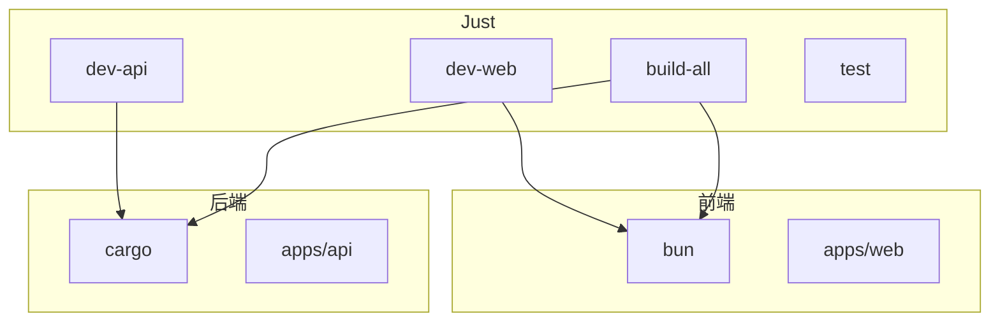
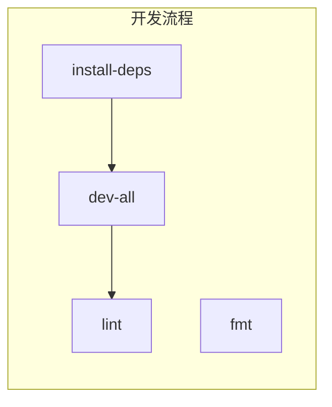

# 构建系统与工具

本文介绍 ATMOS 的构建流水线、任务编排（Just）、Rust 与前端构建命令，以及开发工作流中的常用操作。

## Overview

项目使用 Just 作为统一任务入口，前端由 Bun 管理依赖和脚本，后端由 Cargo 管理。`just dev-web`、`just dev-api`、`just dev-all` 是开发中最常用的命令。构建分为 `build-rust` 与 `bun run build`，CI 流程为 `just ci`（lint + test + build-all）。

## Architecture

## 常用命令

| 命令 | 说明 |
|------|------|
| `just dev-web` | 启动 Next.js 开发服务器 |
| `just dev-api` | 启动 API（cargo watch 热重载） |
| `just dev-all` | 并行启动 Web 与 API |
| `just build-all` | 构建所有 Rust 与前端 |
| `just lint` | ESLint + Clippy |
| `just fmt` | Prettier + cargo fmt |
| `just test` | 前端与 Rust 测试 |
| `just ci` | 完整 CI 流程 |

## Rust 工作区

`Cargo.toml` 定义 workspace，members 包括 `apps/api` 与 `crates/*`。共享依赖在 `[workspace.dependencies]` 中统一管理。

## Key Source Files

| File | Purpose |
|------|---------|
| `justfile` | 任务定义 |
| `Cargo.toml` | Rust 工作区 |
| `package.json` | 前端 Monorepo |

## Next Steps

- **[快速开始](../../getting-started/quick-start.md)** — 运行命令速查
- **[配置指南](../../getting-started/configuration.md)** — 环境变量
