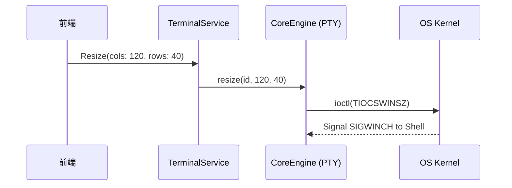
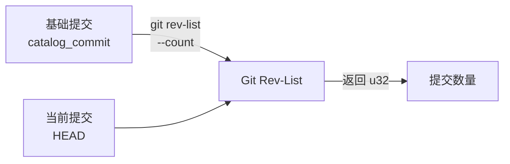
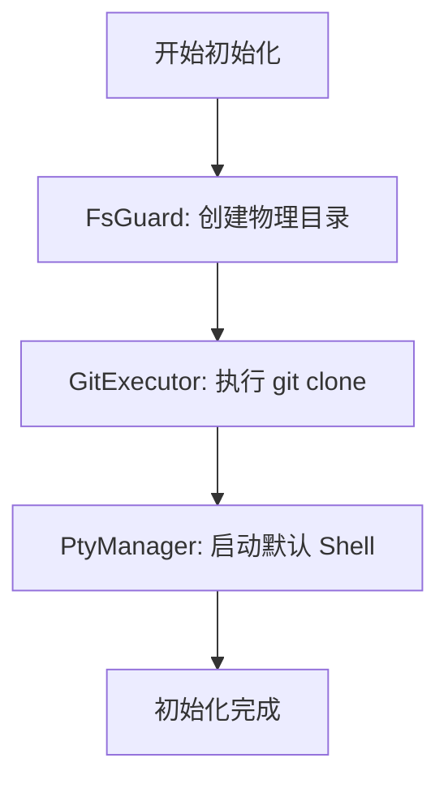

# PTY, Git 与文件系统

`core-engine` 是 Atmos 的"肌肉"，负责执行所有与操作系统直接相关的繁重任务。它封装了伪终端 (PTY) 的底层操作、Git 仓库的自动化管理以及安全的文件系统访问。本章将深入探讨这些核心技术模块的实现原理及其在 Atmos 中的协作方式。

## 伪终端 (PTY) 管理

PTY 是实现 Web 终端的基础。Atmos 使用 `portable-pty` 库来提供跨平台的终端模拟能力。

### 1. PTY 的创建与生命周期
当用户开启一个终端时，`core-engine` 会执行以下步骤：
1. **系统调用**: 调用操作系统的 PTY 系统（如 Linux 的 `/dev/ptmx`）。
2. **进程派生**: 在 PTY 的从设备端启动指定的 Shell（如 `bash` 或 `zsh`）。
3. **流转发**: 将 PTY 主设备端的读写接口暴露给上层服务。

### 2. 窗口大小调整 (Winsize)
终端的行列数决定了 CLI 工具的渲染布局。Atmos 通过发送 `SIGWINCH` 信号来通知 Shell 进程窗口大小的变更。



## Git 自动化引擎

Atmos 的 Git 模块旨在为开发者提供无感的版本控制体验。

### 1. 核心功能实现
- **克隆 (Clone)**: 支持异步克隆，并实时反馈进度。
- **状态解析**: 通过解析 `git status --porcelain` 或调用库接口，获取当前分支、脏文件列表等元数据。
- **认证管理**: 自动处理 SSH Agent 和环境变量，确保私有仓库的访问安全。

### 2. 提交计数与版本追踪
Atmos 提供了精确的版本差异追踪功能，帮助用户了解代码库的演进状态。

#### Git Rev-List 计数原理
`get_commit_count` 函数使用 `git rev-list --count base..head` 命令来统计两个提交之间的提交数量。这个命令高效地遍历 Git 图，返回可访问的提交计数。



**关键实现细节**:
- 使用 `..` 范围语法（不包括基础提交本身）
- 将输出字符串解析为 `u32` 整数
- 处理无效的提交哈希和非可达引用的错误

#### HEAD 提交哈希获取
`get_head_commit` 函数使用 `git rev-parse HEAD` 获取当前工作区的完整 SHA-1 哈希值。这个哈希值用于:
- Wiki 增量更新的版本比较
- 工作区状态追踪
- 与远程仓库的同步状态判断

### 3. 性能与并发
为了避免 Git 操作（尤其是大型仓库的克隆）阻塞 Rust 的异步运行时，所有的 Git 指令都在专用的阻塞任务池中执行。

## 安全文件系统 (FsGuard)

在多工作区环境下，防止路径穿越 (Path Traversal) 攻击是安全性的重中之重。

### 1. 路径沙箱化
`core-engine` 实现了一个路径校验层，确保所有文件操作都被限制在工作区的根目录下。

```rust
// 安全校验逻辑示例
pub fn safe_join(root: &Path, user_path: &Path) -> Result<PathBuf, Error> {
    let joined = root.join(user_path);
    let canonical = joined.canonicalize()?;
    if canonical.starts_with(root.canonicalize()?) {
        Ok(canonical)
    } else {
        Err(Error::SecurityViolation("Path outside of sandbox"))
    }
}
```

### 2. 异步文件 I/O
利用 `tokio::fs`，Atmos 实现了非阻塞的文件读取、写入和目录遍历，确保在处理大量文件时 API 依然响应迅速。

## 模块协作：以“初始化工作区”为例



## 关键源码分析

| 文件路径 | 核心职责 |
|:---|:---|
| `crates/core-engine/src/pty/mod.rs` | 封装 `portable-pty`，管理进程派生与 I/O 句柄。 |
| `crates/core-engine/src/git/mod.rs` | 实现 Git 命令的封装与执行逻辑。 |
| `crates/core-engine/src/fs/mod.rs` | 提供带安全校验的文件系统操作接口。 |
| `crates/core-engine/src/search.rs` | 实现基于内容的快速文件搜索功能。 |
| `crates/core-engine/src/error.rs` | 定义引擎层特有的系统级错误。 |

## 总结

`core-engine` 通过对底层操作系统能力的精细封装，为 Atmos 提供了稳定、安全且高性能的技术支撑。它不仅解决了 PTY 流处理和 Git 自动化的复杂性，更通过严格的路径校验机制筑起了系统的安全防线。

## 下一步建议

- **[Tmux 会话管理](./tmux.md)**: 了解如何在此基础上实现会话持久化。
- **[终端服务实现](../core-service/terminal.md)**: 探索业务层如何调度这些底层能力。
- **[工作区生命周期](../core-service/workspace.md)**: 了解初始化流程的完整编排。
- **[架构概览](../../getting-started/architecture.md)**: 查看引擎层在整体系统中的位置。
