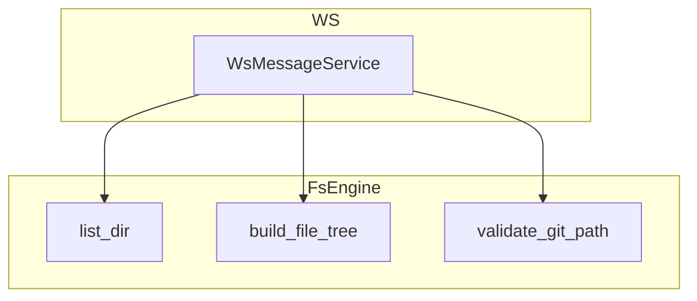
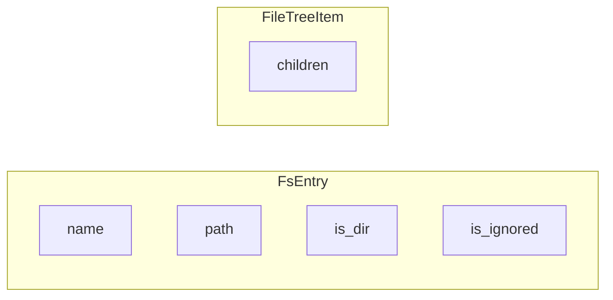

# 文件系统引擎

文件系统引擎提供目录浏览、文件树构建、Git 路径校验和内容搜索能力。本文介绍 FsEngine 的 API、FsEntry 与 FileTreeItem 结构，以及 WebSocket 消息如何触发这些操作。

## Overview

`FsEngine` 封装 `list_dir`、`build_file_tree`、`validate_git_path`、`read_file`、`write_file`、`search_content` 等能力。L3 不直接调用 FsEngine，而是通过 `WsMessageService` 处理 WebSocket 请求，由 `WsMessageHandler` 内部调用 FsEngine 完成实际 I/O。

## Architecture

## list_dir

按路径列出目录内容，支持 `dirs_only`、`show_hidden`。返回 `Vec<FsEntry>`，包含 name、path、is_dir、is_symlink、is_ignored、is_git_repo 等字段。隐藏文件（以 `.` 开头）默认跳过。

## build_file_tree

递归构建目录树，返回 `FileTreeItem` 结构，带 `children` 嵌套。用于前端项目文件树展示。

## validate_git_path

校验路径是否在 Git 仓库内，可用于确保操作不超出工作区范围。

## Key Source Files

| File | Purpose |
|------|---------|
| `crates/core-engine/src/fs/mod.rs` | FsEngine、FsEntry、FileTreeItem |
| `crates/infra/src/websocket/message.rs` | Fs 相关 WsRequest/WsResponse 类型 |

## Next Steps

- **[WebSocket 处理器](../api/websocket-handlers.md)** — Fs 请求如何路由到 FsEngine
- **[Git 引擎](git.md)** — worktree 路径与校验
