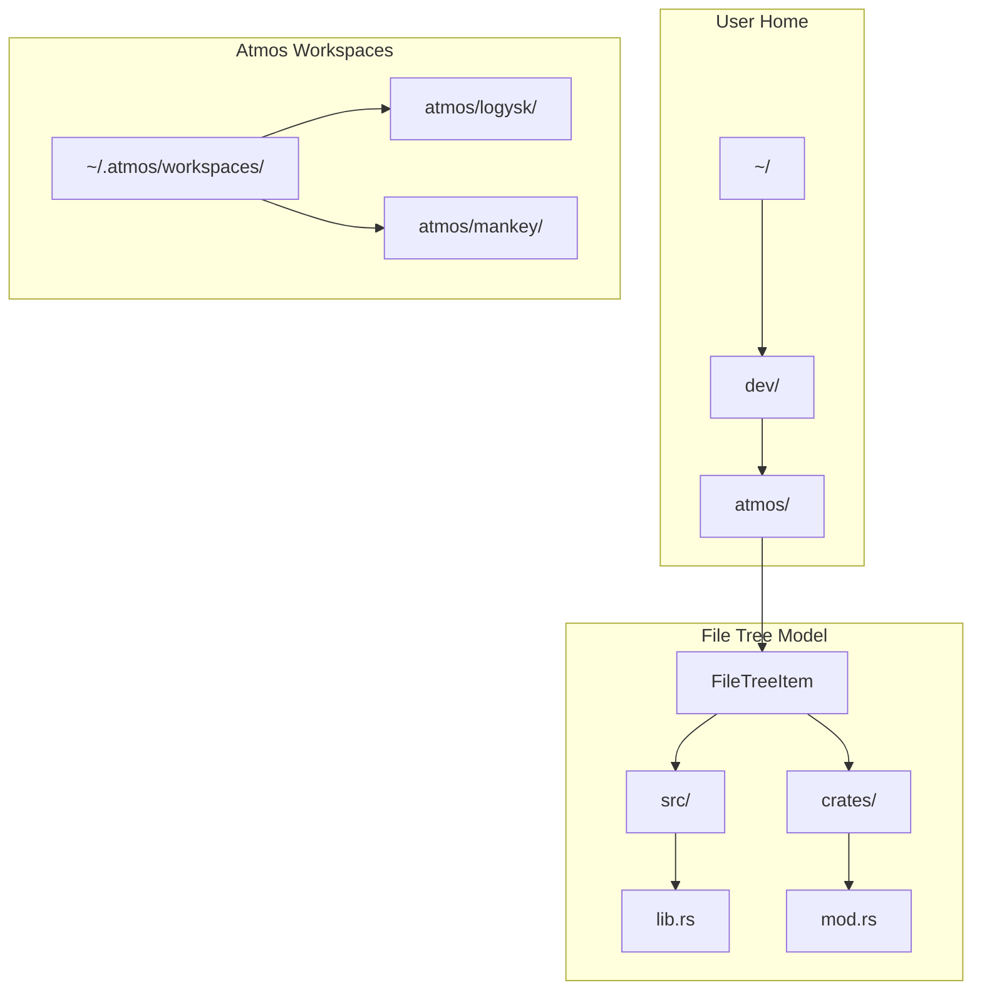
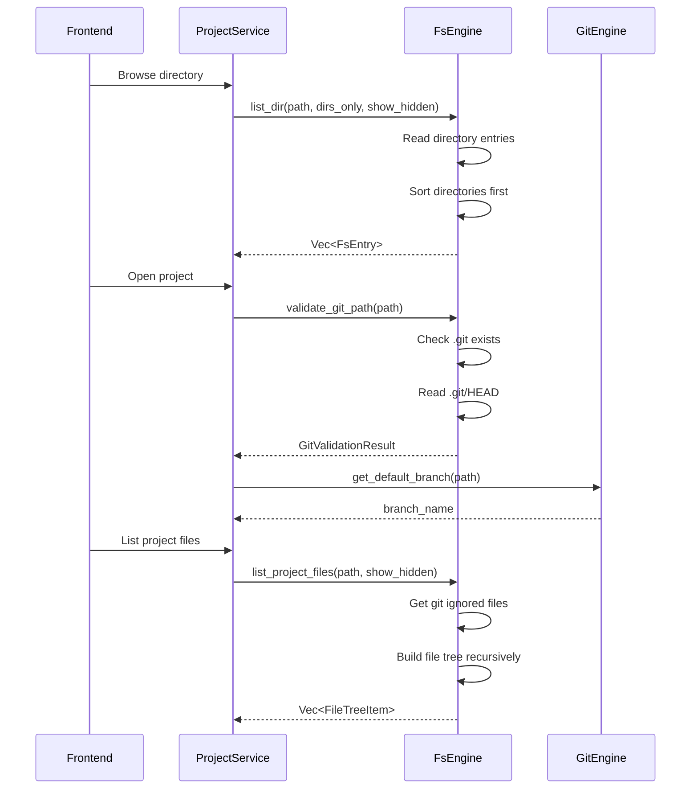
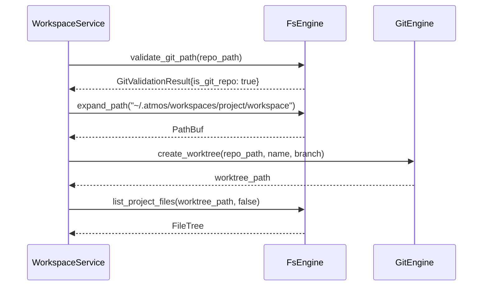

# File System Engine

> **Reading Time**: 10 minutes
> **Level**: Advanced
> **Last Updated**: 2025-02-11

## Overview

The `FsEngine` provides file system navigation, validation, and project file listing capabilities for ATMOS. It handles directory traversal, git ignore detection, binary file handling, and path validation—essential features for the project browser and workspace management.

## Architecture

### File System Hierarchy



### Data Models

```rust
// Source: crates/core-engine/src/fs/mod.rs

/// File system entry for directory listing
#[derive(Debug, Clone)]
pub struct FsEntry {
    pub name: String,
    pub path: PathBuf,
    pub is_dir: bool,
    pub is_symlink: bool,
    pub is_ignored: bool,
    pub symlink_target: Option<String>,
    pub is_git_repo: bool,
}

/// File tree item for recursive project listing
#[derive(Debug, Clone)]
pub struct FileTreeItem {
    pub name: String,
    pub path: PathBuf,
    pub is_dir: bool,
    pub is_symlink: bool,
    pub is_ignored: bool,
    pub symlink_target: Option<String>,
    pub children: Option<Vec<FileTreeItem>>,
}
```

## Directory Operations

### Listing Directories

```rust
// Source: crates/core-engine/src/fs/mod.rs
pub fn list_dir(&self, path: &Path, dirs_only: bool, show_hidden: bool) -> Result<Vec<FsEntry>> {
    // Validate path
    if !path.exists() {
        return Err(EngineError::FileSystem(format!(
            "Path does not exist: {}",
            path.display()
        )));
    }

    if !path.is_dir() {
        return Err(EngineError::FileSystem(format!(
            "Path is not a directory: {}",
            path.display()
        )));
    }

    let mut entries = Vec::new();
    let read_dir = fs::read_dir(path).map_err(|e| {
        EngineError::FileSystem(format!("Failed to read directory {}: {}", path.display(), e))
    })?;

    for entry in read_dir {
        let entry = match entry {
            Ok(e) => e,
            Err(_) => continue,  // Skip unreadable entries
        };

        let name = entry.file_name().to_string_lossy().to_string();

        // Skip hidden files unless requested
        if !show_hidden && name.starts_with('.') {
            continue;
        }

        let path = entry.path();
        let is_dir = path.is_dir();
        let file_type = entry.file_type().ok();
        let is_symlink = file_type.map(|ft| ft.is_symlink()).unwrap_or(false);

        let symlink_target = if is_symlink {
            fs::read_link(&path).ok().map(|p| p.to_string_lossy().to_string())
        } else {
            None
        };

        // Skip files if dirs_only is true
        if dirs_only && !is_dir {
            continue;
        }

        // Check if it's a git repository
        let is_git_repo = if is_dir {
            path.join(".git").exists()
        } else {
            false
        };

        // Check if commonly ignored
        let is_ignored = self.is_commonly_ignored(&name);

        entries.push(FsEntry {
            name,
            path,
            is_dir,
            is_symlink,
            is_ignored,
            symlink_target,
            is_git_repo,
        });
    }

    // Sort: directories first, then alphabetically
    entries.sort_by(|a, b| {
        match (a.is_dir, b.is_dir) {
            (true, false) => std::cmp::Ordering::Less,
            (false, true) => std::cmp::Ordering::Greater,
            _ => a.name.to_lowercase().cmp(&b.name.to_lowercase()),
        }
    });

    Ok(entries)
}
```

**Example Usage**:
```rust
let engine = FsEngine::new();

// List all directories in ~/dev
let entries = engine.list_dir(
    Path::new("/Users/dev"),
    true,   // dirs_only
    false   // show_hidden
)?;

for entry in entries {
    println!("{} {}", entry.name, if entry.is_git_repo { "(git)" } else { "" });
}
```

### Project File Tree

```rust
// Source: crates/core-engine/src/fs/mod.rs
pub fn list_project_files(&self, root_path: &Path, show_hidden: bool) -> Result<Vec<FileTreeItem>> {
    if !root_path.exists() {
        return Err(EngineError::FileSystem(format!(
            "Path does not exist: {}",
            root_path.display()
        )));
    }

    if !root_path.is_dir() {
        return Err(EngineError::FileSystem(format!(
            "Path is not a directory: {}",
            root_path.display()
        )));
    }

    // Get ignored files using git
    let mut ignored_paths = HashSet::new();
    if let Ok(output) = Command::new("git")
        .current_dir(root_path)
        .args(["status", "--ignored", "--porcelain", "-uall"])
        .output()
    {
        if output.status.success() {
            let stdout = String::from_utf8_lossy(&output.stdout);
            for line in stdout.lines() {
                if line.starts_with("!! ") {
                    let rel_path = line[3..].trim_end_matches('/');
                    ignored_paths.insert(rel_path.to_string());
                }
            }
        }
    }

    self.build_file_tree(root_path, root_path, show_hidden, 0, &ignored_paths)
}
```

**Tree Building**:
```rust
// Source: crates/core-engine/src/fs/mod.rs
fn build_file_tree(
    &self,
    root_path: &Path,
    dir_path: &Path,
    show_hidden: bool,
    depth: usize,
    ignored_paths: &HashSet<String>,
) -> Result<Vec<FileTreeItem>> {
    // Limit recursion depth
    const MAX_DEPTH: usize = 10;
    if depth >= MAX_DEPTH {
        return Ok(Vec::new());
    }

    let mut items = Vec::new();
    let read_dir = fs::read_dir(dir_path).map_err(|e| {
        EngineError::FileSystem(format!("Failed to read directory {}: {}", dir_path.display(), e))
    })?;

    for entry in read_dir {
        let entry = match entry {
            Ok(e) => e,
            Err(_) => continue,
        };

        let name = entry.file_name().to_string_lossy().to_string();

        // Skip hidden files unless requested
        if !show_hidden && name.starts_with('.') {
            continue;
        }

        let path = entry.path();
        let rel_path = path.strip_prefix(root_path).unwrap_or(&path);
        let rel_path_str = rel_path.to_string_lossy().to_string();

        // Check if ignored
        let is_ignored = ignored_paths.contains(&rel_path_str)
            || (rel_path_str.ends_with('/') && ignored_paths.contains(rel_path_str.trim_end_matches('/')))
            || self.is_commonly_ignored(&name);

        let is_dir = path.is_dir();
        let file_type = entry.file_type().ok();
        let is_symlink = file_type.map(|ft| ft.is_symlink()).unwrap_or(false);

        let symlink_target = if is_symlink {
            fs::read_link(&path).ok().map(|p| p.to_string_lossy().to_string())
        } else {
            None
        };

        // Recurse into directories
        let should_recurse = is_dir && !self.should_skip_recursion(&name);
        let children = if should_recurse {
            Some(self.build_file_tree(root_path, &path, show_hidden, depth + 1, ignored_paths)?)
        } else {
            None
        };

        items.push(FileTreeItem {
            name,
            path,
            is_dir,
            is_symlink,
            is_ignored,
            symlink_target,
            children,
        });
    }

    // Sort: directories first, then alphabetically
    items.sort_by(|a, b| {
        match (a.is_dir, b.is_dir) {
            (true, false) => std::cmp::Ordering::Less,
            (false, true) => std::cmp::Ordering::Greater,
            _ => a.name.to_lowercase().cmp(&b.name.to_lowercase()),
        }
    });

    Ok(items)
}
```

### Ignore Patterns

```rust
// Source: crates/core-engine/src/fs/mod.rs

/// Directories to skip during recursion
fn should_skip_recursion(&self, name: &str) -> bool {
    matches!(
        name,
        "node_modules"
            | "target"
            | ".git"
            | ".next"
            | "dist"
            | "build"
            | ".turbo"
            | "__pycache__"
            | ".venv"
            | "venv"
            | ".idea"
            | ".vscode"
    )
}

/// Files/directories commonly ignored
fn is_commonly_ignored(&self, name: &str) -> bool {
    self.should_skip_recursion(name)
        || name == "tsconfig.tsbuildinfo"
        || name == ".DS_Store"
}
```

**Ignore Hierarchy**:
1. **Git ignore**: Files marked by `git status --ignored`
2. **Common patterns**: Well-known directories (node_modules, target, etc.)
3. **Build artifacts**: dist, build, .next
4. **Editor files**: .idea, .vscode
5. **OS files**: .DS_Store

## File Operations

### Reading Files

```rust
// Source: crates/core-engine/src/fs/mod.rs
pub fn read_file(&self, path: &Path) -> Result<(String, u64)> {
    if !path.exists() {
        return Err(EngineError::FileSystem(format!(
            "File does not exist: {}",
            path.display()
        )));
    }

    if !path.is_file() {
        return Err(EngineError::FileSystem(format!(
            "Path is not a file: {}",
            path.display()
        )));
    }

    let metadata = fs::metadata(path).map_err(|e| {
        EngineError::FileSystem(format!("Failed to get file metadata: {}", e))
    })?;

    match fs::read_to_string(path) {
        Ok(content) => Ok((content, metadata.len())),
        Err(e) if e.kind() == std::io::ErrorKind::InvalidData => {
            // Binary file - encode as base64
            let bytes = fs::read(path).map_err(|e| {
                EngineError::FileSystem(format!("Failed to read binary file {}: {}", path.display(), e))
            })?;

            use base64::Engine as _;
            let encoded = base64::engine::general_purpose::STANDARD.encode(&bytes);

            Ok((
                format!("data:application/octet-stream;base64,{}", encoded),
                metadata.len()
            ))
        }
        Err(e) => Err(EngineError::FileSystem(format!(
            "Failed to read file {}: {}",
            path.display(), e
        ))),
    }
}
```

**Binary Handling**:
- Text files returned as-is
- Binary files encoded as base64 data URI
- Format: `data:application/octet-stream;base64,{encoded_content}`

### Writing Files

```rust
// Source: crates/core-engine/src/fs/mod.rs
pub fn write_file(&self, path: &Path, content: &str) -> Result<()> {
    // Ensure parent directory exists
    if let Some(parent) = path.parent() {
        if !parent.exists() {
            fs::create_dir_all(parent).map_err(|e| {
                EngineError::FileSystem(format!(
                    "Failed to create parent directory: {}",
                    e
                ))
            })?;
        }
    }

    fs::write(path, content).map_err(|e| {
        EngineError::FileSystem(format!("Failed to write file {}: {}", path.display(), e))
    })?;

    Ok(())
}
```

**Features**:
- Creates parent directories automatically
- Overwrites existing files
- Returns error on failure

## Path Operations

### Path Validation

```rust
// Source: crates/core-engine/src/fs/mod.rs
pub fn validate_git_path(&self, path: &Path) -> GitValidationResult {
    if !path.exists() {
        return GitValidationResult {
            is_valid: false,
            is_git_repo: false,
            suggested_name: None,
            default_branch: None,
            error: Some("Path does not exist".to_string()),
        };
    }

    if !path.is_dir() {
        return GitValidationResult {
            is_valid: false,
            is_git_repo: false,
            suggested_name: None,
            default_branch: None,
            error: Some("Path is not a directory".to_string()),
        };
    }

    let is_git_repo = path.join(".git").exists();
    let suggested_name = path
        .file_name()
        .map(|n| n.to_string_lossy().to_string());

    let default_branch = if is_git_repo {
        self.get_default_branch(path).ok()
    } else {
        None
    };

    GitValidationResult {
        is_valid: true,
        is_git_repo,
        suggested_name,
        default_branch,
        error: None,
    }
}
```

**Validation Result**:
```rust
#[derive(Debug, Clone)]
pub struct GitValidationResult {
    pub is_valid: bool,
    pub is_git_repo: bool,
    pub suggested_name: Option<String>,
    pub default_branch: Option<String>,
    pub error: Option<String>,
}
```

### Getting Default Branch

```rust
// Source: crates/core-engine/src/fs/mod.rs
fn get_default_branch(&self, path: &Path) -> Result<String> {
    let head_path = path.join(".git").join("HEAD");

    if !head_path.exists() {
        return Err(EngineError::FileSystem("Not a git repository".to_string()));
    }

    let content = fs::read_to_string(&head_path)
        .map_err(|e| EngineError::FileSystem(format!("Failed to read HEAD file: {}", e)))?;

    // HEAD file format: "ref: refs/heads/main\n"
    if let Some(branch) = content.strip_prefix("ref: refs/heads/") {
        Ok(branch.trim().to_string())
    } else {
        // Detached HEAD state
        Ok(content.trim().to_string())
    }
}
```

### Path Expansion

```rust
// Source: crates/core-engine/src/fs/mod.rs
pub fn expand_path(&self, path: &str) -> Result<PathBuf> {
    if path.starts_with('~') {
        let home = self.get_home_dir()?;
        let rest = path.strip_prefix("~/").unwrap_or(&path[1..]);
        Ok(home.join(rest))
    } else {
        Ok(PathBuf::from(path))
    }
}

pub fn get_home_dir(&self) -> Result<PathBuf> {
    dirs::home_dir()
        .ok_or_else(|| EngineError::FileSystem("Unable to determine home directory".to_string()))
}
```

**Example**:
```rust
let engine = FsEngine::new();
let path = engine.expand_path("~/dev/atmos")?;
// Results in: /Users/username/dev/atmos
```

### Parent Directory

```rust
// Source: crates/core-engine/src/fs/mod.rs
pub fn get_parent(&self, path: &Path) -> Option<PathBuf> {
    path.parent().map(|p| p.to_path_buf())
}
```

## Integration Patterns

### Project Browser Workflow



### Workspace Creation



## Performance Considerations

### Depth Limiting

```rust
const MAX_DEPTH: usize = 10;

if depth >= MAX_DEPTH {
    return Ok(Vec::new());
}
```

Prevents excessive recursion in deeply nested directories.

### Lazy Evaluation

```rust
// FileTreeItem children are Option<Vec<FileTreeItem>>
// Only populated when needed for display
pub children: Option<Vec<FileTreeItem>>,
```

### Smart Filtering

```rust
// Skip common directories early
let should_recurse = is_dir && !self.should_skip_recursion(&name);
```

Avoids traversing node_modules, target, etc.

## Error Handling

```rust
// All FsEngine methods return Result<T>
pub type Result<T> = std::result::Result<T, EngineError>;

// Error examples
EngineError::FileSystem("Path does not exist: /invalid/path".to_string())
EngineError::FileSystem("Failed to read directory: Permission denied".to_string())
EngineError::FileSystem("Not a git repository".to_string())
```

## Best Practices

### 1. **Validate Before Operations**

```rust
let engine = FsEngine::new();
let validation = engine.validate_git_path(path)?;

if !validation.is_valid {
    return Err(...);
}
```

### 2. **Use Git Ignore Detection**

```rust
// Combines git status with common patterns
let ignored_paths = get_git_ignored_paths(root_path)?;
let is_ignored = ignored_paths.contains(&rel_path) || is_commonly_ignored(&name);
```

### 3. **Handle Binary Files**

```rust
// Encode binary files as base64
match fs::read_to_string(path) {
    Ok(content) => Ok((content, metadata.len())),
    Err(e) if e.kind() == std::io::ErrorKind::InvalidData => {
        // Binary file handling
        let encoded = base64::encode(&bytes);
        Ok((format!("data:application/octet-stream;base64,{}", encoded), metadata.len()))
    }
}
```

### 4. **Sort Consistently**

```rust
// Directories first, then alphabetically
entries.sort_by(|a, b| {
    match (a.is_dir, b.is_dir) {
        (true, false) => std::cmp::Ordering::Less,
        (false, true) => std::cmp::Ordering::Greater,
        _ => a.name.to_lowercase().cmp(&b.name.to_lowercase()),
    }
});
```

## Related Documentation

- **[Git Engine](./git.md)**: Worktree operations
- **[Core Engine Overview](./index.md)**: Layer architecture
- **[Project Service](../core-service/project.md)**: Service layer usage

## External Resources

- **[Rust std::fs Module](https://doc.rust-lang.org/std/fs/)**: File system operations
- **[ignore Crate](https://docs.rs/ignore/latest/ignore/)**: Git ignore parsing
- **[walkdir Crate](https://docs.rs/walkdir/latest/walkdir/)**: Efficient directory traversal
