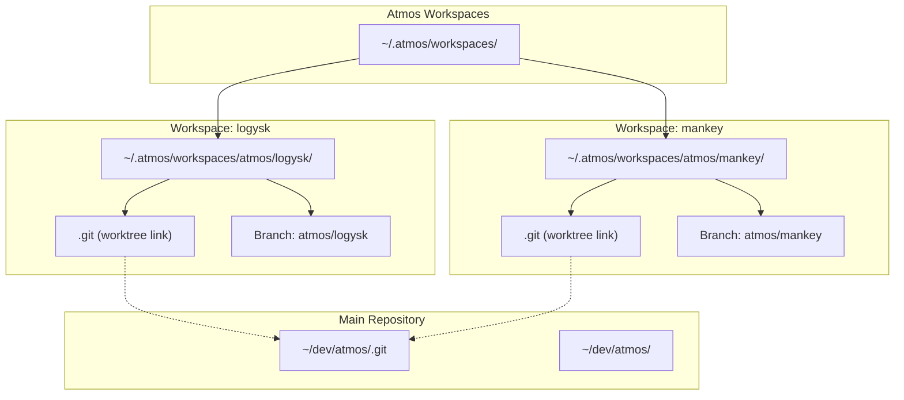
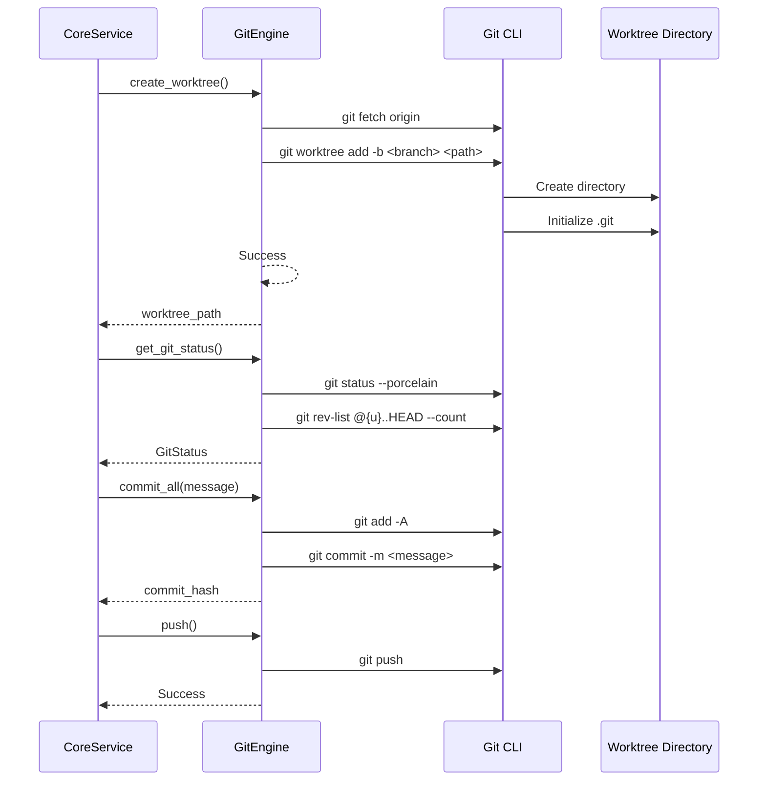

# Git Engine

> **Reading Time**: 10 minutes
> **Level**: Advanced
> **Last Updated**: 2025-02-11

## Overview

The `GitEngine` provides git worktree operations for ATMOS, enabling isolated workspace environments. Each workspace maps to a separate git worktree, allowing developers to work on multiple branches simultaneously without cluttering their main repository.

## Architecture

### Worktree Model



### Directory Structure

```
~/.atmos/workspaces/
├── aruni/
│   └── pikachu/          # Workspace: aruni/pikachu
│       ├── .git          # Worktree metadata
│       ├── src/
│       └── Cargo.toml
├── atmos/
│   ├── logysk/           # Workspace: atmos/logysk
│   │   ├── .git
│   │   ├── src/
│   │   └── Cargo.toml
│   └── mankey/           # Workspace: atmos/mankey
│       ├── .git
│       ├── src/
│       └── Cargo.toml
└── ...
```

## Worktree Operations

### Creating Worktrees

```rust
// Source: crates/core-engine/src/git/mod.rs
pub fn create_worktree(
    &self,
    repo_path: &Path,
    workspace_name: &str,
    base_branch: &str,
) -> Result<PathBuf> {
    let worktree_path = self.get_worktree_path(workspace_name)?;

    // Ensure parent directory exists
    if let Some(parent) = worktree_path.parent() {
        std::fs::create_dir_all(parent).map_err(|e| {
            EngineError::Git(format!("Failed to create worktree directory: {}", e))
        })?;
    }

    // Check if worktree already exists
    if worktree_path.exists() {
        return Err(EngineError::Git(format!(
            "Worktree already exists at: {}",
            worktree_path.display()
        )));
    }

    // Fetch latest from remote
    let fetch_output = Command::new("git")
        .current_dir(repo_path)
        .args(["fetch", "origin"])
        .output()
        .map_err(|e| EngineError::Git(format!("Failed to fetch from remote: {}", e)))?;

    if !fetch_output.status.success() {
        tracing::warn!(
            "Git fetch warning: {}",
            String::from_utf8_lossy(&fetch_output.stderr)
        );
    }

    // Create worktree with new branch
    let output = Command::new("git")
        .current_dir(repo_path)
        .args([
            "worktree",
            "add",
            "-b",
            workspace_name,
            worktree_path.to_str().unwrap(),
            base_branch,
        ])
        .output()
        .map_err(|e| EngineError::Git(format!("Failed to create worktree: {}", e)))?;

    if !output.status.success() {
        let stderr = String::from_utf8_lossy(&output.stderr);
        return Err(EngineError::Git(format!(
            "Failed to create worktree (likely branch conflict): {}",
            stderr
        )));
    }

    tracing::info!(
        "Created worktree at {} with branch {} (not pushed to remote yet)",
        worktree_path.display(),
        workspace_name
    );

    Ok(worktree_path)
}
```

**Example**:
```rust
let engine = GitEngine::new();
let worktree_path = engine.create_worktree(
    Path::new("/Users/dev/atmos"),
    "atmos/logysk",
    "main"
)?;
// Results in: ~/.atmos/workspaces/atmos/logysk/
```

### Removing Worktrees

```rust
// Source: crates/core-engine/src/git/mod.rs
pub fn remove_worktree(
    &self,
    repo_path: &Path,
    workspace_name: &str,
) -> Result<()> {
    let worktree_path = self.get_worktree_path(workspace_name)?;

    if !worktree_path.exists() {
        tracing::warn!("Worktree does not exist: {}", worktree_path.display());
        return Ok(());
    }

    // Remove worktree using git
    let output = Command::new("git")
        .current_dir(repo_path)
        .args(["worktree", "remove", "--force", worktree_path.to_str().unwrap()])
        .output()
        .map_err(|e| EngineError::Git(format!("Failed to remove worktree: {}", e)))?;

    if !output.status.success() {
        let stderr = String::from_utf8_lossy(&output.stderr);
        return Err(EngineError::Git(format!(
            "Failed to remove worktree: {}",
            stderr
        )));
    }

    // Delete local branch
    let local_result = Command::new("git")
        .current_dir(repo_path)
        .args(["branch", "-D", workspace_name])
        .output();

    if local_result.is_ok() {
        tracing::info!("Deleted local branch: {}", workspace_name);
    }

    // Delete remote branch if exists
    let remote_result = Command::new("git")
        .current_dir(repo_path)
        .args(["push", "origin", "--delete", workspace_name])
        .output();

    if let Ok(output) = remote_result {
        if output.status.success() {
            tracing::info!("Deleted remote branch: origin/{}", workspace_name);
        }
    }

    tracing::info!("Removed worktree for workspace {}", workspace_name);
    Ok(())
}
```

**Cleanup Process**:
1. Remove worktree directory via `git worktree remove`
2. Delete local branch via `git branch -D`
3. Delete remote branch via `git push origin --delete`

### Listing Worktrees

```rust
// Source: crates/core-engine/src/git/mod.rs
pub fn list_worktrees(&self, repo_path: &Path) -> Result<Vec<WorktreeInfo>> {
    let output = Command::new("git")
        .current_dir(repo_path)
        .args(["worktree", "list", "--porcelain"])
        .output()
        .map_err(|e| EngineError::Git(format!("Failed to list worktrees: {}", e)))?;

    if !output.status.success() {
        let stderr = String::from_utf8_lossy(&output.stderr);
        return Err(EngineError::Git(format!(
            "Failed to list worktrees: {}",
            stderr
        )));
    }

    let stdout = String::from_utf8_lossy(&output.stdout);
    let worktrees = parse_worktree_list(&stdout);

    Ok(worktrees)
}
```

**Output Format**:
```
worktree /Users/dev/atmos
HEAD abc123def456
branch refs/heads/main

worktree /Users/.atmos/workspaces/atmos/logysk
HEAD def456ghi789
branch refs/heads/atmos/logysk
```

## Status Operations

### Git Status

```rust
// Source: crates/core-engine/src/git/mod.rs
pub fn get_git_status(&self, repo_path: &Path) -> Result<GitStatus> {
    // Check for uncommitted changes
    let status_output = Command::new("git")
        .current_dir(repo_path)
        .args(["status", "--porcelain", "-uall"])
        .output()
        .map_err(|e| EngineError::Git(format!("Failed to get git status: {}", e)))?;

    let status_stdout = String::from_utf8_lossy(&status_output.stdout);
    let uncommitted_count = status_stdout.lines().filter(|l| !l.is_empty()).count() as u32;
    let has_uncommitted_changes = uncommitted_count > 0;

    // Check for unpushed commits
    let unpushed_output = Command::new("git")
        .current_dir(repo_path)
        .args(["rev-list", "@{u}..HEAD", "--count"])
        .output()
        .map_err(|e| EngineError::Git(format!("Failed to check unpushed commits: {}", e)))?;

    let (has_unpushed_commits, unpushed_count) = if unpushed_output.status.success() {
        let count_str = String::from_utf8_lossy(&unpushed_output.stdout);
        let count = count_str.trim().parse::<u32>().unwrap_or(0);
        (count > 0, count)
    } else {
        // No upstream configured
        (false, 0)
    };

    Ok(GitStatus {
        has_uncommitted_changes,
        has_unpushed_commits,
        uncommitted_count,
        unpushed_count,
    })
}
```

**Data Structure**:
```rust
pub struct GitStatus {
    pub has_uncommitted_changes: bool,
    pub has_unpushed_commits: bool,
    pub uncommitted_count: u32,
    pub unpushed_count: u32,
}
```

### Changed Files

```rust
// Source: crates/core-engine/src/git/mod.rs
pub fn get_changed_files(&self, repo_path: &Path) -> Result<ChangedFilesInfo> {
    // Get status with porcelain format
    let status_output = Command::new("git")
        .current_dir(repo_path)
        .args(["-c", "core.quotePath=false", "status", "--porcelain", "-uall"])
        .output()
        .map_err(|e| EngineError::Git(format!("Failed to get git status: {}", e)))?;

    let status_stdout = String::from_utf8_lossy(&status_output.stdout);
    let mut staged_files: Vec<ChangedFileInfo> = Vec::new();
    let mut unstaged_files: Vec<ChangedFileInfo> = Vec::new();
    let mut untracked_files: Vec<ChangedFileInfo> = Vec::new();
    let mut total_additions = 0u32;
    let mut total_deletions = 0u32;

    for line in status_stdout.lines() {
        if line.len() < 3 {
            continue;
        }

        // XY format: X=index status, Y=worktree status
        let x = line.chars().next().unwrap_or(' ');
        let y = line.chars().nth(1).unwrap_or(' ');
        let file_path = Self::unquote_path(&line[3..]);

        // Get numstat for this file
        let (additions, deletions) = self.get_file_numstat(repo_path, &file_path);
        total_additions += additions;
        total_deletions += deletions;

        // Categorize by status
        if x == '?' && y == '?' {
            untracked_files.push(ChangedFileInfo {
                path: file_path,
                status: "?".to_string(),
                additions,
                deletions,
                staged: false,
            });
        } else {
            // Staged changes (X is not space)
            if x != ' ' && x != '?' {
                staged_files.push(ChangedFileInfo {
                    path: file_path.clone(),
                    status: Self::status_char_to_string(x),
                    additions,
                    deletions,
                    staged: true,
                });
            }

            // Unstaged changes (Y is not space)
            if y != ' ' {
                unstaged_files.push(ChangedFileInfo {
                    path: file_path,
                    status: Self::status_char_to_string(y),
                    additions,
                    deletions,
                    staged: false,
                });
            }
        }
    }

    Ok(ChangedFilesInfo {
        staged_files,
        unstaged_files,
        untracked_files,
        total_additions,
        total_deletions,
    })
}
```

**Status Codes**:
| Code | Meaning |
|------|---------|
| `M` | Modified |
| `A` | Added |
| `D` | Deleted |
| `R` | Renamed |
| `C` | Copied |
| `U` | Unmerged |
| `?` | Untracked |

**Data Structure**:
```rust
pub struct ChangedFileInfo {
    pub path: String,
    pub status: String,
    pub additions: u32,
    pub deletions: u32,
    pub staged: bool,
}

pub struct ChangedFilesInfo {
    pub staged_files: Vec<ChangedFileInfo>,
    pub unstaged_files: Vec<ChangedFileInfo>,
    pub untracked_files: Vec<ChangedFileInfo>,
    pub total_additions: u32,
    pub total_deletions: u32,
}
```

### File Diff

```rust
// Source: crates/core-engine/src/git/mod.rs
pub fn get_file_diff(&self, repo_path: &Path, file_path: &str) -> Result<FileDiffInfo> {
    // Get file status
    let status_output = Command::new("git")
        .current_dir(repo_path)
        .args(["-c", "core.quotePath=false", "status", "--porcelain", "--", file_path])
        .output()
        .map_err(|e| EngineError::Git(format!("Failed to get file status: {}", e)))?;

    let status_stdout = String::from_utf8_lossy(&status_output.stdout);
    let status = if let Some(line) = status_stdout.lines().next() {
        let code = &line[0..2];
        match code.trim() {
            "M" | " M" | "MM" => "M",
            "A" | " A" | "AM" => "A",
            "D" | " D" => "D",
            "??" => "A",
            _ => "M",
        }.to_string()
    } else {
        "M".to_string()
    };

    // Get old content (HEAD version)
    let old_content = if status == "A" {
        String::new()  // New file
    } else {
        let output = Command::new("git")
            .current_dir(repo_path)
            .args(["show", &format!("HEAD:{}", file_path)])
            .output()
            .map_err(|e| EngineError::Git(format!("Failed to get old content: {}", e)))?;

        if output.status.success() {
            String::from_utf8_lossy(&output.stdout).to_string()
        } else {
            String::new()
        }
    };

    // Get new content (working directory)
    let new_content = if status == "D" {
        String::new()  // Deleted file
    } else {
        let full_path = repo_path.join(file_path);
        std::fs::read_to_string(&full_path).unwrap_or_default()
    };

    Ok(FileDiffInfo {
        file_path: file_path.to_string(),
        old_content,
        new_content,
        status,
    })
}
```

## Git Operations

### Commit

```rust
// Source: crates/core-engine/src/git/mod.rs
pub fn commit_all(&self, repo_path: &Path, message: &str) -> Result<String> {
    // Stage all changes
    let add_output = Command::new("git")
        .current_dir(repo_path)
        .args(["add", "-A"])
        .output()
        .map_err(|e| EngineError::Git(format!("Failed to stage changes: {}", e)))?;

    if !add_output.status.success() {
        let stderr = String::from_utf8_lossy(&add_output.stderr);
        return Err(EngineError::Git(format!("Failed to stage changes: {}", stderr)));
    }

    // Commit
    let commit_output = Command::new("git")
        .current_dir(repo_path)
        .args(["commit", "-m", message])
        .output()
        .map_err(|e| EngineError::Git(format!("Failed to commit: {}", e)))?;

    if !commit_output.status.success() {
        let stderr = String::from_utf8_lossy(&commit_output.stderr);
        return Err(EngineError::Git(format!("Failed to commit: {}", stderr)));
    }

    // Get commit hash
    let hash_output = Command::new("git")
        .current_dir(repo_path)
        .args(["rev-parse", "HEAD"])
        .output()
        .map_err(|e| EngineError::Git(format!("Failed to get commit hash: {}", e)))?;

    let hash = String::from_utf8_lossy(&hash_output.stdout).trim().to_string();
    tracing::info!("Committed changes with hash: {}", hash);
    Ok(hash)
}
```

### Push

```rust
// Source: crates/core-engine/src/git/mod.rs
pub fn push(&self, repo_path: &Path) -> Result<()> {
    let output = Command::new("git")
        .current_dir(repo_path)
        .args(["push"])
        .output()
        .map_err(|e| EngineError::Git(format!("Failed to push: {}", e)))?;

    if !output.status.success() {
        let stderr = String::from_utf8_lossy(&output.stderr);

        // Try push with set-upstream for new branches
        if stderr.contains("no upstream") || stderr.contains("set-upstream") {
            let branch = self.get_current_branch(repo_path)?;
            let upstream_output = Command::new("git")
                .current_dir(repo_path)
                .args(["push", "--set-upstream", "origin", &branch])
                .output()
                .map_err(|e| EngineError::Git(format!("Failed to push with upstream: {}", e)))?;

            if !upstream_output.status.success() {
                let stderr = String::from_utf8_lossy(&upstream_output.stderr);
                return Err(EngineError::Git(format!("Failed to push: {}", stderr)));
            }
        } else {
            return Err(EngineError::Git(format!("Failed to push: {}", stderr)));
        }
    }

    tracing::info!("Pushed changes to remote");
    Ok(())
}
```

### Stage Files

```rust
// Source: crates/core-engine/src/git/mod.rs
pub fn stage_files(&self, repo_path: &Path, paths: &[String]) -> Result<()> {
    if paths.is_empty() {
        return Ok(());
    }

    let mut args = vec!["add", "--"];
    let path_refs: Vec<&str> = paths.iter().map(|s| s.as_str()).collect();
    args.extend(path_refs);

    let output = Command::new("git")
        .current_dir(repo_path)
        .args(&args)
        .output()
        .map_err(|e| EngineError::Git(format!("Failed to stage files: {}", e)))?;

    if !output.status.success() {
        let stderr = String::from_utf8_lossy(&output.stderr);
        return Err(EngineError::Git(format!("Failed to stage files: {}", stderr)));
    }

    tracing::info!("Staged {} files", paths.len());
    Ok(())
}
```

### Discard Changes

```rust
// Source: crates/core-engine/src/git/mod.rs
pub fn discard_unstaged(&self, repo_path: &Path, paths: &[String]) -> Result<()> {
    if paths.is_empty() {
        return Ok(());
    }

    let mut args = vec!["checkout", "--"];
    let path_refs: Vec<&str> = paths.iter().map(|s| s.as_str()).collect();
    args.extend(path_refs);

    let output = Command::new("git")
        .current_dir(repo_path)
        .args(&args)
        .output()
        .map_err(|e| EngineError::Git(format!("Failed to discard changes: {}", e)))?;

    if !output.status.success() {
        let stderr = String::from_utf8_lossy(&output.stderr);
        return Err(EngineError::Git(format!("Failed to discard changes: {}", stderr)));
    }

    tracing::info!("Discarded changes to {} files", paths.len());
    Ok(())
}
```

## Branch Operations

### Get Current Branch

```rust
// Source: crates/core-engine/src/git/mod.rs
pub fn get_current_branch(&self, repo_path: &Path) -> Result<String> {
    let output = Command::new("git")
        .current_dir(repo_path)
        .args(["rev-parse", "--abbrev-ref", "HEAD"])
        .output()
        .map_err(|e| EngineError::Git(format!("Failed to get current branch: {}", e)))?;

    if !output.status.success() {
        let stderr = String::from_utf8_lossy(&output.stderr);
        return Err(EngineError::Git(format!(
            "Failed to get current branch: {}",
            stderr
        )));
    }

    Ok(String::from_utf8_lossy(&output.stdout).trim().to_string())
}
```

### Get Default Branch

```rust
// Source: crates/core-engine/src/git/mod.rs
pub fn get_default_branch(&self, repo_path: &Path) -> Result<String> {
    // Try to get default branch from remote
    let output = Command::new("git")
        .current_dir(repo_path)
        .args(["symbolic-ref", "refs/remotes/origin/HEAD", "--short"])
        .output()
        .map_err(|e| EngineError::Git(format!("Failed to get default branch: {}", e)))?;

    if output.status.success() {
        let branch = String::from_utf8_lossy(&output.stdout)
            .trim()
            .strip_prefix("origin/")
            .unwrap_or("main")
            .to_string();
        return Ok(branch);
    }

    // Fallback: read HEAD
    let head_output = Command::new("git")
        .current_dir(repo_path)
        .args(["rev-parse", "--abbrev-ref", "HEAD"])
        .output()
        .map_err(|e| EngineError::Git(format!("Failed to get HEAD: {}", e)))?;

    if head_output.status.success() {
        return Ok(String::from_utf8_lossy(&head_output.stdout)
            .trim()
            .to_string());
    }

    // Default fallback
    Ok("main".to_string())
}
```

### List Branches

```rust
// Source: crates/core-engine/src/git/mod.rs
pub fn list_branches(&self, repo_path: &Path) -> Result<Vec<String>> {
    let output = Command::new("git")
        .current_dir(repo_path)
        .args([
            "for-each-ref",
            "refs/heads",
            "refs/remotes/origin",
            "--format=%(refname)",
        ])
        .output()
        .map_err(|e| EngineError::Git(format!("Failed to list branches: {}", e)))?;

    let stdout = String::from_utf8_lossy(&output.stdout);
    let branches = stdout
        .lines()
        .map(|l| l.trim())
        .filter(|l| !l.is_empty() && !l.ends_with("/HEAD"))
        .filter_map(|l| {
            l.strip_prefix("refs/heads/")
                .or_else(|| l.strip_prefix("refs/remotes/origin/"))
                .map(|s| s.to_string())
        })
        .collect::<std::collections::HashSet<_>>()
        .into_iter()
        .collect::<Vec<_>>();

    Ok(branches)
}
```

## Workflow Integration



## Error Handling

```rust
// All GitEngine methods return Result<T>
pub type Result<T> = std::result::Result<T, EngineError>;

// Error examples
EngineError::Git("Failed to create worktree: branch already exists".to_string())
EngineError::Git("Failed to fetch from remote: connection refused".to_string())
EngineError::Git("Failed to commit: nothing to commit".to_string())
```

## Best Practices

### 1. **Always Fetch Before Creating**

```rust
// Fetch latest to ensure base_branch is up to date
Command::new("git")
    .args(["fetch", "origin"])
    .output()?;
```

### 2. **Handle Branch Conflicts**

```rust
// Check for existing worktree before creating
if worktree_path.exists() {
    return Err(EngineError::Git(format!(
        "Worktree already exists at: {}",
        worktree_path.display()
    )));
}
```

### 3. **Clean Up Remote Branches**

```rust
// When removing worktree, also clean up remote
if let Ok(output) = Command::new("git")
    .args(["push", "origin", "--delete", workspace_name])
    .output()
{
    if output.status.success() {
        tracing::info!("Deleted remote branch: origin/{}", workspace_name);
    }
}
```

### 4. **Use Porcelain Format**

```rust
// --porcelain provides machine-readable output
Command::new("git")
    .args(["status", "--porcelain", "-uall"])
    .output()?;
```

## Related Documentation

- **[File System Engine](./fs.md)**: File operations for worktrees
- **[Core Engine Overview](./index.md)**: Layer architecture
- **[git worktree Documentation](https://git-scm.com/docs/git-worktree)**: Official git worktree docs

## External Resources

- **[Git Worktrees](https://git-scm.com/docs/git-worktree)**: Official documentation
- **[Git Branching](https://git-scm.com/book/en/v2/Git-Branching-Overview)**: Pro Git book
- **[Git Porcelain](https://git-scm.com/docs/git-status#_porcelain_format)**: Machine-readable output format
