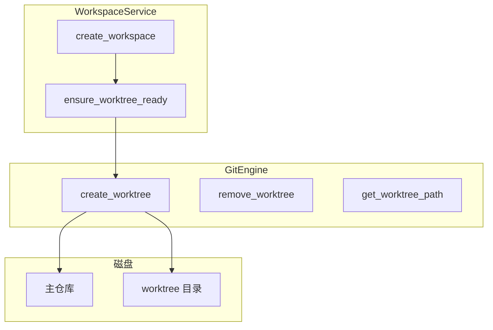
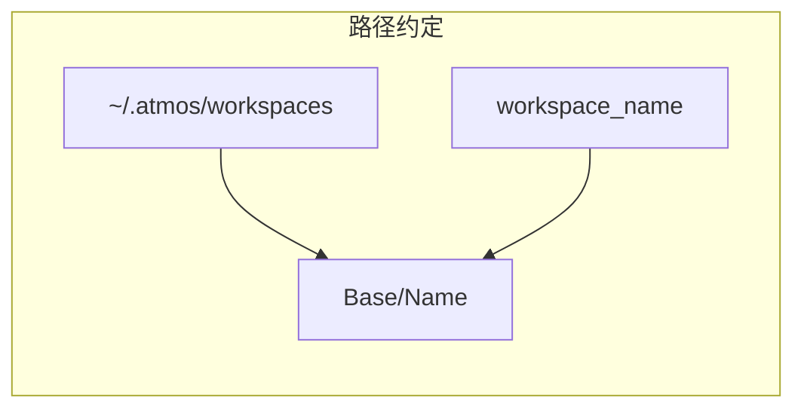
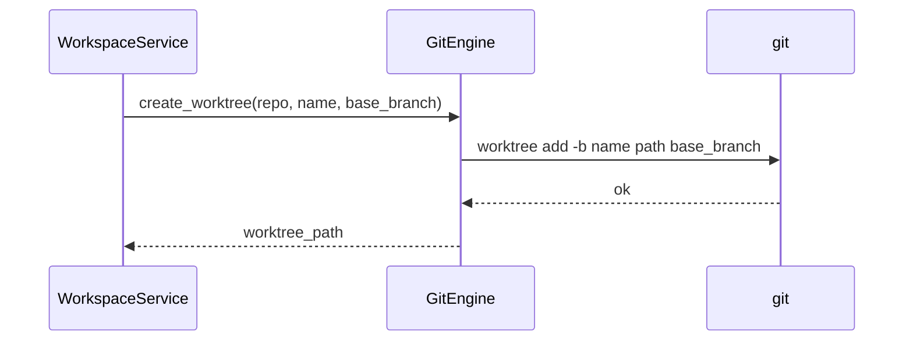

# Git 引擎

Git 引擎封装仓库与 worktree 操作，是工作区创建、删除和分支管理的技术基础。本文介绍 worktree 路径约定、创建/删除流程，以及 L3 如何利用 GitEngine 实现工作区生命周期。

## Overview

`GitEngine` 通过 `git` 子进程执行命令，主要能力包括：获取 worktree 基础路径（`~/.atmos/workspaces`）、创建/删除 worktree、获取默认分支、列出分支、状态查询、提交、推送等。工作区名称即分支名，路径为 `{base}/{workspace_name}`。

## Architecture

## Worktree 创建流程

1. 计算 worktree 路径：`~/.atmos/workspaces/{workspace_name}`
2. 若目录已存在则返回错误
3. `git fetch origin` 确保有最新 base_branch
4. `git worktree add -b {workspace_name} {path} {base_branch}` 创建新分支与工作目录

## Worktree 删除

`remove_worktree` 先 `git worktree remove`，再删除目录。失败时可能需手动清理。

## 名称冲突

工作区名称不能与已有分支重复。WorkspaceService 通过 `workspace_name_generator` 生成 Pokemon 风格唯一名称，或由用户指定并经冲突检测。

## Key Source Files

| File | Purpose |
|------|---------|
| `crates/core-engine/src/git/mod.rs` | GitEngine 全部方法 |
| `crates/core-service/src/service/workspace.rs` | 工作区创建时调用 create_worktree |
| `crates/core-service/src/utils/workspace_name_generator.rs` | 名称生成逻辑 |

## Next Steps

- **[工作区服务](../core-service/workspace.md)** — 工作区创建的业务编排
- **[文件系统引擎](fs.md)** — 目录浏览与 Git 路径校验
