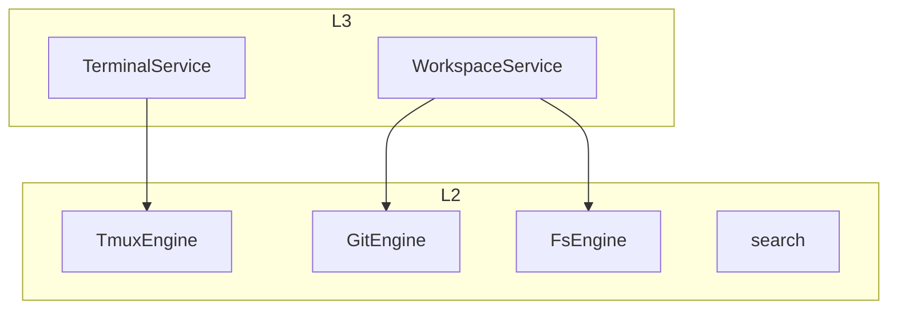
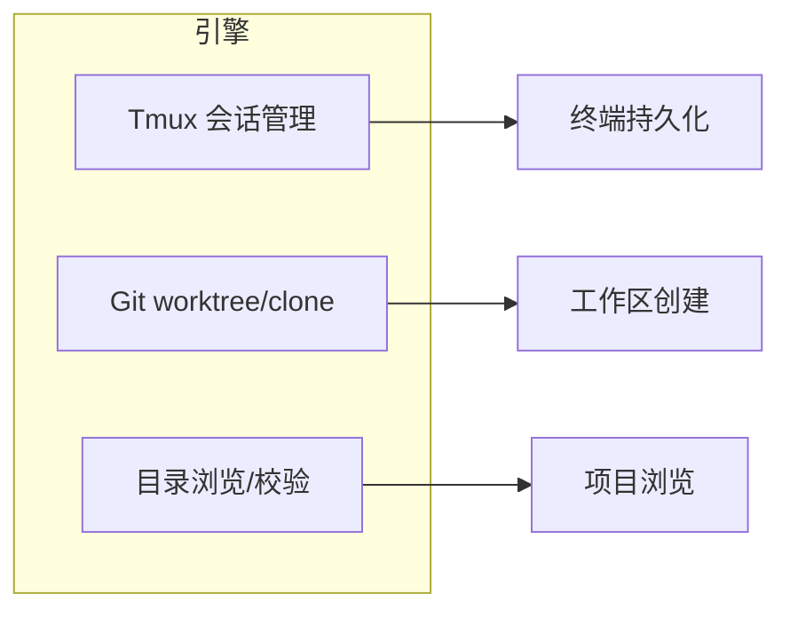

# 核心引擎层

核心引擎层（L2）封装 PTY、Git、Tmux、文件系统等技术能力，不包含业务逻辑。本文概述各引擎的职责、对外 API 以及与 L3 的协作方式。

## Overview

L2 对应 `crates/core-engine`，包含 `TmuxEngine`、`GitEngine`、`FsEngine`、`search`、`test_engine` 等。L3 调用这些引擎完成工作区创建、终端管理、文件浏览等操作。引擎设计原则：不感知用户身份与业务规则，仅提供纯粹技术能力。

## Architecture

## 模块职责

| 引擎 | 职责 |
|------|------|
| TmuxEngine | 会话创建、窗格管理、自定义 socket 隔离 |
| GitEngine | worktree 创建/删除、分支、状态、提交 |
| FsEngine | list_dir、校验 Git 路径、文件树 |
| search | 内容搜索 |
| test_engine | 演示用引擎 |

## Key Source Files

| File | Purpose |
|------|---------|
| `crates/core-engine/src/lib.rs` | 模块导出 |
| `crates/core-engine/src/tmux/mod.rs` | Tmux 引擎 |
| `crates/core-engine/src/git/mod.rs` | Git 引擎 |
| `crates/core-engine/src/fs/mod.rs` | 文件系统引擎 |

## Next Steps

- **[Tmux 引擎](tmux.md)** — 终端持久化实现
- **[Git 引擎](git.md)** — worktree 与分支管理
- **[文件系统引擎](fs.md)** — 目录浏览与校验
