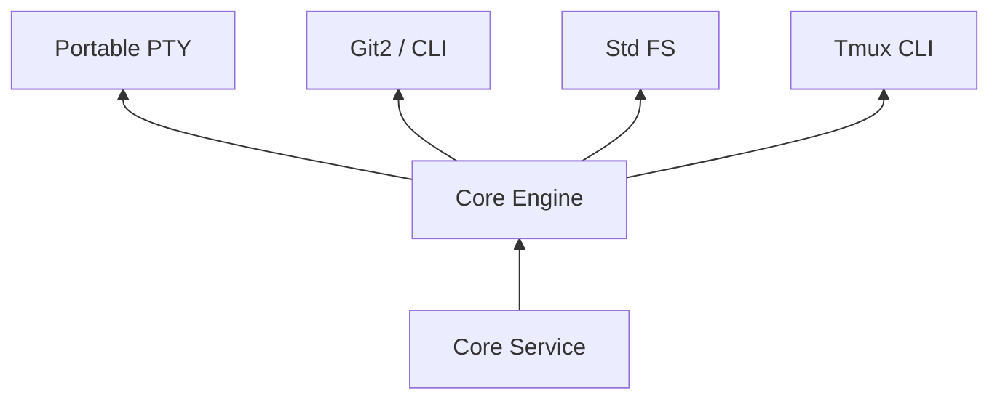

# 核心引擎 (Core Engine)

`core-engine` 是 Atmos 的底层技术支撑层。它封装了所有与操作系统、文件系统和外部工具（如 Git, Tmux）直接交互的逻辑。

## 模块目标

- **技术抽象**: 为上层业务逻辑提供统一、跨平台的技术接口。
- **安全性**: 确保所有底层操作（如文件读写）都在受控的范围内执行。
- **高性能**: 利用 Rust 的异步特性和底层系统调用，实现极低的 I/O 延迟。

## 核心组件

本章节将详细探讨以下核心组件：

- **[PTY, Git 与文件系统](./fs-git.md)**: 深入了解伪终端管理、自动化 Git 操作和安全的文件系统访问实现。
- **[Tmux 会话管理](./tmux.md)**: 了解我们如何利用 Tmux 实现终端会话的持久化。

## 架构位置

## 关键技术点

1. **异步 I/O**: 所有的文件和进程操作都尽量使用异步方式，避免阻塞主线程。
2. **错误处理**: 定义了详尽的错误类型，确保底层故障能被准确地传达给用户。
3. **资源隔离**: 通过严格的路径校验，防止跨目录访问风险。

## 下一步

- 深入了解 PTY 实现：**[PTY, Git 与文件系统](./fs-git.md)**。
- 探索会话持久化：**[Tmux 会话管理](./tmux.md)**。
