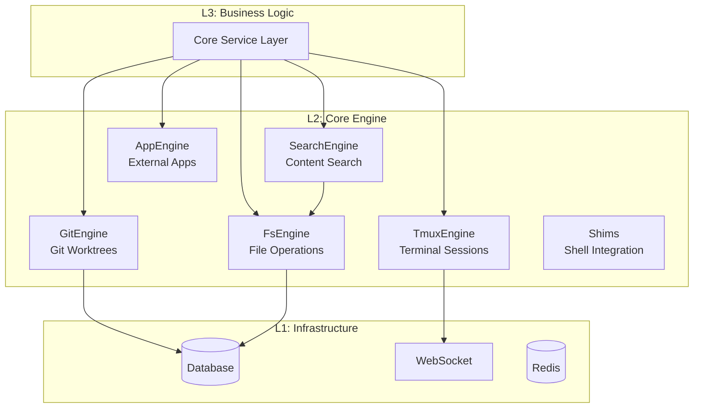
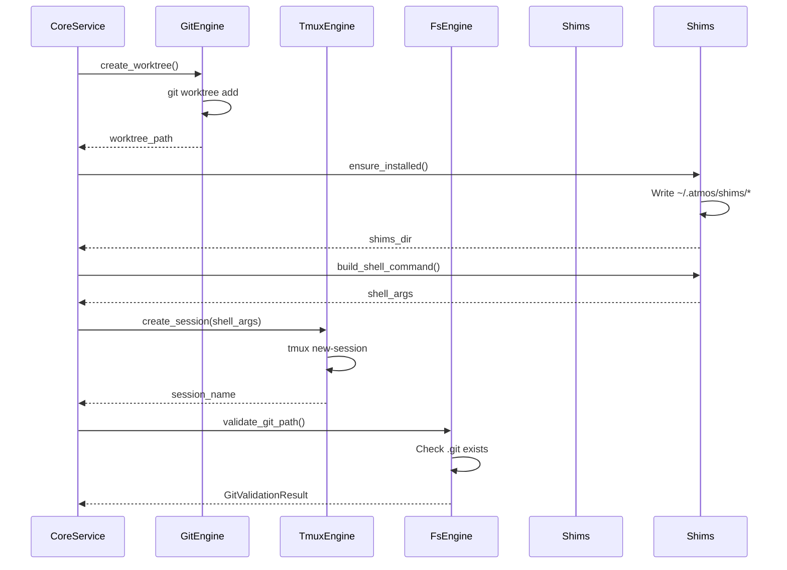

# Core Engine Layer

> **Reading Time**: 8 minutes
> **Level**: Intermediate
> **Last Updated**: 2025-02-11

## Overview

The Core Engine Layer is L2 of ATMOS's backend architecture, serving as the technical capabilities foundation that bridges infrastructure (L1) and business logic (L3). This layer encapsulates complex technical operations into clean, reusable interfaces, allowing the service layer to focus on business rules rather than implementation details.

## Architecture

The Core Engine Layer consists of several specialized engines, each handling a specific technical domain:

```rust
// Source: crates/core-engine/src/lib.rs
pub mod error;
pub mod fs;
pub mod git;
pub mod pty;
pub mod search;
pub mod shims;
pub mod test_engine;
pub mod tmux;
pub mod app;

pub use error::EngineError;
pub use fs::{FileTreeItem, FsEngine, FsEntry, GitValidationResult};
pub use git::{ChangedFileInfo, ChangedFilesInfo, FileDiffInfo, GitEngine, GitStatus, WorktreeInfo};
pub use search::{search_content, SearchMatch, SearchResult};
pub use tmux::{TmuxEngine, TmuxSessionInfo, TmuxVersion, TmuxWindowInfo};
pub use app::AppEngine;
```

## Layer Responsibilities



## Design Principles

### 1. **Single Responsibility**

Each engine handles one specific technical domain:

- **TmuxEngine**: Manages tmux sessions for terminal persistence
- **GitEngine**: Handles git worktree operations
- **FsEngine**: Provides file system navigation and validation
- **SearchEngine**: Executes content search using ripgrep
- **AppEngine**: Opens external applications

### 2. **Error Handling**

All engines use a unified error type:

```rust
// Source: crates/core-engine/src/error.rs
use thiserror::Error;

#[derive(Debug, Error)]
pub enum EngineError {
    #[error("Processing error: {0}")]
    Processing(String),

    #[error("PTY error: {0}")]
    Pty(String),

    #[error("Git error: {0}")]
    Git(String),

    #[error("Tmux error: {0}")]
    Tmux(String),

    #[error("FileSystem error: {0}")]
    FileSystem(String),

    #[error("Search error: {0}")]
    Search(String),
}

pub type Result<T> = std::result::Result<T, EngineError>;
```

This ensures consistent error handling across all engine operations.

### 3. **Command-Line Interface Wrapping**

Most engines wrap system CLI tools rather than implementing functionality directly:

```rust
// GitEngine wraps git commands
let output = Command::new("git")
    .current_dir(repo_path)
    .args(["worktree", "add", "-b", workspace_name, worktree_path, base_branch])
    .output()?;

// TmuxEngine wraps tmux commands
let output = Command::new("tmux")
    .arg("-S")
    .arg(self.socket_arg())
    .args(["new-session", "-d", "-s", session_name])
    .output()?;

// SearchEngine wraps ripgrep
let output = Command::new("rg")
    .arg("--json")
    .arg("--context").arg("2")
    .arg(query)
    .output()?;
```

This approach leverages battle-tested tools and reduces maintenance burden.

## Engine Details

### TmuxEngine

**Purpose**: Provides terminal session persistence across WebSocket disconnections.

**Key Features**:
- Custom socket path for isolation (`~/.atmos/atmos.sock`)
- Session naming convention: `atmos_{project}_{workspace}`
- Window-based terminal management
- Shell shim injection for dynamic titles
- OSC passthrough for escape sequences
- Mouse mode for scrollback
- Aggressive resize for grouped sessions

**Key Methods**:
```rust
// Session Management
pub fn create_session(&self, workspace_id: &str, cwd: Option<&str>, shell_command: Option<&[String]>) -> Result<String>
pub fn create_grouped_session(&self, target_session: &str, new_session: &str) -> Result<()>
pub fn kill_session(&self, session_name: &str) -> Result<()>

// Window Management
pub fn create_window(&self, session_name: &str, window_name: &str, cwd: Option<&str>, shell_command: Option<&[String]>) -> Result<u32>
pub fn get_pane_tty(&self, session_name: &str, window_index: u32) -> Result<String>
pub fn resize_pane(&self, session_name: &str, window_index: u32, cols: u16, rows: u16) -> Result<()>

// I/O Operations
pub fn send_keys(&self, session_name: &str, window_index: u32, keys: &str) -> Result<()>
pub fn capture_pane(&self, session_name: &str, window_index: u32, lines: Option<i32>) -> Result<String>

// Query Methods
pub fn get_pane_current_command(&self, session_name: &str, window_index: u32) -> Result<String>
pub fn get_pane_current_path(&self, session_name: &str, window_index: u32) -> Result<String>
```

**Configuration**:
```rust
// Default session size
"-x", "120",  // 120 columns
"-y", "30",   // 30 rows

// Options
"status", "off"                    // Disable status bar
"allow-passthrough", "on"          // Enable OSC sequences
"mouse", "on"                      // Enable mouse mode
"history-limit", "10000"           // Scrollback buffer
"aggressive-resize", "on"          // Per-client resize
"allow-rename", "off"              // Prevent shell renaming
```

### GitEngine

**Purpose**: Manages git worktree operations for isolated workspace environments.

**Key Features**:
- Worktree creation and removal
- Git status monitoring
- File change tracking with additions/deletions
- Commit, push, pull operations
- Branch management
- Remote synchronization

**Workspace Structure**:
```
~/.atmos/workspaces/
├── aruni/pikachu/          # Worktree for workspace "pikachu" in project "aruni"
├── atmos/logysk/           # Worktree for workspace "logysk" in project "atmos"
└── ...
```

**Key Methods**:
```rust
// Worktree Operations
pub fn create_worktree(&self, repo_path: &Path, workspace_name: &str, base_branch: &str) -> Result<PathBuf>
pub fn remove_worktree(&self, repo_path: &Path, workspace_name: &str) -> Result<()>
pub fn list_worktrees(&self, repo_path: &Path) -> Result<Vec<WorktreeInfo>>

// Status & Info
pub fn get_git_status(&self, repo_path: &Path) -> Result<GitStatus>
pub fn get_changed_files(&self, repo_path: &Path) -> Result<ChangedFilesInfo>
pub fn get_file_diff(&self, repo_path: &Path, file_path: &str) -> Result<FileDiffInfo>
pub fn get_current_branch(&self, repo_path: &Path) -> Result<String>

// Operations
pub fn commit_all(&self, repo_path: &Path, message: &str) -> Result<String>
pub fn push(&self, repo_path: &Path) -> Result<()>
pub fn stage_files(&self, repo_path: &Path, paths: &[String]) -> Result<()>
pub fn discard_unstaged(&self, repo_path: &Path, paths: &[String]) -> Result<()>
```

**Data Types**:
```rust
pub struct GitStatus {
    pub has_uncommitted_changes: bool,
    pub has_unpushed_commits: bool,
    pub uncommitted_count: u32,
    pub unpushed_count: u32,
}

pub struct ChangedFileInfo {
    pub path: String,
    pub status: String,        // "M", "A", "D", "R", "C"
    pub additions: u32,
    pub deletions: u32,
    pub staged: bool,
}

pub struct FileDiffInfo {
    pub file_path: String,
    pub old_content: String,
    pub new_content: String,
    pub status: String,
}
```

### FsEngine

**Purpose**: Provides file system navigation, validation, and project file listing.

**Key Features**:
- Directory listing with metadata
- Git ignore detection
- Binary file handling (base64 encoding)
- Path validation and expansion
- Recursive file tree building
- Smart ignore patterns

**Key Methods**:
```rust
// Directory Operations
pub fn list_dir(&self, path: &Path, dirs_only: bool, show_hidden: bool) -> Result<Vec<FsEntry>>
pub fn list_project_files(&self, root_path: &Path, show_hidden: bool) -> Result<Vec<FileTreeItem>>
pub fn get_parent(&self, path: &Path) -> Option<PathBuf>

// File Operations
pub fn read_file(&self, path: &Path) -> Result<(String, u64)>  // (content, size)
pub fn write_file(&self, path: &Path, content: &str) -> Result<()>

// Validation
pub fn validate_git_path(&self, path: &Path) -> GitValidationResult
pub fn expand_path(&self, path: &str) -> Result<PathBuf>
```

**Data Types**:
```rust
pub struct FsEntry {
    pub name: String,
    pub path: PathBuf,
    pub is_dir: bool,
    pub is_symlink: bool,
    pub is_ignored: bool,
    pub symlink_target: Option<String>,
    pub is_git_repo: bool,
}

pub struct FileTreeItem {
    pub name: String,
    pub path: PathBuf,
    pub is_dir: bool,
    pub is_symlink: bool,
    pub is_ignored: bool,
    pub symlink_target: Option<String>,
    pub children: Option<Vec<FileTreeItem>>,
}
```

**Ignore Patterns**:
```rust
fn should_skip_recursion(&self, name: &str) -> bool {
    matches!(
        name,
        "node_modules" | "target" | ".git" | ".next" |
        "dist" | "build" | ".turbo" | "__pycache__" |
        ".venv" | "venv" | ".idea" | ".vscode"
    )
}
```

### SearchEngine

**Purpose**: Executes content search using ripgrep with context and highlighting.

**Key Features**:
- Fast content search via ripgrep
- JSON output parsing
- Context before/after matches
- Match position tracking
- Configurable result limits
- Smart glob patterns

**API**:
```rust
pub fn search_content(
    root_path: &Path,
    query: &str,
    max_results: usize,
    case_sensitive: bool,
) -> Result<SearchResult>
```

**Data Types**:
```rust
pub struct SearchMatch {
    pub file_path: String,
    pub line_number: usize,
    pub line_content: String,
    pub match_start: usize,
    pub match_end: usize,
    pub context_before: Vec<String>,
    pub context_after: Vec<String>,
}

pub struct SearchResult {
    pub matches: Vec<SearchMatch>,
    pub truncated: bool,
}
```

### AppEngine

**Purpose**: Opens external applications (editors, terminals, file managers) by platform.

**Supported Platforms**: macOS, Windows, Linux

**Supported Applications**:
- **File Managers**: Finder, Explorer, Nautilus
- **Terminals**: Terminal, iTerm, Warp, Ghostty, PowerShell, Windows Terminal, Konsole
- **Editors**: VS Code, Cursor, Zed, Sublime Text, Xcode
- **JetBrains IDEs**: IntelliJ IDEA, WebStorm, PyCharm, DataGrip

**API**:
```rust
pub fn open_with_app(&self, app_name: &str, path: &str) -> Result<(), EngineError>
```

### Shims Module

**Purpose**: Manages shell integration for dynamic terminal titles.

**How It Works**:
1. Shim scripts are embedded at compile time
2. Written to `~/.atmos/shims/` at startup
3. Injected into shell sessions via tmux
4. Emit OSC 9999 sequences for title updates
5. xterm.js intercepts and displays titles

**Supported Shells**:
- **Bash**: `--init-file` flag
- **Zsh**: `ZDOTDIR` environment variable
- **Fish**: `--init-command` flag

**API**:
```rust
pub fn ensure_installed() -> Result<PathBuf>
pub fn detect_shell(explicit_shell: Option<&str>) -> String
pub fn build_shell_command(shims_dir: &Path, shell: Option<&str>) -> Option<Vec<String>>
```

## Integration Flow



## Performance Considerations

### 1. **Command Execution**

All engine operations spawn external processes:
- Use batch operations where possible
- Implement timeouts for long-running commands
- Cache expensive results (git status, file trees)

### 2. **Error Resilience**

```rust
// Graceful degradation
if let Err(e) = self.run_tmux(&["set-option", "-g", "allow-passthrough", "on"]) {
    debug!("Optional tmux option failed (older version?): {}", e);
}
```

### 3. **Resource Management**

- Tmux sessions persist across disconnections
- Git worktrees are cleaned up on workspace deletion
- File trees are limited to MAX_DEPTH (10 levels)

## Testing

The Core Engine Layer includes comprehensive unit tests:

```rust
#[cfg(test)]
mod tests {
    #[test]
    fn test_session_name_generation() {
        let engine = TmuxEngine::new();
        assert_eq!(
            engine.session_name("abc-def-123"),
            "atmos_abc_def_123"
        );
    }

    #[test]
    fn test_parse_workspace_id() {
        let engine = TmuxEngine::new();
        assert_eq!(
            engine.parse_workspace_id("atmos_abc_def_123"),
            Some("abc-def-123".to_string())
        );
    }
}
```

## Related Documentation

- **[Tmux Engine Deep Dive](./tmux.md)**: Terminal session management
- **[Git Engine Deep Dive](./git.md)**: Git worktree operations
- **[File System Engine Deep Dive](./fs.md)**: File operations and validation
- **[Infrastructure Layer](../infrastructure/)**: Database, WebSocket, Redis
- **[Core Service Layer](../core-service/)**: Business logic layer

## Further Reading

- **[tmux Source](https://github.com/tmux/tmux)**: tmux terminal multiplexer
- **[git-scm.com](https://git-scm.com/docs)**: Git documentation
- **[ripgrep](https://github.com/BurntSushi/ripgrep)**: Fast content search
