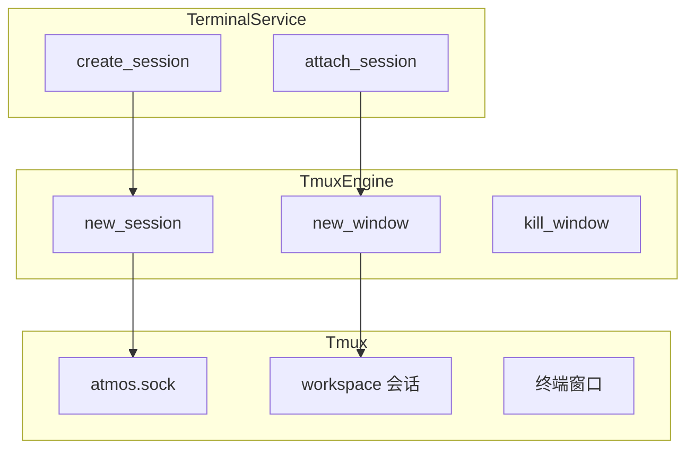
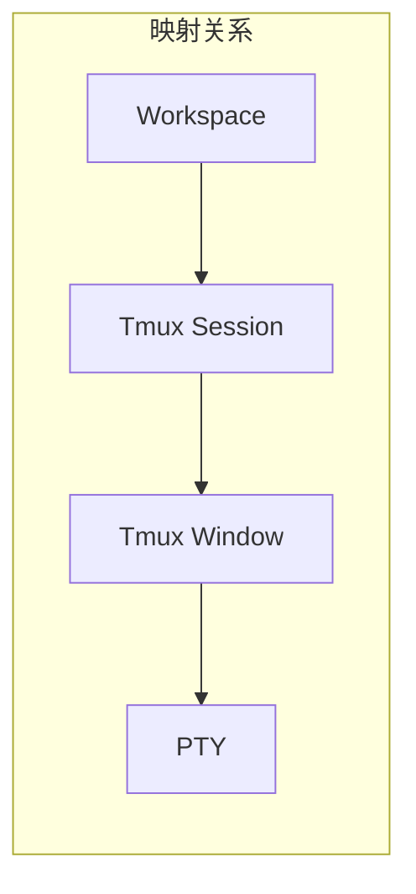
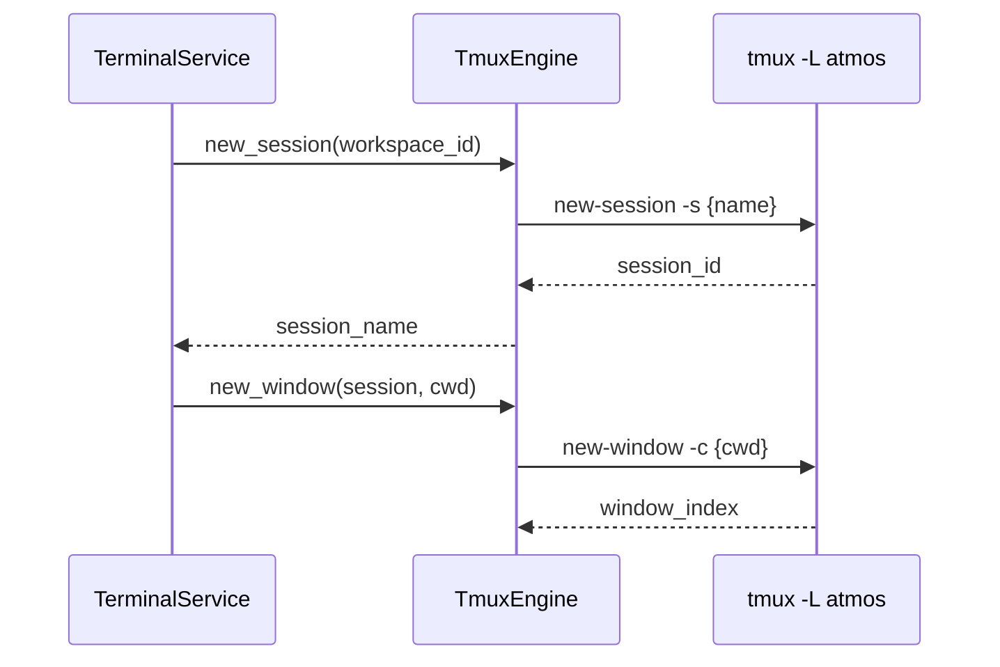

# Tmux 引擎

Tmux 引擎是 ATMOS 终端持久化的核心，通过 Tmux 会话实现 WebSocket 断开后终端状态保留。本文介绍 socket 隔离、会话与窗口映射、以及 L3 如何使用 Tmux 管理 PTY。

## Overview

`TmuxEngine` 使用自定义 socket 路径（`~/.atmos/atmos.sock`）与系统默认 Tmux 实例隔离。每个工作区对应一个 Tmux 会话，每个终端窗格对应一个 Tmux 窗口。API 通过 `tmux -L atmos` 调用，保证不会干扰用户已有的 Tmux 会话。

## Architecture

## Socket 隔离

Tmux 使用 `-L socket_name` 指定 socket，默认是 `default`。Atmos 使用 `atmos`，对应 `~/.atmos/atmos.sock`。这样同一台机器上可以有独立的 Tmux 服务，用户自己的 `tmux` 会话不受影响。

## 会话与窗口

- 工作区首次创建终端时，会为该工作区创建一个 Tmux 会话（名称由 workspace 推导）
- 每个终端窗格对应一个 Tmux 窗口，`new_window` 时指定 `-c cwd` 设置工作目录
- 关闭 PTY 连接时只 detach，不 kill window，实现“重连可恢复”

## 错误处理

`EngineError` 涵盖 Git、FileSystem、Tmux 等错误类型。Tmux 命令失败时返回 stderr，便于排查 branch 冲突、权限等问题。

## Key Source Files

| File | Purpose |
|------|---------|
| `crates/core-engine/src/tmux/mod.rs` | TmuxEngine 实现、socket 路径、命令封装 |
| `crates/core-service/src/service/terminal.rs` | TerminalService 调用 TmuxEngine |

## Next Steps

- **[终端服务](../core-service/terminal.md)** — PTY 与 Tmux 的完整协作
- **[Git 引擎](git.md)** — 工作区目录与 worktree 路径
