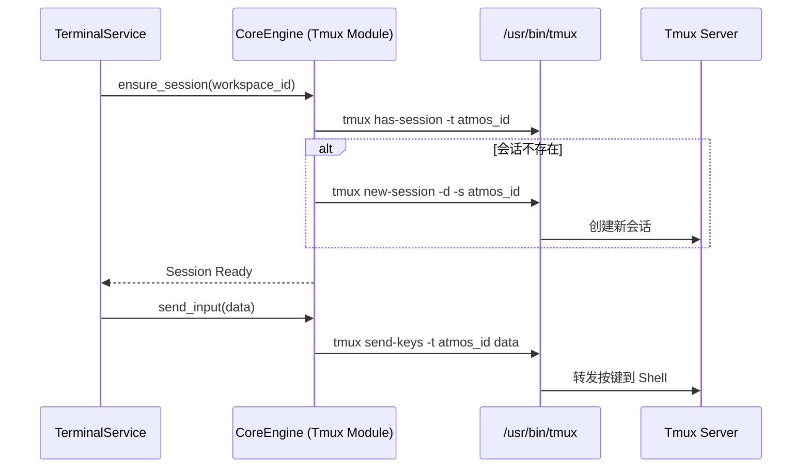

# Tmux 会话管理

Tmux (Terminal Multiplexer) 是 Atmos 实现“永不掉线”开发体验的核心技术支柱。通过将 PTY 进程托管在 Tmux 会话中，Atmos 成功解决了 Web 环境下进程生命周期与浏览器连接绑定的难题。本章将深入探讨 Atmos 如何在 Rust 中控制 Tmux，以及如何实现复杂的会话持久化逻辑。

## 为什么选择 Tmux？

在构建 Web 终端时，最常见的挑战是：当用户刷新页面或网络闪断时，后端启动的 Shell 进程会因为失去控制终端而退出。Tmux 提供了以下关键优势：

1. **解耦性**: Tmux Server 是一个独立的后台进程，不依赖于 Atmos 的 API 服务。
2. **持久化**: 会话可以被“分离”(Detach) 并在任何时候重新“附加”(Attach)。
3. **状态保持**: Tmux 负责维护终端的屏幕缓冲区、光标位置和环境变量。
4. **多面板支持**: 原生支持将一个窗口划分为多个面板，为 Atmos 的多终端布局提供了底层可能。

## 架构集成：Rust 与 Tmux 的对话

Atmos 并不直接实现 Tmux 协议，而是通过封装 `tmux` 命令行工具来与其交互。

### 会话管理流

## 核心实现细节

### 1. 会话命名规范
为了防止不同工作区之间的冲突，Atmos 采用统一的命名规则：`atmos_ws_{workspace_uuid}`。这确保了每个工作区都有一个全局唯一的 Tmux 会话。

### 2. 输出捕获：`pipe-pane` 技术
这是最复杂的部分。为了将 Tmux 的输出实时推送到 Web 端，Atmos 使用了 Tmux 的 `pipe-pane` 功能。
- **原理**: 我们启动一个辅助进程（如 `cat`），让 Tmux 将面板的所有输出重定向到这个进程的 `stdout`。
- **读取**: Atmos 的 Rust 后端异步读取这个辅助进程的流，并将其转发到 WebSocket。

### 3. 窗口大小同步 (Resizing)
当用户调整浏览器窗口大小时，前端会发送 `resize` 事件。Atmos 会将其转化为 `tmux resize-window` 指令。
- **挑战**: Tmux 默认会根据所有附加客户端的最小尺寸来调整窗口。Atmos 通过设置 `window-size smallest` 等选项来优化这一行为。

## 异常处理与资源清理

### Tmux 未安装处理
在 `core-engine` 初始化时，系统会检查 `tmux` 二进制文件是否存在。如果缺失，Atmos 会优雅地降级到“纯 PTY 模式”，并向用户发出警告。

### 孤儿会话清理
当工作区被删除时，`WorkspaceService` 会显式调用 `tmux kill-session`。此外，系统还包含一个定时任务，用于清理那些标记为已停止但 Tmux 会话依然存在的异常情况。

## 性能考量

- **指令开销**: 频繁调用 `tmux` 命令行会产生一定的 Fork 开销。Atmos 通过在内存中缓存会话状态，尽量减少不必要的查询指令。
- **内存占用**: 每个 Tmux 会话都会占用少量系统内存。对于拥有数百个工作区的服务器，Atmos 建议配置合理的归档策略。

## 关键源码分析

| 文件路径 | 核心职责 |
|:---|:---|
| `crates/core-engine/src/tmux/mod.rs` | 封装 `Command::new("tmux")`，实现所有基础指令。 |
| `crates/core-service/src/service/terminal.rs` | 决定何时创建 Tmux 会话，何时附加到现有会话。 |
| `apps/api/src/api/ws/terminal_handler.rs` | 将 WebSocket 输入转化为 Tmux 的 `send-keys` 指令。 |
| `crates/core-engine/src/error.rs` | 定义 Tmux 相关的错误类型（如：会话冲突、二进制文件缺失）。 |

## 总结

Tmux 会话管理是 Atmos 实现生产级稳定性的秘密武器。它不仅解决了连接不稳定的问题，还通过成熟的开源工具链为 Atmos 提供了强大的终端复用能力。通过 Rust 的精细控制，我们将这个古老的命令行工具转化为了现代云原生开发环境的核心组件。

## 下一步建议

- **[PTY, Git 与文件系统](./fs-git.md)**: 了解不使用 Tmux 时的基础 PTY 实现。
- **[终端服务实现](../core-service/terminal.md)**: 探索业务层如何调度这些 Tmux 会话。
- **[WebSocket 系统设计](../../deep-dive/infra/websocket.md)**: 了解 Tmux 输出是如何流向前端的。
- **[架构概览](../../getting-started/architecture.md)**: 查看 Tmux 在整体系统中的位置。
