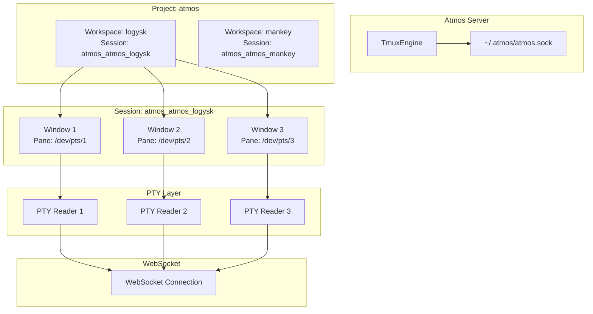

# Tmux Engine

> **Reading Time**: 12 minutes
> **Level**: Advanced
> **Last Updated**: 2025-02-11

## Overview

The `TmuxEngine` provides terminal session persistence for ATMOS by wrapping tmux (terminal multiplexer) operations. It enables workspaces to maintain terminal state across WebSocket disconnections, supports multiple terminal panes per workspace, and provides dynamic terminal title integration through shell shims.

## Architecture

### Session Model



### Socket Isolation

Atmos uses a custom tmux socket for isolation from user's local tmux sessions:

```rust
// Source: crates/core-engine/src/tmux/mod.rs
const TMUX_SOCKET_NAME: &str = "atmos";

pub struct TmuxEngine {
    socket_path: PathBuf,
}

impl TmuxEngine {
    pub fn new() -> Self {
        let socket_dir = dirs::home_dir()
            .map(|h| h.join(".atmos"))
            .unwrap_or_else(|| PathBuf::from("/tmp/.atmos"));

        Self {
            socket_path: socket_dir,
        }
    }

    fn socket_arg(&self) -> String {
        self.socket_path
            .join(format!("{}.sock", TMUX_SOCKET_NAME))
            .to_string_lossy()
            .to_string()
    }
}
```

**Benefits**:
- No interference with user's personal tmux sessions
- Complete control over session configuration
- Isolated lifecycle management

## Session Management

### Session Naming Convention

Sessions follow the pattern `atmos_{project}_{workspace}`:

```rust
// Source: crates/core-engine/src/tmux/mod.rs
pub fn session_name_from_names(&self, project_name: &str, workspace_name: &str) -> String {
    let sanitize = |s: &str| -> String {
        s.chars()
            .map(|c| if c.is_alphanumeric() || c == '-' { c } else { '_' })
            .collect::<String>()
            .trim_matches('_')
            .to_string()
    };

    let project = sanitize(project_name);
    let workspace = sanitize(workspace_name);

    // Avoid duplication if workspace already starts with project name
    let body = if workspace.starts_with(&project) &&
                  (workspace.len() == project.len() || workspace.as_bytes()[project.len()] == b'_') {
        workspace
    } else {
        format!("{}_{}", project, workspace)
    };

    format!("atmos_{}", body)
}
```

**Examples**:
- Project `atmos`, workspace `logysk` → `atmos_atmos_logysk`
- Project `kepano-obsidian`, workspace `kepano-obsidian/exeggutor` → `atmos_kepano-obsidian_exeggutor`

### Creating Sessions

```rust
// Source: crates/core-engine/src/tmux/mod.rs
pub fn create_session(
    &self,
    workspace_id: &str,
    cwd: Option<&str>,
    shell_command: Option<&[String]>,
) -> Result<String> {
    let session_name = self.session_name(workspace_id);
    self.create_session_internal(&session_name, cwd, shell_command)
}

fn create_session_internal(
    &self,
    session_name: &str,
    cwd: Option<&str>,
    shell_command: Option<&[String]>,
) -> Result<String> {
    if self.session_exists(session_name)? {
        info!("Tmux session already exists: {}", session_name);
        return Ok(session_name.to_string());
    }

    // Build command args
    let mut args: Vec<String> = vec![
        "new-session".to_string(),
        "-d".to_string(),              // Detached
        "-s".to_string(),              // Session name
        session_name.to_string(),
        "-n".to_string(),              // Window name
        "1".to_string(),
        "-x".to_string(),              // Columns
        "120".to_string(),
        "-y".to_string(),              // Rows
        "30".to_string(),
    ];

    if let Some(dir) = cwd {
        args.push("-c".to_string());
        args.push(dir.to_string());
    }

    if let Some(cmd) = shell_command {
        args.extend(cmd.iter().cloned());
    }

    self.run_tmux(&args.iter().map(|s| s.as_str()).collect::<Vec<_>>())?;

    // Apply configuration
    self.configure_session()?;

    Ok(session_name.to_string())
}
```

### Session Configuration

```rust
// Source: crates/core-engine/src/tmux/mod.rs
// Configuration applied after session creation

// Disable status bar
self.run_tmux(&["set-option", "-g", "status", "off"])?;

// Enable OSC passthrough for shell shims
self.run_tmux(&["set-option", "-g", "allow-passthrough", "on"])?;

// Enable mouse mode for scrollback
self.run_tmux(&["set-option", "-g", "mouse", "on"])?;

// Set scrollback buffer
self.run_tmux(&["set-option", "-g", "history-limit", "10000"])?;

// Aggressive resize for grouped sessions
self.run_tmux(&["set-option", "-g", "aggressive-resize", "on"])?;

// Prevent shell from renaming windows
self.run_tmux(&["set-option", "-g", "allow-rename", "off"])?;
self.run_tmux(&["set-option", "-g", "automatic-rename", "off"])?;
```

**Configuration Details**:

| Option | Value | Purpose |
|--------|-------|---------|
| `status` | `off` | Hide tmux status bar (clean UI) |
| `allow-passthrough` | `on` | Enable OSC sequences for dynamic titles |
| `mouse` | `on` | Enable mouse scrolling in copy mode |
| `history-limit` | `10000` | Scrollback buffer size |
| `aggressive-resize` | `on` | Per-client window sizing |
| `allow-rename` | `off` | Prevent shell from renaming windows |
| `automatic-rename` | `off` | Keep window names stable |

**Note on Alternate Screen**:
```rust
// We intentionally do NOT disable the alternate screen buffer
// (smcup@:rmcup@). Keeping it enabled is critical for correct
// resize behavior. Without it, tmux's screen redraw after SIGWINCH
// pushes old content into xterm.js scrollback.
```

## Window Management

### Creating Windows

```rust
// Source: crates/core-engine/src/tmux/mod.rs
pub fn create_window(
    &self,
    session_name: &str,
    window_name: &str,
    cwd: Option<&str>,
    shell_command: Option<&[String]>,
) -> Result<u32> {
    // Build new-window command
    let mut args: Vec<String> = vec![
        "new-window".to_string(),
        "-t".to_string(),
        session_name.to_string(),
        "-n".to_string(),
        window_name.to_string(),
        "-P".to_string(),              // Print window index
        "-F".to_string(),              // Format
        "#{window_index}".to_string(),
    ];

    if let Some(dir) = cwd {
        args.push("-c".to_string());
        args.push(dir.to_string());
    }

    if let Some(cmd) = shell_command {
        args.extend(cmd.iter().cloned());
    }

    let output = self.run_tmux(&args.iter().map(|s| s.as_str()).collect::<Vec<_>>())?;
    let index = output.parse::<u32>()?;

    info!("Created tmux window: {}:{} (index: {})", session_name, window_name, index);
    Ok(index)
}
```

### PTY Bridge

Each window pane has a PTY device that bridges to the PTY layer:

```rust
// Source: crates/core-engine/src/tmux/mod.rs
pub fn get_pane_tty(&self, session_name: &str, window_index: u32) -> Result<String> {
    let target = format!("{}:{}.0", session_name, window_index);
    let tty = self.run_tmux(&[
        "display-message",
        "-t", &target,
        "-p",
        "#{pane_tty}"
    ])?;

    if tty.is_empty() {
        return Err(EngineError::Tmux(format!("No TTY found for {}", target)));
    }

    debug!("Got PTY for {}: {}", target, tty);
    Ok(tty)
}
```

**PTY Flow**:
```
Tmux Window → /dev/pts/N → PTY Reader → WebSocket → xterm.js
```

### Pane Information

```rust
// Get current foreground command
pub fn get_pane_current_command(&self, session_name: &str, window_index: u32) -> Result<String> {
    let target = format!("{}:{}.0", session_name, window_index);
    let cmd = self.run_tmux(&[
        "display-message",
        "-t", &target,
        "-p",
        "#{pane_current_command}"
    ])?;
    Ok(cmd.trim().to_string())
}

// Get current working directory (via OSC 7)
pub fn get_pane_current_path(&self, session_name: &str, window_index: u32) -> Result<String> {
    let target = format!("{}:{}.0", session_name, window_index);
    let path = self.run_tmux(&[
        "display-message",
        "-t", &target,
        "-p",
        "#{pane_current_path}"
    ])?;
    Ok(path.trim().to_string())
}
```

### Window Operations

```rust
// Resize pane
pub fn resize_pane(&self, session_name: &str, window_index: u32, cols: u16, rows: u16) -> Result<()> {
    let target = format!("{}:{}.0", session_name, window_index);
    self.run_tmux(&[
        "resize-pane",
        "-t", &target,
        "-x", &cols.to_string(),
        "-y", &rows.to_string(),
    ])?;
    Ok(())
}

// Kill window
pub fn kill_window(&self, session_name: &str, window_index: u32) -> Result<()> {
    let target = format!("{}:{}", session_name, window_index);
    self.run_tmux(&["kill-window", "-t", &target])?;
    info!("Killed tmux window: {}", target);
    Ok(())
}

// Rename window
pub fn rename_window(&self, session_name: &str, window_index: u32, new_name: &str) -> Result<()> {
    let target = format!("{}:{}", session_name, window_index);
    self.run_tmux(&["rename-window", "-t", &target, new_name])?;
    debug!("Renamed window {} to {}", target, new_name);
    Ok(())
}
```

## Input/Output

### Sending Input

```rust
// Source: crates/core-engine/src/tmux/mod.rs
pub fn send_keys(&self, session_name: &str, window_index: u32, keys: &str) -> Result<()> {
    let target = format!("{}:{}", session_name, window_index);
    self.run_tmux(&["send-keys", "-t", &target, "-l", keys])?;
    Ok(())
}
```

The `-l` flag sends keys as literal text, preventing interpretation of special characters.

### Capturing Output

```rust
// Source: crates/core-engine/src/tmux/mod.rs
pub fn capture_pane(&self, session_name: &str, window_index: u32, lines: Option<i32>) -> Result<String> {
    let target = format!("{}:{}.0", session_name, window_index);
    let start_line = lines.map(|l| format!("-{}", l)).unwrap_or_else(|| "-".to_string());

    let content = self.run_tmux(&[
        "capture-pane",
        "-t", &target,
        "-p",              // Print to stdout
        "-S", &start_line, // Start line
    ])?;

    Ok(content)
}
```

Used for potential session restore or debugging.

## Shell Integration

### Dynamic Titles

Atmos injects shell shims to enable dynamic terminal titles (similar to iTerm2):

```rust
// Source: crates/core-engine/src/shims/mod.rs
pub fn build_shell_command(shims_dir: &Path, shell: Option<&str>) -> Option<Vec<String>> {
    let shell_name = detect_shell(shell);

    match shell_name.as_str() {
        "bash" => {
            let shim_path = shims_dir.join("atmos_shim.bash");
            Some(vec![
                shell_path,
                "--init-file".to_string(),
                shim_path.to_string_lossy().to_string(),
            ])
        }
        "zsh" => {
            let zdotdir = shims_dir.join("zdotdir");
            Some(vec![
                "env".to_string(),
                format!("ZDOTDIR={}", zdotdir.to_string_lossy()),
                shell_path,
            ])
        }
        "fish" => {
            let shim_path = shims_dir.join("atmos_shim.fish");
            Some(vec![
                shell_path,
                "--init-command".to_string(),
                format!("source {}", shim_path.to_string_lossy()),
            ])
        }
        _ => None
    }
}
```

### OSC Passthrough

The `allow-passthrough` option allows escape sequences through tmux:

```rust
// OSC 9999 sequence for title updates
// Emit by shell: \033]9999;title\007
// xterm.js receives and updates tab title
```

## Grouped Sessions

For advanced scenarios, tmux supports grouped sessions that share windows:

```rust
// Source: crates/core-engine/src/tmux/mod.rs
pub fn create_grouped_session(&self, target_session: &str, new_session: &str) -> Result<()> {
    if self.session_exists(new_session)? {
        return Ok(());
    }

    self.run_tmux(&[
        "new-session",
        "-d",
        "-t", target_session,
        "-s", new_session,
    ])?;

    debug!("Created grouped tmux session '{}' linked to '{}'", new_session, target_session);
    Ok(())
}
```

**Use Case**: Multiple views into the same workspace with different active windows.

## Lifecycle Management

### Session Cleanup

```rust
// Source: crates/core-engine/src/tmux/mod.rs
pub fn cleanup_orphaned_sessions(&self, valid_workspace_ids: &[String]) -> Result<Vec<String>> {
    let sessions = self.list_atmos_sessions()?;
    let mut cleaned = vec![];

    for session in sessions {
        if let Some(workspace_id) = self.parse_workspace_id(&session.name) {
            if !valid_workspace_ids.contains(&workspace_id) {
                self.kill_session(&session.name)?;
                cleaned.push(session.name);
            }
        }
    }

    if !cleaned.is_empty() {
        info!("Cleaned up {} orphaned tmux sessions", cleaned.len());
    }

    Ok(cleaned)
}
```

### Server Operations

```rust
// Kill entire tmux server
pub fn kill_server(&self) -> Result<()> {
    self.run_tmux(&["kill-server"])?;
    info!("Killed tmux server");
    Ok(())
}

// Get server PID
pub fn get_server_pid(&self) -> Option<u32> {
    self.run_tmux(&["display-message", "-p", "#{pid}"])
        .ok()
        .and_then(|s| s.trim().parse().ok())
}

// Get server start time
pub fn get_server_start_time(&self) -> Option<u64> {
    self.run_tmux(&["display-message", "-p", "#{start_time}"])
        .ok()
        .and_then(|s| s.trim().parse().ok())
}
```

## Query Operations

### Listing Sessions

```rust
// Source: crates/core-engine/src/tmux/mod.rs
pub fn list_sessions(&self) -> Result<Vec<TmuxSessionInfo>> {
    let output = self.run_tmux(&[
        "list-sessions",
        "-F",
        "#{session_name}|#{session_windows}|#{session_created_string}|#{session_attached}",
    ])?;

    if output.is_empty() {
        return Ok(vec![]);
    }

    let sessions = output
        .lines()
        .filter_map(|line| {
            let parts: Vec<&str> = line.split('|').collect();
            if parts.len() >= 4 {
                Some(TmuxSessionInfo {
                    name: parts[0].to_string(),
                    windows: parts[1].parse().unwrap_or(0),
                    created: parts[2].to_string(),
                    attached: parts[3] == "1",
                })
            } else {
                None
            }
        })
        .collect();

    Ok(sessions)
}

pub fn list_atmos_sessions(&self) -> Result<Vec<TmuxSessionInfo>> {
    let all_sessions = self.list_sessions()?;
    Ok(all_sessions
        .into_iter()
        .filter(|s| s.name.starts_with("atmos_"))
        .collect())
}
```

### Listing Windows

```rust
// Source: crates/core-engine/src/tmux/mod.rs
pub fn list_windows(&self, session_name: &str) -> Result<Vec<TmuxWindowInfo>> {
    let output = self.run_tmux(&[
        "list-windows",
        "-t", session_name,
        "-F",
        "#{window_index}|#{window_name}|#{window_active}|#{window_panes}",
    ])?;

    if output.is_empty() {
        return Ok(vec![]);
    }

    let windows = output
        .lines()
        .filter_map(|line| {
            let parts: Vec<&str> = line.split('|').collect();
            if parts.len() >= 4 {
                Some(TmuxWindowInfo {
                    index: parts[0].parse().unwrap_or(0),
                    name: parts[1].to_string(),
                    active: parts[2] == "1",
                    panes: parts[3].parse().unwrap_or(1),
                })
            } else {
                None
            }
        })
        .collect();

    Ok(windows)
}
```

## Error Handling

```rust
// Source: crates/core-engine/src/tmux/mod.rs
fn run_tmux(&self, args: &[&str]) -> Result<String> {
    self.ensure_socket_dir()?;

    let output = Command::new("tmux")
        .arg("-f")
        .arg("/dev/null")  // Isolate from ~/.tmux.conf
        .arg("-S")
        .arg(self.socket_arg())
        .args(args)
        .output()
        .map_err(|e| EngineError::Tmux(format!("Failed to execute tmux: {}", e)))?;

    if output.status.success() {
        Ok(String::from_utf8_lossy(&output.stdout).trim().to_string())
    } else {
        let stderr = String::from_utf8_lossy(&output.stderr).trim().to_string();
        // Some "errors" are expected
        if stderr.contains("no server running") || stderr.contains("no sessions") {
            Ok(String::new())
        } else {
            Err(EngineError::Tmux(format!("tmux error: {}", stderr)))
        }
    }
}
```

## Version Detection

```rust
// Source: crates/core-engine/src/tmux/mod.rs
pub fn get_version() -> Result<TmuxVersion> {
    let output = Command::new("tmux")
        .arg("-V")
        .output()
        .map_err(|e| EngineError::Tmux(format!("Failed to get tmux version: {}", e)))?;

    if !output.status.success() {
        return Err(EngineError::Tmux("tmux -V failed".to_string()));
    }

    let raw = String::from_utf8_lossy(&output.stdout).trim().to_string();
    let version_str = raw
        .strip_prefix("tmux ")
        .unwrap_or(&raw)
        .chars()
        .take_while(|c| c.is_ascii_digit() || *c == '.')
        .collect::<String>();

    let parts: Vec<&str> = version_str.split('.').collect();
    let major = parts.first().and_then(|s| s.parse().ok()).unwrap_or(0);
    let minor = parts.get(1).and_then(|s| s.parse().ok()).unwrap_or(0);

    Ok(TmuxVersion { major, minor, raw })
}

impl TmuxVersion {
    pub fn at_least(&self, major: u32, minor: u32) -> bool {
        self.major > major || (self.major == major && self.minor >= minor)
    }
}
```

## Testing

```rust
// Source: crates/core-engine/src/tmux/mod.rs
#[cfg(test)]
mod tests {
    #[test]
    fn test_session_name_generation() {
        let engine = TmuxEngine::new();
        assert_eq!(
            engine.session_name("abc-def-123"),
            "atmos_abc_def_123"
        );
    }

    #[test]
    fn test_version_at_least() {
        let v = TmuxVersion {
            major: 3,
            minor: 4,
            raw: "tmux 3.4".to_string(),
        };
        assert!(v.at_least(3, 4));
        assert!(v.at_least(3, 3));
        assert!(!v.at_least(3, 5));
    }
}
```

## Related Documentation

- **[Shell Shims](https://github.com/atmos-engine/atmos/tree/main/crates/core-engine/src/shims)**: Dynamic title implementation
- **[PTY Layer](../pty.md)**: PTY reader integration
- **[Core Engine Overview](./index.md)**: Layer architecture

## External Resources

- **[tmux Manual](https://man.openbsd.org/tmux.1)**: Official tmux documentation
- **[tmux Wiki](https://github.com/tmux/tmux/wiki)**: Community documentation
- **[OSC Codes](https://iterm2.com/documentation-escape-codes.html)**: Escape sequence reference
