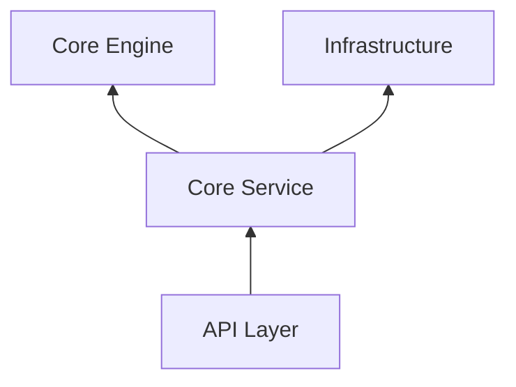

# 业务逻辑 (Core Service)

`core-service` 是 Atmos 的核心业务层。它不直接处理 HTTP 请求，也不直接操作底层 PTY，而是作为“指挥官”，协调 `infra` 和 `core-engine` 来实现复杂的业务流程。

## 模块目标

- **业务建模**: 定义项目、工作区、终端等核心业务实体的行为。
- **流程编排**: 组合多个底层操作（如：创建目录 -> 克隆代码 -> 启动 PTY）来完成一个业务目标。
- **状态管理**: 维护业务实体的生命周期状态。

## 核心组件

本章节包含以下深度解析：

- **[工作区生命周期](./workspace.md)**: 探索工作区从创建到归档的完整状态机实现。
- **[终端服务实现](./terminal.md)**: 了解终端会话的管理、流调度以及异常处理。

## 架构位置

## 核心服务类

1. **WorkspaceService**: 处理所有与工作区相关的逻辑。
2. **ProjectService**: 管理项目元数据和 Git 仓库关联。
3. **TerminalService**: 调度终端资源和数据流。

## 设计原则

- **解耦**: 通过 Trait 和依赖注入（在 API 层完成），确保业务逻辑不依赖于具体的数据库或 PTY 实现。
- **健壮性**: 每一个业务操作都包含详尽的参数校验和错误回滚逻辑。

## 下一步

- 深入了解工作区管理：**[工作区生命周期](./workspace.md)**。
- 了解终端如何运作：**[终端服务实现](./terminal.md)**。
