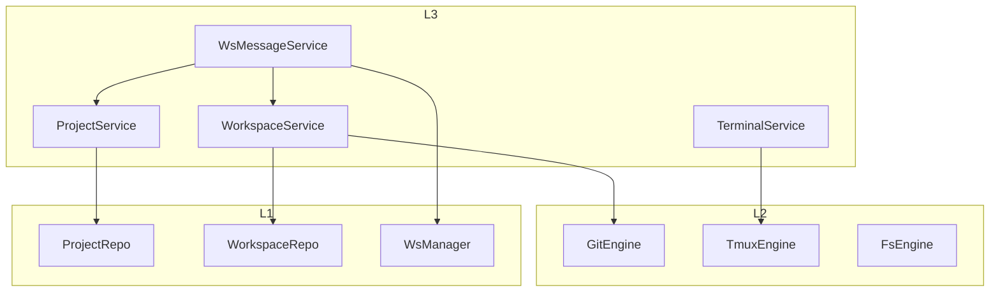
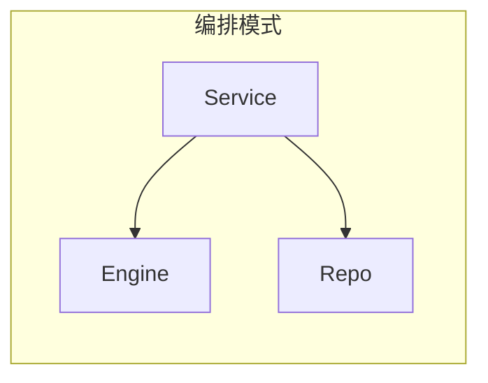

# 业务服务层

业务服务层（L3）实现 ATMOS 的核心业务逻辑，编排 L2 引擎与 L1 仓库。本文概述各服务职责、依赖关系以及与 API 层的协作方式。

## Overview

L3 对应 `crates/core-service`，包含 `ProjectService`、`WorkspaceService`、`TerminalService`、`WsMessageService`、`TestService`、`MessagePushService` 等。服务通过构造函数注入 DB、引擎等依赖，在 `main.rs` 中装配后传入 AppState。

## Architecture

## 服务职责

| 服务 | 职责 |
|------|------|
| ProjectService | 项目 CRUD、仓库路径管理 |
| WorkspaceService | 工作区创建/删除/列表、worktree 协调 |
| TerminalService | PTY 会话、Tmux 窗口、WebSocket 输出 |
| WsMessageService | 处理 WebSocket 业务消息，调用 Project/Workspace/Git/Fs |
| TestService | 演示用服务 |
| MessagePushService | 消息状态管理 |

## Key Source Files

| File | Purpose |
|------|---------|
| `crates/core-service/src/lib.rs` | 服务导出 |
| `crates/core-service/src/service/mod.rs` | 服务模块 |
| `apps/api/src/main.rs` | 服务装配与注入 |

## Next Steps

- **[工作区服务](workspace.md)** — 工作区完整生命周期
- **[终端服务](terminal.md)** — PTY 与 Tmux 协作
- **[项目服务](project.md)** — 项目 CRUD 与元数据
