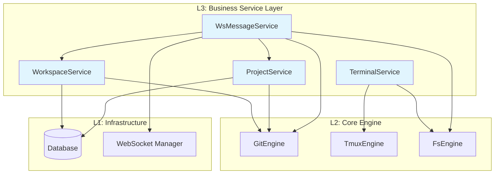
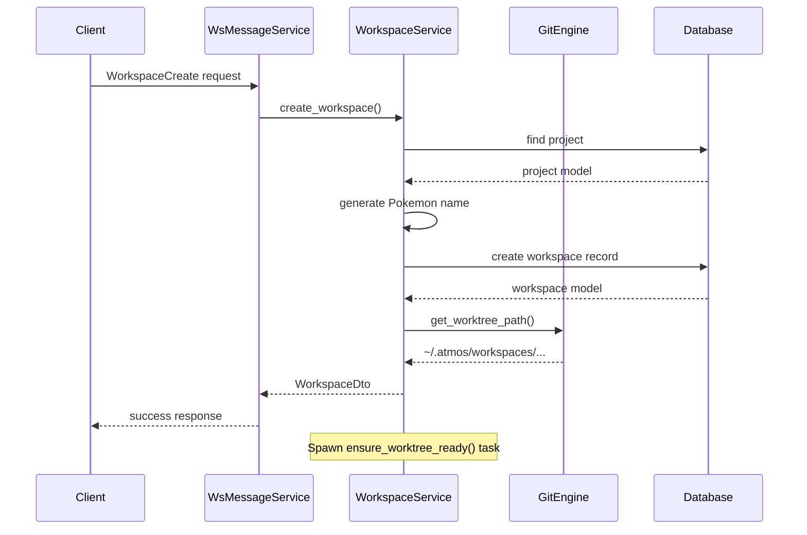
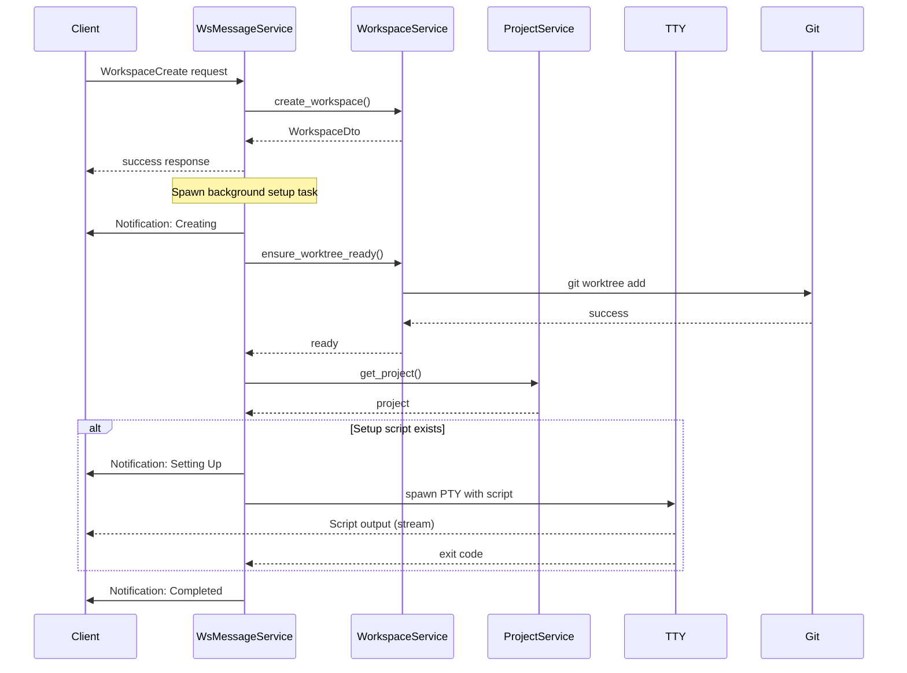

# Business Service Layer

> **Architecture Level:** L3 - Business Logic Layer
>
> **Reading Time:** 8 minutes
>
> **Source Files:** 6+ referenced

---

## Overview

The Business Service Layer (`crates/core-service/`) is the orchestrator of ATMOS's backend architecture. Sitting at Layer 3, it translates business requirements into coordinated operations across the Core Engine (L2) and Infrastructure (L1) layers. While the Engine layer provides technical capabilities (PTY, Git, FS) and Infra provides data persistence, the Service layer defines **what operations are possible** and **how they relate to business concepts**.



---

## Architecture Principles

### 1. Dependency Inversion

The service layer depends on abstractions (repositories, engines) rather than concrete implementations. This is evident in how services are constructed:

```rust
// From /crates/core-service/src/service/workspace.rs
pub struct WorkspaceService {
    db: Arc<DatabaseConnection>,
    git_engine: GitEngine,
}

impl WorkspaceService {
    pub fn new(db: Arc<DatabaseConnection>) -> Self {
        Self {
            db,
            git_engine: GitEngine::new(),
        }
    }
}
```

Services receive database connections as `Arc<DatabaseConnection>` for thread-safe sharing, while engines like `GitEngine` are instantiated directly. This design allows:
- **Testability**: Database connections can be mocked
- **Concurrency**: Multiple handlers can share the same service instance
- **Lifecycle Control**: Engines with internal state (like `TmuxEngine`) can be managed centrally

### 2. DTO Pattern for Enrichment

Services return Data Transfer Objects (DTOs) that combine database models with computed fields from other layers:

```rust
// From /crates/core-service/src/service/workspace.rs
#[derive(Serialize)]
pub struct WorkspaceDto {
    #[serde(flatten)]
    pub model: workspace::Model,  // Database fields
    pub local_path: String,        // Computed from GitEngine
}
```

The `local_path` field is computed by calling `git_engine.get_worktree_path(&model.name)` on each query. This keeps the database schema simple while providing rich data to clients.

### 3. Error Translation

The service layer defines its own error type that wraps errors from lower layers:

```rust
// From /crates/core-service/src/error.rs
#[derive(Debug, Error)]
pub enum ServiceError {
    #[error("Engine error: {0}")]
    Engine(#[from] core_engine::EngineError),

    #[error("Infrastructure error: {0}")]
    Infra(#[from] infra::InfraError),

    #[error("Repository error: {0}")]
    Repository(String),

    #[error("Validation error: {0}")]
    Validation(String),

    #[error("Not found: {0}")]
    NotFound(String),
}

pub type Result<T> = std::result::Result<T, ServiceError>;
```

This unified error type allows handlers to provide consistent error responses regardless of which layer the error originated from.

---

## Core Services

### WorkspaceService

**File:** `/crates/core-service/src/service/workspace.rs`

`WorkspaceService` manages git worktrees for parallel development. Its responsibilities include:

- **Workspace Creation**: Generates unique names using Pokemon-based naming, creates git worktrees
- **Path Resolution**: Computes `local_path` for each workspace via `GitEngine.get_worktree_path()`
- **Lifecycle Management**: Pin, archive, soft-delete workspaces
- **Background Setup**: Asynchronously ensures worktrees are ready after creation

**Key Integration Points:**
- `WorkspaceRepo` for database persistence
- `GitEngine` for worktree operations
- `ProjectRepo` for fetching project metadata during workspace creation

### ProjectService

**File:** `/crates/core-service/src/service/project.rs`

`ProjectService` handles repository-level operations:

- **CRUD Operations**: Create, list, update, delete projects
- **Validation**: Ensures repositories can be deleted (no active workspaces)
- **Cleanup**: Removes worktrees when deleting projects

**Key Integration Points:**
- `ProjectRepo` for database operations
- `GitEngine` for worktree cleanup during deletion
- `WorkspaceRepo` for cascading soft-deletes

### TerminalService

**File:** `/crates/core-service/src/service/terminal.rs`

`TerminalService` manages PTY sessions with tmux persistence:

- **Session Types**: Supports both Tmux-backed (`SessionType::Tmux`) and simple PTY (`SessionType::Simple`) sessions
- **Lifecycle Management**: Create, attach, resize, close, and destroy sessions
- **Concurrency Control**: Per-workspace locks prevent race conditions during session creation
- **Cleanup**: Gracefully shuts down all sessions on application exit

**Key Integration Points:**
- `TmuxEngine` for session and window management
- `portable-pty` crate for PTY operations
- Tokio channels for inter-thread communication

### WsMessageService

**File:** `/crates/core-service/src/service/ws_message.rs`

`WsMessageService` implements the `WsMessageHandler` trait to route WebSocket requests:

```rust
// From /crates/core-service/src/service/ws_message.rs
#[async_trait]
impl WsMessageHandler for WsMessageService {
    async fn handle_message(&self, conn_id: &str, message: &str) -> Option<String> {
        // Parse incoming message
        // Route to appropriate handler
        // Return response
    }
}
```

**Handler Categories:**
- **File System**: `FsListDir`, `FsReadFile`, `FsWriteFile`, `FsSearchContent`
- **Git**: `GitGetStatus`, `GitListBranches`, `GitCommit`, `GitPush`
- **Project**: `ProjectList`, `ProjectCreate`, `ProjectDelete`, `ProjectUpdate`
- **Workspace**: `WorkspaceList`, `WorkspaceCreate`, `WorkspaceDelete`, `WorkspaceArchive`
- **Scripts**: `ScriptGet`, `ScriptSave` (for setup scripts)

---

## Data Flow Patterns

### Request-Response via WebSocket



The request-response pattern is synchronous from the client's perspective, but services may spawn background tasks (like `ensure_worktree_ready`) for long-running operations.

### Service-to-Service Communication

Services communicate through shared dependencies (database, engines) rather than direct method calls. For example, `WsMessageService` holds references to `ProjectService` and `WorkspaceService`:

```rust
// From /crates/core-service/src/service/ws_message.rs
pub struct WsMessageService {
    fs_engine: FsEngine,
    git_engine: GitEngine,
    app_engine: core_engine::AppEngine,
    project_service: Arc<ProjectService>,
    workspace_service: Arc<WorkspaceService>,
    ws_manager: OnceCell<Arc<infra::WsManager>>,
}
```

Services are wrapped in `Arc` to enable sharing across WebSocket connections without cloning.

---

## Error Handling

The service layer uses Rust's `?` operator extensively for error propagation:

```rust
// From /crates/core-service/src/service/workspace.rs
pub async fn create_workspace(
    &self,
    project_guid: String,
    name: String,
    branch: String,
    sidebar_order: i32,
) -> Result<WorkspaceDto> {
    let project_repo = ProjectRepo::new(&self.db);
    let project = project_repo
        .find_by_guid(&project_guid)
        .await?
        .ok_or_else(|| ServiceError::NotFound(format!("Project {} not found", project_guid)))?;

    // ... more operations ...
}
```

Errors from repositories (`infra::db::repo`) and engines (`core_engine`) are automatically converted to `ServiceError` via `From` implementations, then returned to the WebSocket handler for JSON serialization.

---

## Concurrency Model

### Thread-Safe Services

Services use `Arc<DatabaseConnection>` for sharing across async tasks. Since `DatabaseConnection` from SeaORM is thread-safe (via underlying connection pooling), multiple WebSocket handlers can use the same service instance concurrently.

### Per-Workspace Locks

`TerminalService` uses a map of `Arc<Mutex<()>>` to prevent concurrent session creation for the same workspace:

```rust
// From /crates/core-service/src/service/terminal.rs
pub struct TerminalService {
    sessions: Arc<Mutex<HashMap<String, SessionHandle>>>,
    tmux_engine: Arc<TmuxEngine>,
    creation_locks: Arc<Mutex<HashMap<String, Arc<Mutex<()>>>>>,
    // ...
}

async fn get_creation_lock(&self, tmux_session_name: &str) -> Arc<Mutex<()>> {
    let mut locks = self.creation_locks.lock().await;
    locks.entry(tmux_session_name.to_string())
        .or_insert_with(|| Arc::new(Mutex::new(())))
        .clone()
}
```

This prevents race conditions when multiple terminals for the same workspace are created simultaneously (e.g., React Strict Mode double-mount).

---

## Extension Points

### Adding a New Service

1. **Create the service struct** in `/crates/core-service/src/service/`
2. **Implement business methods** that coordinate repos and engines
3. **Add to lib.rs exports** for downstream usage
4. **Wire in WsMessageService** for WebSocket access

Example structure:
```rust
pub struct MyService {
    db: Arc<DatabaseConnection>,
    my_engine: MyEngine,
}

impl MyService {
    pub fn new(db: Arc<DatabaseConnection>) -> Self { ... }
    pub async fn do_something(&self) -> Result<ResponseDto> { ... }
}
```

### Adding a New WebSocket Handler

1. **Define the request type** in `/crates/infra/src/`
2. **Add `WsAction` variant** for routing
3. **Implement handler method** in `WsMessageService`
4. **Route in `handle_action()`** method

---

## Testing Considerations

Services are designed for testability through dependency injection:

```rust
#[cfg(test)]
mod tests {
    use super::*;

    #[tokio::test]
    async fn test_workspace_list() {
        // Setup: Create test database connection
        let db = Arc::new(create_test_db().await);
        let service = WorkspaceService::new(db);

        // Exercise: Call service method
        let workspaces = service.list_by_project("test-guid".to_string()).await.unwrap();

        // Assert: Verify results
        assert!(workspaces.is_empty());
    }
}
```

---

## MessagePushService

**File:** `/crates/core-service/src/service/message_push.rs`

`MessagePushService` handles outgoing WebSocket messages for real-time updates:

```rust
// From /crates/core-service/src/lib.rs
pub use service::message_push::MessagePushService;
```

**Responsibilities:**
- **Broadcasting**: Send messages to all connected clients
- **Targeted Messaging**: Send messages to specific connections
- **Event Notifications**: Handle workspace setup progress, terminal output

**Integration:**
- Used by `WsMessageService` for background task notifications
- Coordinates with `WsManager` for connection management

---

## TestService

**File:** `/crates/core-service/src/service/test.rs`

`TestService` provides testing utilities for the service layer:

```rust
// From /crates/core-service/src/lib.rs
pub use service::test::TestService;
```

**Use Cases:**
- Integration testing with real database connections
- Test data seeding and cleanup
- Service method validation

---

## Workspace Setup Process

The `WsMessageService` orchestrates a multi-step workspace setup process after workspace creation:



The setup process runs asynchronously in the background, sending progress updates via WebSocket notifications. This keeps the API responsive while handling slow operations (git worktree creation, running setup scripts).

---

## Async Task Patterns

### Background Worktree Creation

Workspace creation spawns a background task to avoid blocking the API response:

```rust
// From /crates/core-service/src/service/ws_message.rs
async fn handle_workspace_create(&self, conn_id: &str, req: WorkspaceCreateRequest) -> Result<Value> {
    let workspace = self
        .workspace_service
        .create_workspace(req.project_guid.clone(), req.name, req.branch, req.sidebar_order)
        .await?;

    // Spawn setup in background
    if let Some(manager) = self.ws_manager.get().cloned() {
        let project_service = self.project_service.clone();
        let workspace_service = self.workspace_service.clone();
        tokio::spawn(async move {
            Self::run_setup_process(manager, project_service, workspace_service,
                                   conn_id, project_guid, workspace_id, workspace_name, false).await;
        });
    }

    Ok(json!(workspace))
}
```

**Source:** `/crates/core-service/src/service/ws_message.rs:594-615`

**Benefits:**
- Immediate API response (good UX)
- Slow operations happen asynchronously
- Progress updates via WebSocket notifications

### Script Execution in PTY

Setup scripts are executed in a PTY to capture real-time output:

```rust
// From /crates/core-service/src/service/ws_message.rs
async fn execute_script_in_pty(
    manager: &Arc<infra::WsManager>,
    conn_id: &str,
    workspace_id: &str,
    script: &str,
    cwd: &std::path::Path,
    project_root: &str,
) -> anyhow::Result<()> {
    let pty_system = native_pty_system();
    let pair = pty_system.openpty(PtySize {
        rows: 24, cols: 80, pixel_width: 0, pixel_height: 0,
    })?;

    let shell = std::env::var("SHELL").unwrap_or_else(|_| "/bin/sh".to_string());
    let mut cmd = CommandBuilder::new(&shell);

    // Wrapper for xtrace output
    let wrapper = r#"
PS4='$ '
echo() { { set +x; } 2>/dev/null; builtin echo "$@"; { set -x; } 2>/dev/null; }
printf() { { set +x; } 2>/dev/null; builtin printf "$@"; { set -x; } 2>/dev/null; }
set -x
"#;
    let script_with_wrapper = format!("{}{}", wrapper, script);
    cmd.arg("-c").arg(script_with_wrapper);
    cmd.cwd(cwd.to_path_buf());

    // Inject environment variables
    cmd.env("ATMOS_ROOT_PROJECT_PATH", project_root.to_string());
    cmd.env("ATMOS_WORKSPACE_PATH", cwd.to_string_lossy().to_string());

    let mut child = pair.slave.spawn_command(cmd)?;
    drop(pair.slave);

    let mut reader = pair.master.try_clone_reader()?;
    let (tx, mut rx) = tokio::sync::mpsc::unbounded_channel::<String>();

    // Reading task
    std::thread::spawn(move || {
        let mut buf = [0u8; 4096];
        while let Ok(n) = reader.read(&mut buf) {
            if n == 0 { break; }
            let s = String::from_utf8_lossy(&buf[..n]).to_string();
            if tx.send(s).is_err() { break; }
        }
    });

    while let Some(output) = rx.recv().await {
        let _ = manager.send_to(&conn_id, &WsMessage::notification(
            WsEvent::WorkspaceSetupProgress,
            json!(WorkspaceSetupProgressNotification {
                workspace_id: workspace_id.to_string(),
                status: "setting_up".to_string(),
                step_title: "Running Setup Script".to_string(),
                output: Some(output),
                success: true,
                countdown: None,
            })
        )).await;
    }

    let status = child.wait()?;
    if !status.success() {
        anyhow::bail!("Script exited with status {}", status);
    }

    Ok(())
}
```

**Source:** `/crates/core-service/src/service/ws_message.rs:827-917`

**Features:**
- Executes shell scripts with `set -x` for verbose output
- Captures stdout/stderr in real-time
- Streams output via WebSocket notifications
- Provides environment variables (`ATMOS_ROOT_PROJECT_PATH`, `ATMOS_WORKSPACE_PATH`)

---

## Database Transaction Patterns

While individual repository methods handle single operations, the service layer may need to coordinate multiple repositories. Current implementation uses individual operations, but complex workflows could benefit from transactions:

```rust
// Example: Future improvement for atomic multi-entity operations
use sea_orm::{DatabaseTransaction, TransactionTrait};

pub async fn create_project_with_workspace(
    &self,
    project_name: String,
    repo_path: String,
) -> Result<(project::Model, WorkspaceDto)> {
    let txn = self.db.begin().await?;

    // Create project
    let project = ProjectRepo::new(&txn)
        .create(project_name, repo_path, 0, None)
        .await?;

    // Create workspace
    let workspace = WorkspaceRepo::new(&txn)
        .create(project.guid.clone(), "default".to_string(), "main".to_string(), 0)
        .await?;

    txn.commit().await?;

    Ok((project, WorkspaceDto { model: workspace, local_path: ... }))
}
```

This ensures atomicity across multiple entities.

---

## Service Layer vs Repository Layer

| Aspect | Service Layer | Repository Layer |
|--------|--------------|------------------|
| **Purpose** | Business logic coordination | Database access |
| **Dependencies** | Repositories, Engines | Database connection |
| **Returns** | DTOs (enriched models) | Database models |
| **Error Type** | `ServiceError` | `InfraError` |
| **Operations** | Multi-entity workflows | Single-entity CRUD |
| **Example** | `create_workspace()` with naming + git | `WorkspaceRepo::create()` |

---

## Performance Considerations

### N+1 Query Prevention

When listing workspaces, the service computes `local_path` for each workspace:

```rust
// Potential N+1 issue
for model in models {
    let local_path = self.git_engine.get_worktree_path(&model.name)?;  // Computed per row
    dtos.push(WorkspaceDto { model, local_path });
}
```

**Optimization:** Since `get_worktree_path()` is a pure computation (no I/O), this is acceptable. For database-heavy operations, consider joins or batch queries.

### Connection Pooling

Services use `Arc<DatabaseConnection>` which internally uses a connection pool. This allows concurrent requests without connection contention:

```rust
// SeaORM connection pool configuration (in infra layer)
let db = Database::connect("postgresql://...")
    .await?
    .connect_options(ConnectOptions::new(str))
        .max_connections(100)
        .min_connections(5)
        .to_owned();
```

---

## Security Considerations

### Path Traversal Prevention

Workspace paths are constructed using trusted names (Pokemon-generated or validated user input):

```rust
// GitEngine validates worktree paths
pub fn get_worktree_path(&self, workspace_name: &str) -> Result<PathBuf> {
    let base = self.get_workspaces_base_dir()?;  // ~/.atmos/workspaces
    Ok(base.join(workspace_name))  // Safe join, workspace_name is validated
}
```

Users cannot escape the base directory because:
1. Workspace names are validated against git branch names
2. Path joining is done via `PathBuf::join()` (not string concatenation)

### SQL Injection Prevention

All queries use SeaORM's parameterized queries:

```rust
// Safe: Parameterized query
workspace::Entity::find()
    .filter(workspace::Column::ProjectGuid.eq(project_guid))  // Parameter binding
    .all(self.db)
    .await?;

// Unsafe (never done): String interpolation
// format!("SELECT * FROM workspace WHERE project_guid = '{}'", guid)
```

SeaORM automatically escapes parameters, preventing SQL injection.

---

## References

- **Source Code:**
  - `/crates/core-service/src/lib.rs` - Public API exports
  - `/crates/core-service/src/error.rs` - Error types
  - `/crates/core-service/src/service/workspace.rs` - Workspace management
  - `/crates/core-service/src/service/project.rs` - Project management
  - `/crates/core-service/src/service/terminal.rs` - Terminal sessions
  - `/crates/core-service/src/service/ws_message.rs` - WebSocket routing
  - `/crates/core-service/src/utils/workspace_name_generator.rs` - Pokemon naming

- **Related Articles:**
  - [Workspace Service](./workspace.md) - Deep dive on workspace management
  - [Terminal Service](./terminal.md) - PTY and tmux integration
  - [Project Service](./project.md) - Project CRUD operations

- **Engine Layer:**
  - `/crates/core-engine/src/git/mod.rs` - Git operations
  - `/crates/core-engine/src/tmux/mod.rs` - Terminal persistence

- **Infrastructure Layer:**
  - `/crates/infra/src/db/repo/workspace_repo.rs` - Workspace queries
  - `/crates/infra/src/db/repo/project_repo.rs` - Project queries
