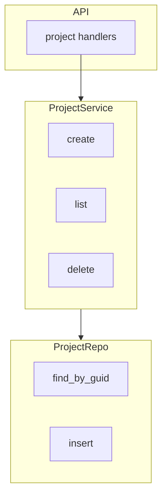
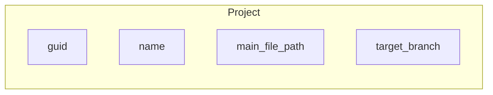

# 项目服务

项目服务负责项目的 CRUD、排序和 target branch 管理。项目是工作区的父实体，对应一个 Git 仓库路径。本文介绍 ProjectService 的 API、与 ProjectRepo 的协作以及删除时的级联校验。

## Overview

`ProjectService` 依赖 `ProjectRepo`，提供 `create`、`list`、`get`、`update`、`delete`、`update_order`、`update_target_branch` 等方法。项目实体包含 `main_file_path`（仓库根路径）、`name`、`target_branch`、`sidebar_order` 等字段。删除项目前需检查是否有未归档工作区。

## Architecture

## 核心操作

- **create**：插入项目，需要 name 和 main_file_path
- **list**：按 sidebar_order 排序返回
- **delete**：先检查 `ProjectCheckCanDelete`，有未归档工作区则拒绝
- **update_target_branch**：更新项目的默认目标分支

## Key Source Files

| File | Purpose |
|------|---------|
| `crates/core-service/src/service/project.rs` | ProjectService 实现 |
| `crates/infra/src/db/repo/project_repo.rs` | 仓库方法 |
| `crates/infra/src/db/entities/project.rs` | 实体定义 |
| `apps/api/src/api/project/handlers.rs` | HTTP 处理器 |

## Next Steps

- **[工作区服务](workspace.md)** — 项目下的工作区管理
- **[数据库与 ORM](../infra/database.md)** — project 实体与迁移
