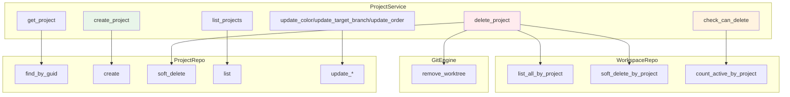
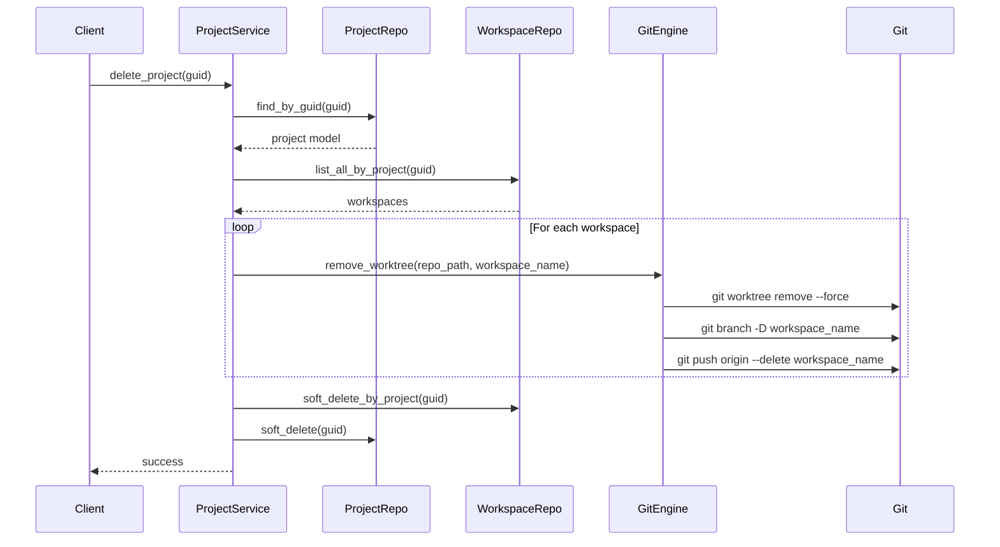
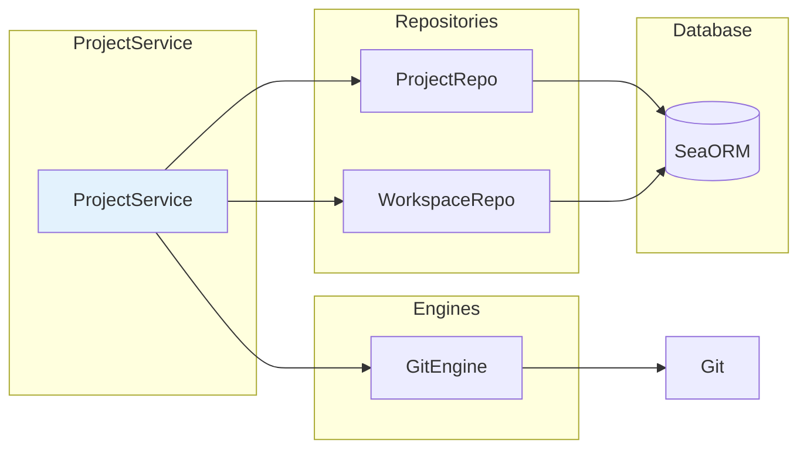

# Project Service

> **Reading Time:** 10 minutes
>
> **Source Files:** 6+ referenced

---

## Overview

`ProjectService` provides CRUD operations for git repository projects in ATMOS. Each project represents a top-level repository that can contain multiple workspaces (git worktrees). The service handles validation, cascading deletions, and integration with the git engine for repository-level operations.



---

## Data Structures

### Project Model

The underlying database model (`project::Model`) contains:

```rust
// From database entity (inferred)
pub struct ProjectModel {
    pub guid: String,              // Unique identifier (UUID)
    pub name: String,              // Display name (e.g., "atmos/atmos")
    pub main_file_path: String,    // Path to git repository
    pub sidebar_order: i32,        // UI sorting order
    pub border_color: Option<String>, // UI accent color
    pub is_open: bool,             // UI state
    pub target_branch: Option<String>, // Default branch for workspaces
    pub created_at: NaiveDateTime,
    pub updated_at: NaiveDateTime,
    pub is_deleted: bool,
}
```

**Source:** Inferred from `/crates/infra/src/db/entities/` schema

### ProjectCanDeleteResponse

Response for deletion validation:

```rust
// From /crates/core-service/src/service/project.rs
#[derive(Debug, serde::Serialize)]
pub struct ProjectCanDeleteResponse {
    pub can_delete: bool,
    pub active_workspace_count: u64,
}
```

**Source:** `/crates/core-service/src/service/project.rs:14-17`

---

## Core Operations

### Listing Projects

```rust
// From /crates/core-service/src/service/project.rs
pub async fn list_projects(&self) -> Result<Vec<project::Model>> {
    let repo = ProjectRepo::new(&self.db);
    Ok(repo.list().await?)
}
```

**Source:** `/crates/core-service/src/service/project.rs:27-30`

**Repository Query:**
```rust
// From /crates/infra/src/db/repo/project_repo.rs
pub async fn list(&self) -> Result<Vec<project::Model>> {
    let projects = project::Entity::find()
        .filter(project::Column::IsDeleted.eq(false))
        .order_by_asc(project::Column::SidebarOrder)
        .all(self.db)
        .await?;
    Ok(projects)
}
```

**Source:** `/crates/infra/src/db/repo/project_repo.rs:25-32`

Projects are sorted by `sidebar_order` in ascending order, allowing users to customize the arrangement in the UI.

### Creating a Project

```rust
// From /crates/core-service/src/service/project.rs
pub async fn create_project(
    &self,
    name: String,
    main_file_path: String,
    sidebar_order: i32,
    border_color: Option<String>,
) -> Result<project::Model> {
    let repo = ProjectRepo::new(&self.db);
    Ok(repo.create(name, main_file_path, sidebar_order, border_color).await?)
}
```

**Source:** `/crates/core-service/src/service/project.rs:32-35`

**Repository Implementation:**
```rust
// From /crates/infra/src/db/repo/project_repo.rs
pub async fn create(
    &self,
    name: String,
    main_file_path: String,
    sidebar_order: i32,
    border_color: Option<String>,
) -> Result<project::Model> {
    let base = BaseFields::new();

    let model = project::ActiveModel {
        guid: Set(base.guid),
        created_at: Set(base.created_at),
        updated_at: Set(base.updated_at),
        is_deleted: Set(base.is_deleted),
        name: Set(name),
        main_file_path: Set(main_file_path),
        sidebar_order: Set(sidebar_order),
        border_color: Set(border_color),
        is_open: Set(true),
        target_branch: Set(None),
    };

    let result = model.insert(self.db).await?;
    Ok(result)
}
```

**Source:** `/crates/infra/src/db/repo/project_repo.rs:44-62`

**Fields:**
- `name`: Display name (e.g., "owner/repo" or "myproject")
- `main_file_path`: Absolute path to the git repository
- `sidebar_order`: Used for UI sorting
- `border_color`: Optional hex color for UI accent (e.g., "#ff6b6b")
- `is_open`: UI state (whether project is expanded)
- `target_branch`: Optional default branch for workspace creation (falls back to repository default)

---

## Project Deletion

### Deletion Flow

Project deletion is a cascading operation that handles workspace cleanup:



### Implementation

```rust
// From /crates/core-service/src/service/project.rs
pub async fn delete_project(&self, guid: String) -> Result<()> {
    let project_repo = ProjectRepo::new(&self.db);
    let workspace_repo = WorkspaceRepo::new(&self.db);

    let project = project_repo
        .find_by_guid(&guid)
        .await?
        .ok_or_else(|| ServiceError::NotFound(format!("Project {} not found", guid)))?;

    // Get all workspaces to clean up their worktrees
    let workspaces = workspace_repo.list_all_by_project(guid.clone()).await?;

    // Clean up git worktrees for all workspaces
    let repo_path = std::path::Path::new(&project.main_file_path);
    for workspace in workspaces {
        if let Err(e) = self.git_engine.remove_worktree(repo_path, &workspace.name) {
            tracing::warn!("Failed to remove worktree for workspace {}: {}", workspace.name, e);
        }
    }

    // Batch soft delete all workspaces for this project
    workspace_repo.soft_delete_by_project(guid.clone()).await?;

    // Soft delete the project
    project_repo.soft_delete(guid).await?;
    Ok(())
}
```

**Source:** `/crates/core-service/src/service/project.rs:37-63`

**Cascading Deletion:**
1. Fetch all workspaces associated with the project
2. Remove git worktrees via `GitEngine.remove_worktree()`
3. Soft-delete all workspaces (sets `is_deleted = true`)
4. Soft-delete the project itself

**Why Soft Delete?**
- Allows for potential recovery (trash/restore functionality)
- Preserves referential integrity in the database
- Worktree directories are cleaned up, but database records remain

**Error Handling:**
- Failures during worktree removal are logged but don't fail the operation
- This handles cases where worktrees were never created or already manually removed

---

## Deletion Validation

Before allowing deletion, the UI checks if the project can be safely deleted:

```rust
// From /crates/core-service/src/service/project.rs
pub async fn check_can_delete_from_archive_modal(&self, guid: String) -> Result<ProjectCanDeleteResponse> {
    let workspace_repo = WorkspaceRepo::new(&self.db);
    let active_count = workspace_repo.count_active_by_project(guid).await?;
    Ok(ProjectCanDeleteResponse {
        can_delete: active_count == 0,
        active_workspace_count: active_count,
    })
}
```

**Source:** `/crates/core-service/src/service/project.rs:65-72`

**Repository Query:**
```rust
// From /crates/infra/src/db/repo/workspace_repo.rs
pub async fn count_active_by_project(&self, project_guid: String) -> Result<u64> {
    let count = workspace::Entity::find()
        .filter(workspace::Column::ProjectGuid.eq(project_guid))
        .filter(workspace::Column::IsDeleted.eq(false))
        .filter(workspace::Column::IsArchived.eq(false))
        .done()
        .count(self.db)
        .await?;
    Ok(count)
}
```

**Source:** `/crates/infra/src/db/repo/workspace_repo.rs:300-308`

**Business Rule:**
- Projects can only be deleted if they have **zero active workspaces**
- Archived workspaces don't count against the limit (they're already inactive)

This prevents accidental deletion of projects with ongoing work.

---

## Update Operations

### Update Border Color

```rust
// From /crates/core-service/src/service/project.rs
pub async fn update_color(&self, guid: String, color: Option<String>) -> Result<()> {
    let repo = ProjectRepo::new(&self.db);
    Ok(repo.update_color(guid, color).await?)
}
```

**Source:** `/crates/core-service/src/service/project.rs:74-77`

**Repository Implementation:**
```rust
// From /crates/infra/src/db/repo/project_repo.rs
pub async fn update_color(&self, guid: String, color: Option<String>) -> Result<()> {
    project::Entity::update_many()
        .col_expr(project::Column::BorderColor, Expr::value(color))
        .filter(project::Column::Guid.eq(guid))
        .exec(self.db)
        .await?;
    Ok(())
}
```

**Source:** `/crates/infra/src/db/repo/project_repo.rs:75-82`

### Update Target Branch

```rust
// From /crates/core-service/src/service/project.rs
pub async fn update_target_branch(&self, guid: String, target_branch: Option<String>) -> Result<()> {
    let repo = ProjectRepo::new(&self.db);
    Ok(repo.update_target_branch(guid, target_branch).await?)
}
```

**Source:** `/crates/core-service/src/service/project.rs:79-82`

**Repository Implementation:**
```rust
// From /crates/infra/src/db/repo/project_repo.rs
pub async fn update_target_branch(&self, guid: String, target_branch: Option<String>) -> Result<()> {
    project::Entity::update_many()
        .col_expr(project::Column::TargetBranch, Expr::value(target_branch))
        .filter(project::Column::Guid.eq(guid))
        .exec(self.db)
        .await?;
    Ok(())
}
```

**Source:** `/crates/infra/src/db/repo/project_repo.rs:111-118`

**Purpose:**
- Allows users to specify a default branch for workspace creation
- If `None`, workspace creation falls back to the repository's default branch (from `git symbolic-ref refs/remotes/origin/HEAD`)
- Useful for repositories with non-standard branch names (e.g., `develop`, `staging`)

### Update Order

```rust
// From /crates/core-service/src/service/project.rs
pub async fn update_order(&self, guid: String, order: i32) -> Result<()> {
    let repo = ProjectRepo::new(&self.db);
    Ok(repo.update_order(guid, order).await?)
}
```

**Source:** `/crates/core-service/src/service/project.rs:89-92`

**Repository Implementation:**
```rust
// From /crates/infra/src/db/repo/project_repo.rs
pub async fn update_order(&self, guid: String, order: i32) -> Result<()> {
    project::Entity::update_many()
        .col_expr(project::Column::SidebarOrder, Expr::value(order))
        .filter(project::Column::Guid.eq(guid))
        .exec(self.db)
        .await?;
    Ok(())
}
```

**Source:** `/crates/infra/src/db/repo/project_repo.rs:65-72`

**Purpose:** Allows users to reorder projects in the sidebar via drag-and-drop.

---

## Service Structure

### ProjectService Definition

```rust
// From /crates/core-service/src/service/project.rs
pub struct ProjectService {
    db: Arc<DatabaseConnection>,
    git_engine: GitEngine,
}

impl ProjectService {
    pub fn new(db: Arc<DatabaseConnection>) -> Self {
        Self {
            db,
            git_engine: GitEngine::new(),
        }
    }
}
```

**Source:** `/crates/core-service/src/service/project.rs:8-25`

**Components:**
- `db`: Shared database connection for repository operations
- `git_engine`: Git operations (used for worktree cleanup during deletion)

### Dependencies



**Repository Pattern:**
- Service uses repository pattern for database access
- Repositories (`ProjectRepo`, `WorkspaceRepo`) encapsulate SeaORM queries
- Service layer orchestrates business logic across multiple repositories

---

## Integration with Workspace Service

When creating workspaces, `WorkspaceService` fetches project metadata:

```rust
// From /crates/core-service/src/service/workspace.rs
pub async fn create_workspace(...) -> Result<WorkspaceDto> {
    // ...

    let project_repo = ProjectRepo::new(&self.db);
    let project = project_repo
        .find_by_guid(&project_guid)
        .await?
        .ok_or_else(|| ServiceError::NotFound(format!("Project {} not found", project_guid)))?;

    let repo_path = Path::new(&project.main_file_path);

    // Use project.main_file_path for git operations
    let _base_branch = self.git_engine.get_default_branch(repo_path)
        .unwrap_or_else(|_| "main".to_string());

    // ...
}
```

**Source:** `/crates/core-service/src/service/workspace.rs:74-85`

**Shared Data:**
- `project.main_file_path`: Path to git repository (used by `GitEngine`)
- `project.name`: Used for workspace name prefix generation
- `project.target_branch`: Optional default branch for workspace creation

---

## Error Handling

```rust
// From /crates/core-service/src/error.rs
#[derive(Debug, Error)]
pub enum ServiceError {
    #[error("Engine error: {0}")]
    Engine(#[from] core_engine::EngineError),

    #[error("Infrastructure error: {0}")]
    Infra(#[from] infra::InfraError),

    #[error("Not found: {0}")]
    NotFound(String),

    #[error("Validation error: {0}")]
    Validation(String),
}
```

**Source:** `/crates/core-service/src/error.rs:4-22`

**Common Error Scenarios:**

| Error Type | Example | Cause |
|------------|---------|-------|
| `NotFound` | "Project abc123 not found" | GUID doesn't exist or is deleted |
| `Engine` | "Failed to remove worktree" | Git operation failed (network, permissions) |
| `Infra` | Database connection error | PostgreSQL unavailable |
| `Validation` | "Invalid repository path" | Path doesn't exist or isn't a git repo |

---

## Testing Example

```rust
#[tokio::test]
async fn test_project_crud() {
    // Setup: Create in-memory database
    let db = Arc::new(create_test_db().await);
    let service = ProjectService::new(db.clone());

    // Create
    let project = service.create_project(
        "test-project".to_string(),
        "/tmp/test/repo".to_string(),
        0,
        Some("#ff0000".to_string()),
    ).await.unwrap();
    assert_eq!(project.name, "test-project");

    // List
    let projects = service.list_projects().await.unwrap();
    assert_eq!(projects.len(), 1);

    // Update
    service.update_color(project.guid.clone(), Some("#00ff00".to_string())).await.unwrap();

    // Validate Deletion
    let check = service.check_can_delete_from_archive_modal(project.guid.clone()).await.unwrap();
    assert!(check.can_delete);

    // Delete
    service.delete_project(project.guid.clone()).await.unwrap();

    // Verify
    let projects = service.list_projects().await.unwrap();
    assert!(projects.is_empty());
}
```

---

## Best Practices

### 1. Path Validation

Before creating a project, validate that `main_file_path` points to a valid git repository:

```rust
// In the API layer or validation middleware
use core_engine::FsEngine;

fn validate_repository(path: &str) -> Result<()> {
    let fs_engine = FsEngine::new();
    let path = std::path::Path::new(path);

    if !path.exists() {
        return Err(ServiceError::Validation("Path does not exist".to_string()));
    }

    let validation = fs_engine.validate_git_path(path)?;
    if !validation.is_valid {
        return Err(ServiceError::Validation(validation.error.unwrap()));
    }

    Ok(())
}
```

### 2. Cascading Operations

Always handle workspace cleanup when deleting projects to avoid orphaned worktrees:

```rust
// Good: Clean up workspaces first
for workspace in workspaces {
    self.git_engine.remove_worktree(repo_path, &workspace.name)?;
}
workspace_repo.soft_delete_by_project(guid).await?;
project_repo.soft_delete(guid).await?;

// Bad: Only delete project (leaves orphaned worktrees)
project_repo.soft_delete(guid).await?;
```

### 3. Use Soft Deletes

Soft delete projects rather than hard deleting to:
- Preserve database relationships
- Enable recovery/trash functionality
- Maintain audit trails

---

## References

**Source Files:**
- `/crates/core-service/src/service/project.rs` - Main service implementation
- `/crates/infra/src/db/repo/project_repo.rs` - Project database queries
- `/crates/infra/src/db/repo/workspace_repo.rs` - Workspace database queries
- `/crates/core-engine/src/git/mod.rs` - Git operations (worktree cleanup)
- `/crates/core-service/src/lib.rs` - Public exports

**Related Articles:**
- [Business Service Layer Overview](./index.md)
- [Workspace Service](./workspace.md)
- [Core Engine: Git](../core-engine/git.md)

**Dependencies:**
- `sea-orm`: Database ORM
- `git2` (via GitEngine): Git operations
- `tokio`: Async runtime
