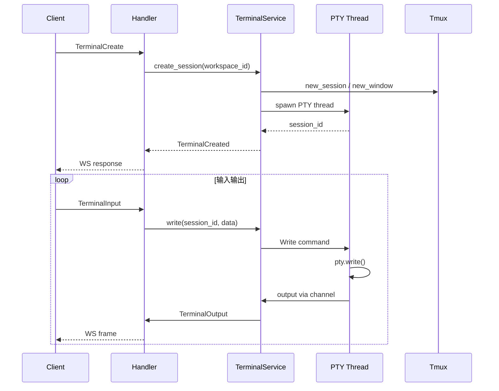
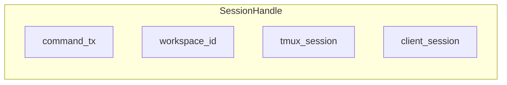

# 终端服务

终端服务负责 PTY 会话的创建、附加、输入输出和销毁，并与 Tmux 协作实现持久化。本文介绍 SessionHandle、PTY 线程、WebSocket 桥接以及 graceful shutdown 时的清理逻辑。

## Overview

`TerminalService` 维护一个 `HashMap<String, SessionHandle>`，以 session_id 为键。每个会话对应一个后台线程，通过 MPSC channel 接收写、resize、close 命令。PTY 输出通过另一个 channel 发回，由 WebSocket handler 转发给前端。Tmux 模式下，关闭 PTY 只 detach，不 kill tmux window，支持重连恢复。

## Architecture

```mermaid
graph TB
    subgraph WS
        TerminalHandler[terminal_handler]
    end

    subgraph TerminalService
        Sessions[SessionHandle Map]
        Tmux[TmuxEngine]
    end

    subgraph PTY Thread
        Pty[portable_pty]
        CmdRx[Command RX]
        OutTx[Output TX]
    end

    TerminalHandler --> Sessions
    Sessions --> Tmux
    Sessions --> PTY Thread
```





## 会话类型

- **Tmux**：持久化终端，基于 Tmux 窗口
- **Simple**：简单 PTY，无 tmux，如 Run Script

## 清理与 Shutdown

启动时 `cleanup_stale_client_sessions` 清理热重载遗留的 tmux client 会话。`shutdown` 时遍历所有会话发送 Close，等待 PTY 线程退出，避免 PTY 设备泄漏。

## Key Source Files

| File | Purpose |
|------|---------|
| `crates/core-service/src/service/terminal.rs` | TerminalService、SessionHandle、PTY 线程 |
| `apps/api/src/api/ws/terminal_handler.rs` | WebSocket 消息到 TerminalService 的桥接 |
| `crates/core-engine/src/tmux/mod.rs` | TmuxEngine 调用 |

## Next Steps

- **[WebSocket 处理器](../api/websocket-handlers.md)** — 终端消息路由
- **[Tmux 引擎](../core-engine/tmux.md)** — 会话与窗口管理
