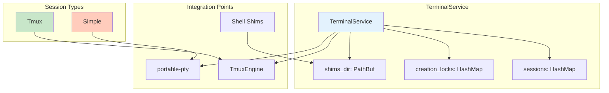
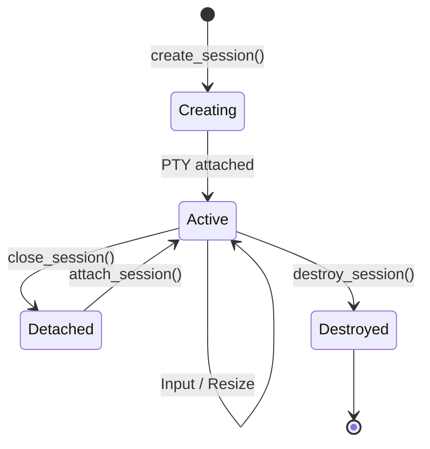
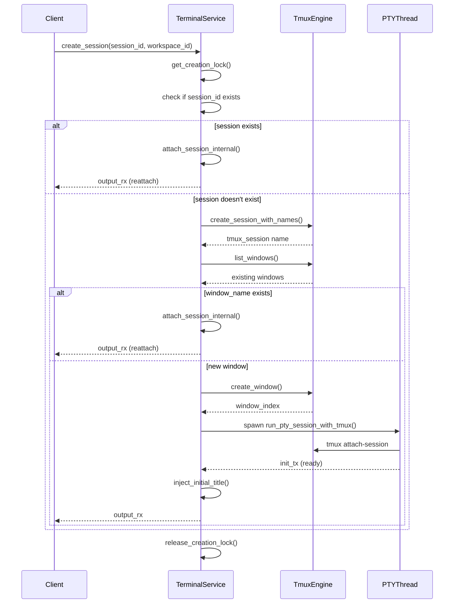
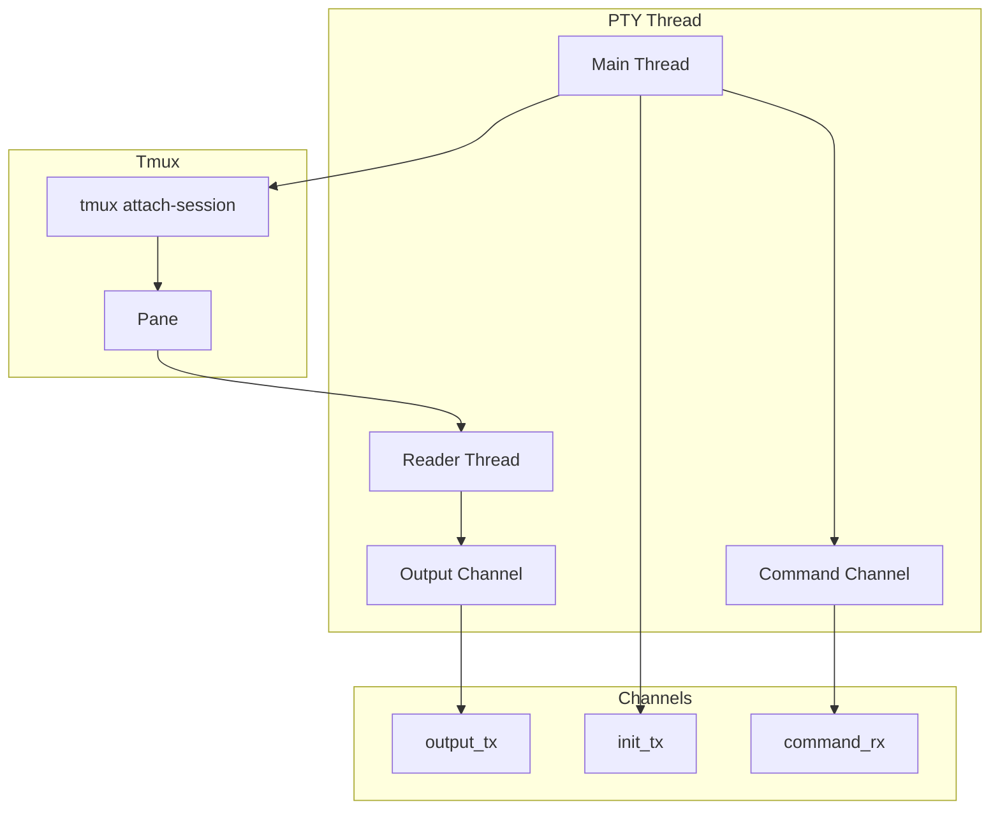
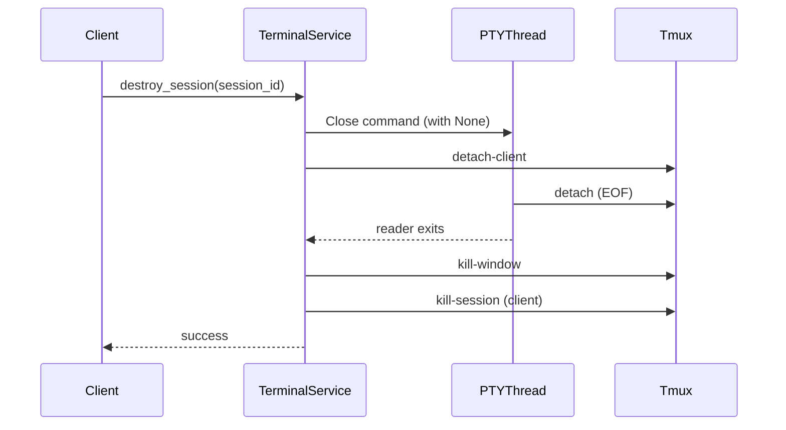

# Terminal Service

> **Reading Time:** 12 minutes
>
> **Source Files:** 7+ referenced

---

## Overview

`TerminalService` manages PTY (pseudo-terminal) sessions with tmux-backed persistence. It enables ATMOS to provide persistent terminal sessions that survive WebSocket disconnections and browser refreshes, with each session mapped to a tmux window for state preservation.

The service handles two types of sessions:
- **Tmux Sessions**: Persistent terminals backed by tmux windows (`SessionType::Tmux`)
- **Simple Sessions**: Direct PTY without tmux, for ephemeral operations (`SessionType::Simple`)



---

## Core Concepts

### Session Types

```rust
// From /crates/core-service/src/service/terminal.rs
#[derive(Debug, Clone, serde::Serialize)]
#[serde(rename_all = "snake_case")]
pub enum SessionType {
    /// Tmux-backed persistent terminal
    Tmux,
    /// Simple PTY without tmux (e.g., Run Script)
    Simple,
}
```

**Source:** `/crates/core-service/src/service/terminal.rs:38-45`

- **Tmux**: Used for workspace terminals. Sessions are reattached on reconnection, preserving scrollback and shell state.
- **Simple**: Used for one-off operations like running setup scripts. No persistence.

### Session Lifecycle



**Key Methods:**
- `create_session()`: Create new session (tmux window or simple PTY)
- `attach_session()`: Reconnect to existing tmux window
- `send_input()`: Send keystrokes to the terminal
- `resize()`: Update terminal dimensions
- `close_session()`: Detach PTY but keep tmux window
- `destroy_session()`: Kill tmux window and clean up

---

## Data Structures

### SessionHandle

Internal representation of an active session:

```rust
// From /crates/core-service/src/service/terminal.rs
struct SessionHandle {
    command_tx: mpsc::UnboundedSender<SessionCommand>,
    workspace_id: String,
    tmux_session: Option<String>,
    tmux_window_index: Option<u32>,
    client_session: Option<String>,
    session_type: SessionType,
    project_name: Option<String>,
    workspace_name: Option<String>,
    terminal_name: Option<String>,
    cwd: Option<String>,
    created_at: Instant,
}
```

**Source:** `/crates/core-service/src/service/terminal.rs:48-61`

**Fields:**
- `command_tx`: Channel for sending commands to the PTY thread
- `tmux_session`: Master tmux session name (e.g., `atmos_project_workspace`)
- `tmux_window_index`: Window index within the session
- `client_session`: Grouped session name for this specific terminal pane (e.g., `atmos_client_abc123`)
- `cwd`: Working directory for the session

### SessionDetail

Public information for the terminal manager UI:

```rust
// From /crates/core-service/src/service/terminal.rs
#[derive(Debug, Clone, serde::Serialize)]
pub struct SessionDetail {
    pub session_id: String,
    pub workspace_id: String,
    pub session_type: SessionType,
    pub project_name: Option<String>,
    pub workspace_name: Option<String>,
    pub terminal_name: Option<String>,
    pub tmux_session: Option<String>,
    pub tmux_window_index: Option<u32>,
    pub cwd: Option<String>,
    pub uptime_secs: u64,
}
```

**Source:** `/crates/core-service/src/service/terminal.rs:64-77`

### Message Enums

**TerminalMessage** (client → server):

```rust
#[derive(Debug, Clone, serde::Serialize, serde::Deserialize)]
#[serde(tag = "type", rename_all = "snake_case")]
pub enum TerminalMessage {
    TerminalCreate { workspace_id: String, shell: Option<String> },
    TerminalAttach { session_id: String, workspace_id: String },
    TerminalInput { session_id: String, data: String },
    TerminalResize { session_id: String, cols: u16, rows: u16 },
    TerminalClose { session_id: String },
    TerminalDestroy { session_id: String },
}
```

**Source:** `/crates/core-service/src/service/terminal.rs:80-105`

**TerminalResponse** (server → client):

```rust
#[derive(Debug, Clone, serde::Serialize, serde::Deserialize)]
#[serde(tag = "type", rename_all = "snake_case")]
pub enum TerminalResponse {
    TerminalCreated { session_id: String, workspace_id: String },
    TerminalAttached { session_id: String, workspace_id: String, history: Option<String> },
    TerminalOutput { session_id: String, data: String },
    TerminalClosed { session_id: String },
    TerminalDestroyed { session_id: String },
    TerminalError { session_id: Option<String>, error: String },
    TmuxCopyModeStatus { session_id: String, in_copy_mode: bool },
}
```

**Source:** `/crates/core-service/src/service/terminal.rs:107-138`

---

## Service Architecture

### TerminalService Structure

```rust
// From /crates/core-service/src/service/terminal.rs
pub struct TerminalService {
    sessions: Arc<Mutex<HashMap<String, SessionHandle>>>,
    tmux_engine: Arc<TmuxEngine>,
    default_cols: u16,
    default_rows: u16,
    creation_locks: Arc<Mutex<HashMap<String, Arc<Mutex<()>>>>>,
    shims_dir: Option<PathBuf>,
}
```

**Source:** `/crates/core-service/src/service/terminal.rs:142-152`

**Components:**
- `sessions`: Thread-safe map of active sessions
- `tmux_engine`: Shared reference to tmux operations
- `creation_locks**: Per-workspace locks to prevent concurrent creation race conditions
- `shims_dir`: Path to shell shims for dynamic terminal title injection

### Creation Locks

To prevent race conditions (e.g., React Strict Mode double-mount), the service uses per-workspace locks:

```rust
// From /crates/core-service/src/service/terminal.rs
async fn get_creation_lock(&self, tmux_session_name: &str) -> Arc<Mutex<()>> {
    let mut locks = self.creation_locks.lock().await;

    // Safety net cleanup: remove locks no longer in use
    locks.retain(|_, lock| Arc::strong_count(lock) > 1);

    locks
        .entry(tmux_session_name.to_string())
        .or_insert_with(|| Arc::new(Mutex::new(())))
        .clone()
}
```

**Source:** `/crates/core-service/src/service/terminal.rs:211-222**

**Why This Matters:**
- Multiple simultaneous terminal creation requests for the same workspace could create duplicate tmux windows
- The lock ensures only one creation happens at a time per workspace
- Stale locks are automatically cleaned up when no longer referenced

---

## Creating a Tmux Session

### Flow Diagram



### Implementation

```rust
// From /crates/core-service/src/service/terminal.rs
pub async fn create_session(
    &self,
    session_id: String,
    workspace_id: String,
    shell: Option<String>,
    cols: Option<u16>,
    rows: Option<u16>,
    project_name: Option<String>,
    workspace_name: Option<String>,
    window_name: Option<String>,
    cwd: Option<String>,
) -> Result<mpsc::UnboundedReceiver<Vec<u8>>> {
    let cols = cols.unwrap_or(self.default_cols);
    let rows = rows.unwrap_or(self.default_rows);

    // Compute tmux session name
    let tmux_session_name = if let (Some(ref proj), Some(ref ws)) = (&project_name, &workspace_name) {
        self.tmux_engine.get_session_name_from_names(proj, ws)
    } else {
        self.tmux_engine.get_session_name(&workspace_id)
    };

    // Acquire per-workspace creation lock
    let creation_lock = self.get_creation_lock(&tmux_session_name).await;
    let _guard = creation_lock.lock().await;

    // Check if session_id is already active
    {
        let sessions = self.sessions.lock().await;
        if let Some(_handle) = sessions.get(&session_id) {
            info!("Session {} already active, reusing existing handle", session_id);
            drop(sessions);
            let res = self.attach_session_internal(
                session_id.clone(),
                workspace_id.clone(),
                None,
                window_name.clone(),
                Some(cols),
                Some(rows),
                project_name.clone(),
                workspace_name.clone(),
            ).await;

            self.release_creation_lock(&tmux_session_name).await;
            return res.map(|(rx, _)| rx);
        }
    }

    // Build shell command with shim injection
    let shell_command = self.shims_dir.as_ref().and_then(|dir| {
        core_engine::shims::build_shell_command(dir, shell.as_deref())
    });

    // Create or get tmux session
    let tmux_session = if let (Some(ref proj), Some(ref ws)) = (&project_name, &workspace_name) {
        self.tmux_engine
            .create_session_with_names(proj, ws, cwd.as_deref(), shell_command.as_deref())
            .map_err(|e| anyhow!("Failed to create tmux session: {}", e))?
    } else {
        self.tmux_engine
            .create_session(&workspace_id, cwd.as_deref(), shell_command.as_deref())
            .map_err(|e| anyhow!("Failed to create tmux session: {}", e))?
    };

    // Check for existing windows (prevents duplicates on reconnect)
    let existing_windows = self.tmux_engine.list_windows(&tmux_session)
        .unwrap_or_default();
    let existing_names: std::collections::HashSet<String> = existing_windows.iter().map(|w| w.name.clone()).collect();

    if let Some(ref name) = window_name {
        if existing_names.contains(name) {
            info!("Window '{}' already exists, attaching", name);
            let result = self.attach_session_internal(
                session_id.clone(),
                workspace_id.clone(),
                None,
                Some(name.clone()),
                Some(cols),
                Some(rows),
                project_name.clone(),
                workspace_name.clone(),
            ).await;

            self.release_creation_lock(&tmux_session_name).await;
            return match result {
                Ok((rx, _)) => Ok(rx),
                Err(e) => Err(anyhow!("Failed to attach to existing window '{}': {}", name, e)),
            };
        }
    }

    // Determine window name
    let final_window_name = if let Some(name) = window_name {
        name
    } else {
        let mut num = existing_windows.len() + 1;
        while existing_names.contains(&num.to_string()) {
            num += 1;
        }
        num.to_string()
    };

    // Create new tmux window
    let window_index = self.tmux_engine
        .create_window(
            &tmux_session,
            &final_window_name,
            cwd.as_deref(),
            shell_command.as_deref(),
        )
        .map_err(|e| anyhow!("Failed to create tmux window: {}", e))?;

    // Attach to the window
    let result = self.attach_to_tmux_window(
        session_id,
        workspace_id,
        tmux_session,
        window_index,
        shell,
        cols,
        rows,
        false,
        project_name,
        workspace_name,
        Some(final_window_name),
        cwd,
    )
    .await;

    self.release_creation_lock(&tmux_session_name).await;
    result
}
```

**Source:** `/crates/core-service/src/service/terminal.rs:252-417`

**Key Features:**
1. **Lock Acquisition**: Prevents concurrent creation for the same workspace
2. **Duplicate Detection**: Checks for existing sessions/windows to avoid duplicates
3. **Shim Injection**: Injects shell shims for dynamic terminal titles
4. **Automatic Window Naming**: Auto-increments for unnamed windows

---

## PTY Thread Management

### Session Command Channel

Commands sent to the PTY thread:

```rust
// From /crates/core-service/src/service/terminal.rs
enum SessionCommand {
    Write(Vec<u8>),
    Resize { cols: u16, rows: u16 },
    Close {
        client_session: Option<String>,
        socket_path: Option<std::path::PathBuf>,
    },
}
```

**Source:** `/crates/core-service/src/service/terminal.rs:24-35`

**Write**: Send keystrokes to the PTY
**Resize**: Update terminal dimensions
**Close**: Detach from tmux (called before killing session)

### PTY Thread with Tmux



The PTY thread has two concurrent loops:
1. **Main thread**: Processes commands (write, resize, close)
2. **Reader thread**: Continuously reads PTY output and forwards via channel

```rust
// From /crates/core-service/src/service/terminal.rs
fn run_pty_session_with_tmux(
    session_id: String,
    tmux_session: String,
    window_index: u32,
    _shell: Option<String>,
    cols: u16,
    rows: u16,
    mut command_rx: mpsc::UnboundedReceiver<SessionCommand>,
    output_tx: mpsc::UnboundedSender<Vec<u8>>,
    init_tx: oneshot::Sender<Result<()>>,
    _is_attach: bool,
) {
    let socket_path: std::path::PathBuf = dirs::home_dir()
        .map(|h| h.join(".atmos").join("atmos.sock"))
        .unwrap_or_else(|| std::path::PathBuf::from("/tmp/.atmos/atmos.sock"));

    // Wait for tmux session to be ready
    let max_retries = 10;
    let retry_delay = std::time::Duration::from_millis(50);
    let mut session_ready = false;

    for attempt in 0..max_retries {
        let check_output = std::process::Command::new("tmux")
            .args(["-f", "/dev/null", "-S", &socket_path.to_string_lossy(),
                   "has-session", "-t", &tmux_session])
            .output();

        match check_output {
            Ok(output) if output.status.success() => {
                session_ready = true;
                break;
            }
            _ => {
                if attempt < max_retries - 1 {
                    std::thread::sleep(retry_delay);
                }
            }
        }
    }

    if !session_ready {
        let _ = init_tx.send(Err(anyhow!(
            "Tmux session '{}' not ready after {} retries",
            tmux_session, max_retries
        )));
        return;
    }

    // Create PTY
    let pty_system = native_pty_system();
    let pair = match pty_system.openpty(PtySize {
        rows, cols, pixel_width: 0, pixel_height: 0,
    }) {
        Ok(pair) => pair,
        Err(e) => {
            let _ = init_tx.send(Err(anyhow!("Failed to open PTY: {}", e)));
            return;
        }
    };

    // Spawn tmux attach process
    let mut cmd = CommandBuilder::new("tmux");
    cmd.args(["-f", "/dev/null", "-S", &socket_path.to_string_lossy(),
              "attach-session", "-t", &tmux_session]);

    if let Err(e) = pair.slave.spawn_command(cmd) {
        let _ = init_tx.send(Err(anyhow!("Failed to attach to tmux: {}", e)));
        return;
    }

    // CRITICAL: Drop slave to prevent PTY leaks
    drop(pair.slave);

    let mut reader = pair.master.try_clone_reader()?;
    let mut writer = pair.master.take_writer()?;
    let master = pair.master;

    // Signal successful initialization
    if init_tx.send(Ok(())).is_err() {
        return;
    }

    // Spawn reader thread
    let output_tx_clone = output_tx.clone();
    let reader_handle = thread::spawn(move || {
        let mut buffer = [0u8; 4096];
        loop {
            match reader.read(&mut buffer) {
                Ok(0) => {
                    debug!("PTY reader EOF for session: {}", session_id);
                    break;
                }
                Ok(n) => {
                    let data = buffer[..n].to_vec();
                    if output_tx_clone.send(data).is_err() {
                        break;
                    }
                }
                Err(e) => {
                    let err_str = e.to_string();
                    if err_str.contains("Input/output error") || err_str.contains("EIO") {
                        debug!("PTY disconnected for session: {}", session_id);
                    } else {
                        warn!("PTY read error for session {}: {}", session_id, e);
                    }
                    break;
                }
            }
        }
    });

    // Process commands in main thread
    let rt = tokio::runtime::Builder::new_current_thread()
        .enable_all()
        .build()
        .unwrap();

    let mut close_client_session: Option<String> = None;
    let mut close_socket_path: Option<std::path::PathBuf> = None;

    rt.block_on(async {
        while let Some(cmd) = command_rx.recv().await {
            match cmd {
                SessionCommand::Write(data) => {
                    if let Err(e) = writer.write_all(&data) {
                        debug!("Failed to write to PTY: {}", e);
                        break;
                    }
                    if let Err(e) = writer.flush() {
                        debug!("Failed to flush PTY: {}", e);
                        break;
                    }
                }
                SessionCommand::Resize { cols, rows } => {
                    if let Err(e) = master.resize(PtySize {
                        rows, cols, pixel_width: 0, pixel_height: 0,
                    }) {
                        debug!("Failed to resize PTY: {}", e);
                    }
                }
                SessionCommand::Close { client_session: cs, socket_path: sp } => {
                    debug!("Closing PTY session (detaching): {}", session_id);

                    let detached = if let (Some(ref client_name), Some(ref sock)) = (&cs, &sp) {
                        std::process::Command::new("tmux")
                            .args(["-f", "/dev/null", "-S", &sock.to_string_lossy(),
                                   "detach-client", "-s", client_name])
                            .output()
                            .map(|o| o.status.success())
                            .unwrap_or(false)
                    } else {
                        false
                    };

                    if !detached {
                        let _ = writer.write_all(&[0x02, b'd']); // Ctrl+B, d fallback
                        let _ = writer.flush();
                    }

                    close_client_session = cs;
                    close_socket_path = sp;
                    break;
                }
            }
        }
    });

    // Wait for reader to finish
    let _ = reader_handle.join();

    // Kill client session after detach
    if let Some(cs) = close_client_session {
        if let Some(sp) = close_socket_path {
            let _ = std::process::Command::new("tmux")
                .args(["-S", &sp.to_string_lossy(), "kill-session", "-t", &cs])
                .output();
        }
    }

    info!("PTY session thread exited (detached): {}", session_id);
}
```

**Source:** `/crates/core-service/src/service/terminal.rs:1068-1304`

**Critical Details:**
1. **Session Ready Check**: Retries until tmux session is available (handles race conditions)
2. **Slave Drop**: The PTY slave must be dropped immediately after spawning to prevent resource leaks
3. **Reader Thread**: Separate thread continuously reads PTY output
4. **Clean Detach**: Uses `tmux detach-client` instead of key sequences for reliability

---

## Dynamic Terminal Titles

The service injects shell shims to provide dynamic terminal titles that show the current command or working directory.

### Title Injection on Connect

```rust
// From /crates/core-service/src/service/terminal.rs
fn inject_initial_title(
    &self,
    tmux_session: &str,
    window_index: u32,
    output_tx: &mpsc::UnboundedSender<Vec<u8>>,
) {
    const SHELLS: &[&str] = &["zsh", "bash", "fish", "sh", "dash", "ksh", "tcsh", "csh"];

    let current_cmd = match self.tmux_engine.get_pane_current_command(tmux_session, window_index) {
        Ok(cmd) => cmd,
        Err(e) => {
            debug!("Could not query pane command for initial title: {}", e);
            return;
        }
    };

    let osc = if SHELLS.contains(&current_cmd.as_str()) {
        match self.tmux_engine.get_pane_current_path(tmux_session, window_index) {
            Ok(path) if !path.is_empty() => format!("\x1b]9999;CMD_END:{}\x07", path),
            _ => return,
        }
    } else {
        format!("\x1b]9999;CMD_START:{}\x07", current_cmd)
    };

    if let Err(e) = output_tx.send(osc.into_bytes()) {
        debug!("Failed to inject initial title OSC: {}", e);
    } else {
        debug!("Injected initial title OSC for {}:{}", tmux_session, window_index);
    }
}
```

**Source:** `/crates/core-service/src/service/terminal.rs:726-759`

**OSC Sequences:**
- `CMD_END:{path}`: Shell is idle, showing working directory
- `CMD_START:{command}`: A program is running, showing its name

These sequences are parsed by the frontend to display dynamic titles.

---

## Session Destruction

### Close vs Destroy

**Close** (`close_session`):
- Detaches PTY from tmux window
- Keeps tmux window and its content alive
- Can be reattached later

**Destroy** (`destroy_session`):
- Detaches PTY
- Kills tmux window (content is lost)
- Used for "Delete Terminal" action



```rust
// From /crates/core-service/src/service/terminal.rs
pub async fn destroy_session(&self, session_id: &str) -> Result<()> {
    let mut sessions = self.sessions.lock().await;
    if let Some(handle) = sessions.remove(session_id) {
        // Step 1: Detach the client FIRST
        if let Some(ref client_session) = handle.client_session {
            let socket = self.tmux_engine.socket_file_path();
            let _ = std::process::Command::new("tmux")
                .args(["-f", "/dev/null", "-S", &socket,
                       "detach-client", "-s", client_session])
                .output();
        }

        // Step 2: Send Close command to PTY thread
        let _ = handle.command_tx.send(SessionCommand::Close {
            client_session: None,
            socket_path: None,
        });

        // Step 3: Kill the tmux window in the master session
        if let (Some(ts), Some(twi)) = (&handle.tmux_session, handle.tmux_window_index) {
            if let Err(e) = self.tmux_engine.kill_window(ts, twi) {
                warn!("Failed to kill tmux window: {}", e);
            }
        }

        // Step 4: Kill the client session
        if let Some(client_session) = &handle.client_session {
            let _ = self.tmux_engine.kill_session(client_session);
        }

        info!("Terminal session destroyed: {} - tmux window {:?}:{:?} killed",
              session_id, handle.tmux_session, handle.tmux_window_index);
        Ok(())
    } else {
        warn!("Attempted to destroy non-existent session: {}", session_id);
        Err(anyhow!("Session not found: {}", session_id))
    }
}
```

**Source:** `/crates/core-service/src/service/terminal.rs:874-917`

**Why This Order Matters:**
1. **Detach First**: Prevents "[exited]" messages in the terminal output
2. **Close Command**: Signals PTY thread to exit cleanly
3. **Kill Window**: Removes the tmux window
4. **Kill Session**: Cleans up the grouped client session

---

## Stale Session Cleanup

On startup and shutdown, the service cleans up orphaned tmux client sessions:

```rust
// From /crates/core-service/src/service/terminal.rs
pub fn cleanup_stale_client_sessions(&self) {
    let active_clients: std::collections::HashSet<String> = self
        .sessions
        .try_lock()
        .map(|sessions| {
            sessions
                .values()
                .filter_map(|h| h.client_session.clone())
                .collect()
        })
        .unwrap_or_default();

    match self.tmux_engine.list_sessions() {
        Ok(sessions) => {
            let mut cleaned = 0;
            for session in sessions {
                if session.name.starts_with("atmos_client_")
                    && !active_clients.contains(&session.name)
                {
                    if let Err(e) = self.tmux_engine.kill_session(&session.name) {
                        warn!("Failed to kill stale client session {}: {}", session.name, e);
                    } else {
                        cleaned += 1;
                    }
                }
            }
            if cleaned > 0 {
                info!("Cleaned up {} stale tmux client sessions (skipped {} active)",
                      cleaned, active_clients.len());
            }
        }
        Err(e) => {
            warn!("Failed to list tmux sessions for cleanup: {}", e);
        }
    }
}
```

**Source:** `/crates/core-service/src/service/terminal.rs:1024-1064`

**Purpose**: Prevents PTY device exhaustion from accumulating orphaned sessions across hot-reloads or crashes.

---

## References

**Source Files:**
- `/crates/core-service/src/service/terminal.rs` - Main service implementation (1500 lines)
- `/crates/core-engine/src/tmux/mod.rs` - TmuxEngine for tmux operations
- `/crates/core-engine/src/shims/mod.rs` - Shell shim injection
- `/crates/core-service/src/lib.rs` - Public exports

**Related Articles:**
- [Business Service Layer Overview](./index.md)
- [Core Engine: Tmux](../core-engine/tmux.md)

**Dependencies:**
- `portable-pty`: Cross-platform PTY creation
- `tokio`: Async runtime and channels
- `tmux`: Terminal multiplexer (external binary)
