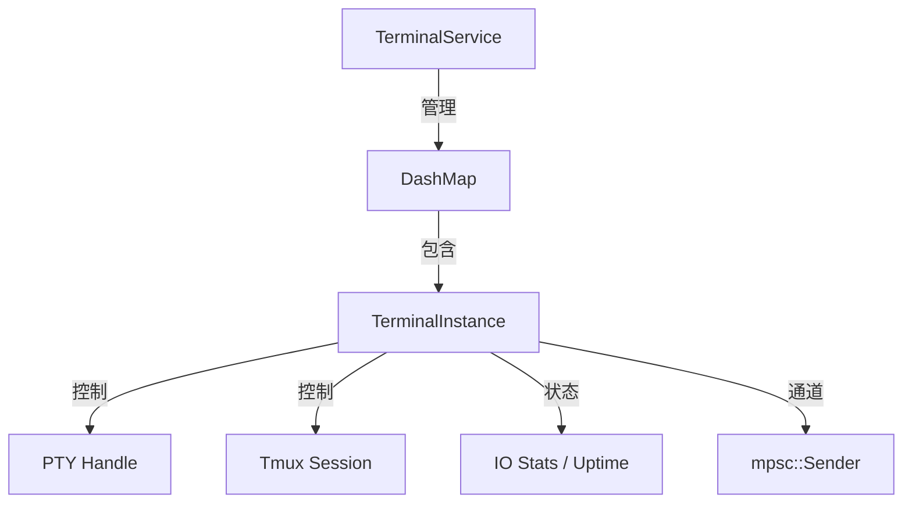
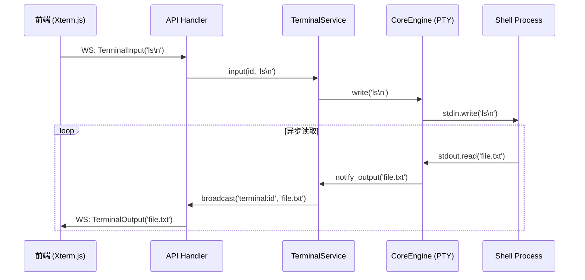

# 终端服务实现

`TerminalService` 是 Atmos 后端架构中最具活力的组件。它不仅是底层 PTY/Tmux 能力的封装者，更是实时数据流的“总调度师”。本章将深入解析 `TerminalService` 如何管理成百上千个并发的终端会话，并确保数据传输的低延迟与高可靠。

## 核心架构：会话管理器

`TerminalService` 维护着一个全局的终端注册表，负责跟踪系统中所有活跃的终端实例。

### 终端实例模型

## 数据流向深度解析

终端数据的处理分为“输入流”和“输出流”两个完全异步的路径。

### 1. 输入路径 (Write Path)
当用户在浏览器按下键盘时，数据流向如下：
1. **前端**: 发送 `TerminalInput` 消息到 WebSocket。
2. **API 层**: 接收消息，调用 `TerminalService::input(terminal_id, data)`。
3. **服务层**: 根据 `terminal_id` 找到对应的 `TerminalInstance`。
4. **引擎层**: 将数据写入底层 PTY 或通过 `tmux send-keys` 发送。

### 2. 输出路径 (Read Path)
这是性能优化的重点。每个终端实例在启动时都会开启一个专用的 **Tokio Task**：
1. **轮询**: 后台任务持续读取 PTY 的输出流。
2. **缓冲与合并**: 为了避免 WebSocket 帧过于碎片化，服务层会进行微小的缓冲（通常为 10-20ms）。
3. **分发**: 将合并后的数据封装成 `TerminalOutput` 消息，通过 `WebSocketManager` 推送到所有订阅了该终端主题的客户端。

## 核心功能实现

### 终端复用与持久化
`TerminalService` 能够识别当前终端是否处于 Tmux 模式。如果是，它会优先尝试“附加”到现有的 Tmux 会话，而不是开启新的进程。这实现了跨页面刷新、跨设备的会话连续性。

### 动态调整大小 (Dynamic Resizing)
当用户调整前端面板大小时：
- 前端发送 `Resize` 指令。
- `TerminalService` 调用底层引擎的 `resize` 接口。
- 系统向 Shell 发送 `SIGWINCH` 信号，强制 CLI 工具（如 `vim`）重绘界面。

### 资源配额与清理
为了防止单个工作区耗尽服务器资源，`TerminalService` 实施了以下策略：
- **最大连接数**: 限制单个工作区可开启的终端数量。
- **空闲检测**: 自动关闭长时间无数据交换且未开启持久化的终端。
- **强制回收**: 当工作区停止时，确保所有关联的 PTY 进程被彻底杀死。

## 交互时序图

## 关键源码分析

| 文件路径 | 核心职责 |
|:---|:---|
| `crates/core-service/src/service/terminal.rs` | 实现终端注册表、读写循环调度和生命周期管理。 |
| `crates/core-service/src/service/ws_message.rs` | 定义终端相关的内部消息格式。 |
| `apps/api/src/api/ws/terminal_handler.rs` | 将外部 WebSocket 流量桥接到 `TerminalService`。 |
| `crates/core-engine/src/pty/mod.rs` | 提供底层的读写 Trait，支持 PTY 的异步操作。 |

## 总结

`TerminalService` 是 Atmos 系统的“心脏”，它通过高效的异步并发模型和精细的流控制，将底层的进程交互转化为了流畅的 Web 体验。它的设计充分考虑了性能、持久化和资源管理，是 Atmos 能够支撑 IDE 级开发任务的核心保障。

## 下一步建议

- **[PTY, Git 与文件系统](../../deep-dive/core-engine/fs-git.md)**: 了解底层 PTY 读写的具体实现。
- **[Tmux 会话管理](../../deep-dive/core-engine/tmux.md)**: 探索如何实现终端的持久化。
- **[WebSocket 系统设计](../../deep-dive/infra/websocket.md)**: 了解数据是如何通过网络传输的。
- **[Web 应用结构与状态管理](../../deep-dive/frontend/web-app.md)**: 探索前端如何渲染这些终端数据。
