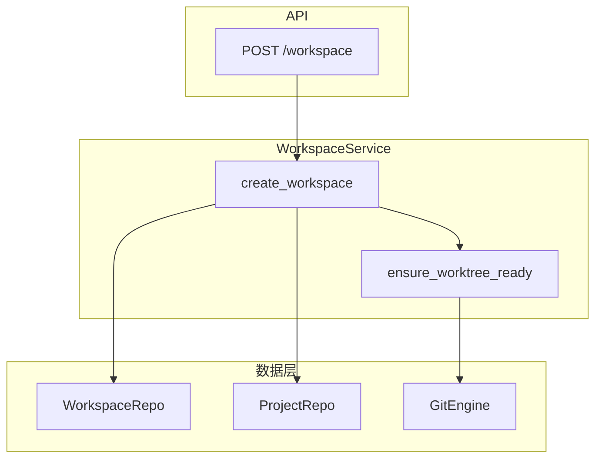
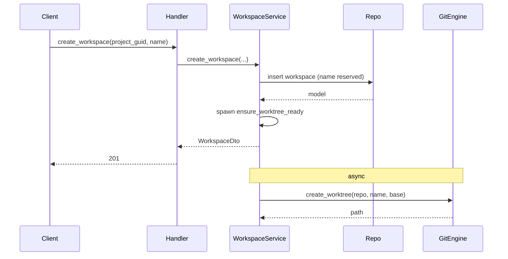
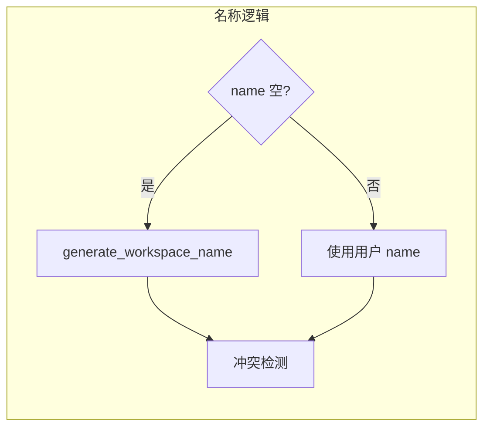

# 工作区服务

工作区服务是 ATMOS 的核心业务之一，负责工作区的创建、删除、归档、固定以及 worktree 协调。本文深入介绍数据流、名称生成、worktree 异步创建与错误处理。

## Overview

`WorkspaceService` 依赖 `WorkspaceRepo`、`ProjectRepo` 和 `GitEngine`。创建工作区时，先在 DB 中预留 name，再由后台任务 `ensure_worktree_ready` 调用 `create_worktree` 创建实际目录，避免阻塞 API 响应。工作区名称支持 Pokemon 风格自动生成或用户指定，需通过冲突检测确保唯一性。

## Architecture

## 创建流程

1. 根据 project_guid 获取项目与仓库路径
2. 收集已有分支与 DB 工作区名称，用于冲突检测
3. 确定最终 name：空则用 generator 生成，否则用用户输入
4. 在 DB 中插入 workspace 记录（name 已预留）
5. 后台 spawn `ensure_worktree_ready`，调用 `create_worktree`
6. 返回 `WorkspaceDto`（含 local_path）

## 错误处理

- 名称冲突超过 MAX_ATTEMPTS：返回 Validation 错误
- Worktree 已存在：GitEngine 返回错误
- 项目不存在：NotFound
- 数据库错误：通过 ServiceError 包装

## Key Source Files

| File | Purpose |
|------|---------|
| `crates/core-service/src/service/workspace.rs` | WorkspaceService 实现 |
| `crates/infra/src/db/repo/workspace_repo.rs` | 仓库方法 |
| `crates/core-engine/src/git/mod.rs` | create_worktree 调用 |
| `crates/core-service/src/utils/workspace_name_generator.rs` | 名称生成 |

## Next Steps

- **[终端服务](terminal.md)** — 工作区下的终端会话
- **[Git 引擎](../core-engine/git.md)** — worktree 技术细节
- **[数据库与 ORM](../infra/database.md)** — workspace 实体与迁移
