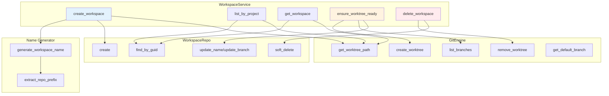
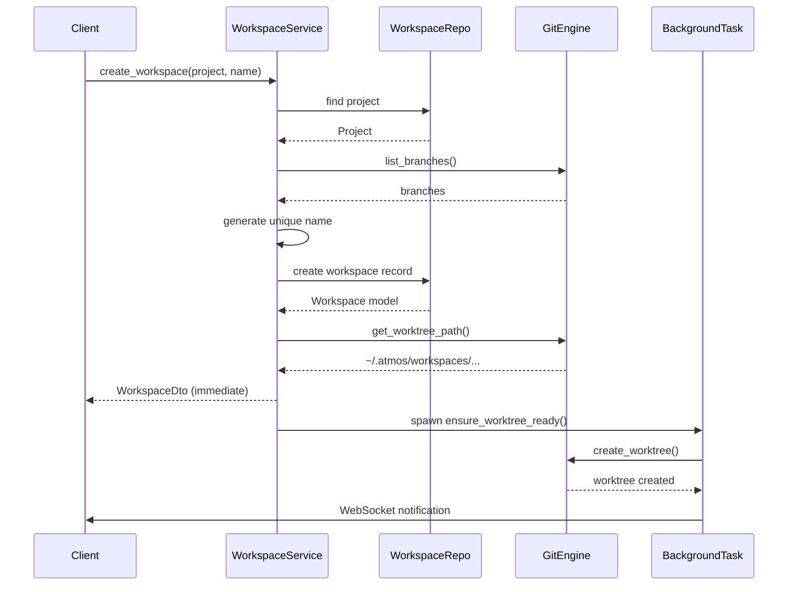
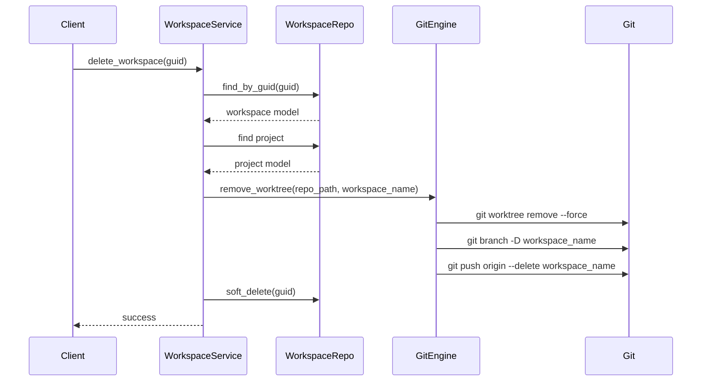

# Workspace Service

> **Reading Time:** 13 minutes
>
> **Source Files:** 8+ referenced

---

## Overview

`WorkspaceService` is the orchestrator for git worktree-based parallel development in ATMOS. Each workspace represents an isolated development environment backed by a git worktree, allowing developers to work on multiple branches simultaneously without context switching.

The service coordinates three key concerns:
1. **Database Persistence**: Storing workspace metadata via `WorkspaceRepo`
2. **Git Operations**: Managing worktrees via `GitEngine`
3. **Naming**: Generating unique workspace names using Pokemon-based naming



---

## Data Structures

### WorkspaceDto

The primary return type for workspace operations:

```rust
// From /crates/core-service/src/service/workspace.rs
#[derive(Serialize)]
pub struct WorkspaceDto {
    #[serde(flatten)]
    pub model: workspace::Model,  // All database fields
    pub local_path: String,        // Computed: ~/.atmos/workspaces/{name}
}
```

**Source:** `/crates/core-service/src/service/workspace.rs:12-16`

The `#[serde(flatten)]` attribute merges all database fields (`guid`, `name`, `branch`, `project_guid`, `created_at`, etc.) directly into the DTO, while `local_path` is computed dynamically via `GitEngine.get_worktree_path()`.

### Database Model

The underlying `workspace::Model` contains:
- `guid`: Unique identifier (UUID)
- `project_guid`: Parent project reference
- `name`: Workspace name (e.g., `atmos/pikachu`)
- `branch`: Git branch name (same as name)
- `sidebar_order`: UI sorting order
- `is_pinned`, `pinned_at`: Pinning state
- `is_archived`, `archived_at`: Archive state
- `is_deleted`: Soft-delete flag
- `terminal_layout`, `maximized_terminal_id`: UI state

---

## Core Operations

### Listing Workspaces

```rust
// From /crates/core-service/src/service/workspace.rs
pub async fn list_by_project(&self, project_guid: String) -> Result<Vec<WorkspaceDto>> {
    let repo = WorkspaceRepo::new(&self.db);
    let models = repo.list_by_project(project_guid).await?;

    let mut dtos = Vec::with_capacity(models.len());
    for model in models {
        let local_path = self.git_engine.get_worktree_path(&model.name)?
            .to_string_lossy()
            .to_string();
        dtos.push(WorkspaceDto { model, local_path });
    }

    Ok(dtos)
}
```

**Source:** `/crates/core-service/src/service/workspace.rs:32-45`

**Flow:**
1. Query database via `WorkspaceRepo.list_by_project()`
2. For each workspace, compute `local_path` using `GitEngine.get_worktree_path()`
3. Return enriched DTOs

**Repository Query:**
```rust
// From /crates/infra/src/db/repo/workspace_repo.rs
pub async fn list_by_project(&self, project_guid: String) -> Result<Vec<workspace::Model>> {
    let workspaces = workspace::Entity::find()
        .filter(workspace::Column::ProjectGuid.eq(project_guid))
        .filter(workspace::Column::IsDeleted.eq(false))
        .filter(workspace::Column::IsArchived.eq(false))
        .order_by_desc(workspace::Column::IsPinned)
        .order_by_desc(workspace::Column::PinnedAt)
        .order_by_desc(workspace::Column::CreatedAt)
        .all(self.db)
        .await?;
    Ok(workspaces)
}
```

**Source:** `/crates/infra/src/db/repo/workspace_repo.rs:25-36`

Workspaces are sorted with pinned items first, then by creation date.

### Getting a Single Workspace

```rust
// From /crates/core-service/src/service/workspace.rs
pub async fn get_workspace(&self, guid: String) -> Result<Option<WorkspaceDto>> {
    let repo = WorkspaceRepo::new(&self.db);
    let model = repo.find_by_guid(guid).await?;

    match model {
        Some(model) => {
            let local_path = self.git_engine.get_worktree_path(&model.name)?
                .to_string_lossy()
                .to_string();
            Ok(Some(WorkspaceDto { model, local_path }))
        },
        None => Ok(None),
    }
}
```

**Source:** `/crates/core-service/src/service/workspace.rs:48-61`

---

## Workspace Creation

### The Creation Flow

Workspace creation is a multi-step process designed for responsiveness:



### Implementation

```rust
// From /crates/core-service/src/service/workspace.rs
pub async fn create_workspace(
    &self,
    project_guid: String,
    name: String,
    _branch: String,
    sidebar_order: i32,
) -> Result<WorkspaceDto> {
    // 1. Get project metadata
    let project_repo = ProjectRepo::new(&self.db);
    let project = project_repo
        .find_by_guid(&project_guid)
        .await?
        .ok_or_else(|| ServiceError::NotFound(format!("Project {} not found", project_guid)))?;

    let repo_path = Path::new(&project.main_file_path);

    // 2. Get default branch
    let _base_branch = self.git_engine.get_default_branch(repo_path)
        .unwrap_or_else(|_| "main".to_string());

    // 3. Collect existing names for conflict detection
    let mut existing_names: Vec<String> = self.git_engine.list_branches(repo_path)
        .unwrap_or_else(|_| Vec::new());

    let workspace_repo = WorkspaceRepo::new(&self.db);
    let db_workspaces = workspace_repo.list_all_by_project(project_guid.clone()).await?;
    for ws in &db_workspaces {
        if !existing_names.contains(&ws.name) {
            existing_names.push(ws.name.clone());
        }
    }

    // 4. Determine final name (with conflict resolution)
    let initial_name = if name.trim().is_empty() {
        let prefix = workspace_name_generator::extract_repo_prefix(&project.name);
        workspace_name_generator::generate_workspace_name(&existing_names, &prefix)
    } else {
        name.clone()
    };

    let mut final_name = initial_name.clone();
    let mut attempt = 0;
    const MAX_ATTEMPTS: u32 = 50;

    loop {
        if attempt >= MAX_ATTEMPTS {
            return Err(ServiceError::Validation(
                "Failed to create workspace: too many naming conflicts".to_string()
            ));
        }

        if !existing_names.contains(&final_name) {
            break;
        } else {
            attempt += 1;
            if name.trim().is_empty() {
                let prefix = workspace_name_generator::extract_repo_prefix(&project.name);
                final_name = workspace_name_generator::generate_workspace_name(&existing_names, &prefix);
            } else {
                final_name = Self::generate_alternative_name(&initial_name, attempt);
            }
        }
    }

    // 5. Save to database
    let workspace_repo = WorkspaceRepo::new(&self.db);
    let model = workspace_repo.create(project_guid, final_name.clone(), final_name, sidebar_order).await?;

    // 6. Compute local path
    let local_path = self.git_engine.get_worktree_path(&model.name)?
        .to_string_lossy()
        .to_string();

    Ok(WorkspaceDto { model, local_path })
}
```

**Source:** `/crates/core-service/src/service/workspace.rs:67-147`

**Key Design Decisions:**

1. **Immediate Response**: The database record is created and returned immediately. Git worktree creation happens asynchronously in `ensure_worktree_ready()`, preventing slow `git worktree add` operations from blocking the API.

2. **Conflict Resolution**: The service checks both git branches AND existing database workspace names for conflicts. If a conflict is detected, it regenerates the name (for Pokemon names) or appends a suffix (for user-provided names).

3. **Name = Branch**: The workspace name serves as both the workspace identifier and the git branch name. This simplifies the mental model but requires unique naming across both git and the database.

---

## Pokemon-Based Naming

When users don't provide a name, ATMOS generates unique names using a Pokemon-based naming system:

```rust
// From /crates/core-service/src/utils/workspace_name_generator.rs
pub fn generate_workspace_name(existing_names: &[String], prefix: &str) -> String {
    let normalize = |name: &str| name.to_lowercase();
    let existing_set: std::collections::HashSet<String> =
        existing_names.iter().map(|n| normalize(n)).collect();

    let is_available = |name: &str| !existing_set.contains(&normalize(name));

    let mut rng = rand::thread_rng();

    // Strategy 1: Try shuffled Pokemon names
    let mut shuffled_pokemon: Vec<&str> = POKEMON_NAMES.to_vec();
    shuffled_pokemon.shuffle(&mut rng);

    for pokemon in &shuffled_pokemon {
        let candidate = format!("{}/{}", prefix, pokemon);
        if is_available(&candidate) {
            return candidate;
        }
    }

    // Strategy 2: Try Pokemon names with version suffix (v2-v9)
    for pokemon in &shuffled_pokemon {
        for v in 2..=9 {
            let candidate = format!("{}/{}-v{}", prefix, pokemon, v);
            if is_available(&candidate) {
                return candidate;
            }
        }
    }

    // Strategy 3: Try combinations of two different Pokemon names
    for _ in 0..50 {
        let pokemon1 = get_random_pokemon();
        let pokemon2 = get_random_pokemon();
        if pokemon1 != pokemon2 {
            let candidate = format!("{}/{}-{}", prefix, pokemon1, pokemon2);
            if is_available(&candidate) {
                return candidate;
            }
        }
    }

    // Strategy 4: Fallback - Pokemon name with random suffix
    let base_pokemon = get_random_pokemon();
    let suffix = generate_random_suffix(4);
    format!("{}/{}-{}", prefix, base_pokemon, suffix)
}
```

**Source:** `/crates/core-service/src/utils/workspace_name_generator.rs:56-102`

**Naming Strategies (in order):**

1. **Simple Pokemon**: `atmos/pikachu`, `atmos/charizard`
2. **Versioned**: `atmos/pikachu-v2`, `atmos/bulbasaur-v3`
3. **Hybrid**: `atmos/pikachu-charizard`, `atmos/squirtle-ivysaur`
4. **Random Suffix**: `atmos/pikachu-a3f9` (fallback)

**Prefix Extraction:**
```rust
// From /crates/core-service/src/utils/workspace_name_generator.rs
pub fn extract_repo_prefix(project_name: &str) -> String {
    if let Some(slash_pos) = project_name.find('/') {
        project_name[..slash_pos].to_string()
    } else {
        project_name.to_string()
    }
}
```

**Source:** `/crates/core-service/src/utils/workspace_name_generator.rs:109-115`

For `owner/repo` style project names, the prefix is `owner`. For simple names, the prefix is the full project name.

**Examples:**
- Project `atmos/atmos` → Workspaces: `atmos/pikachu`, `atmos/charizard`, `atmos/bulbasaur-v2`
- Project `facebook/react` → Workspaces: `facebook/pikachu`, `facebook/eevee`
- Project `myproject` → Workspaces: `myproject/pikachu`, `myproject/vaporeon`

---

## Worktree Readiness

### Background Setup

The `ensure_worktree_ready()` method is called asynchronously after workspace creation:

```rust
// From /crates/core-service/src/service/workspace.rs
pub async fn ensure_worktree_ready(&self, guid: String) -> Result<()> {
    let repo = WorkspaceRepo::new(&self.db);
    let workspace = repo.find_by_guid(guid.clone()).await?
        .ok_or_else(|| ServiceError::NotFound(format!("Workspace {} not found", guid)))?;

    let project_repo = ProjectRepo::new(&self.db);
    let project = project_repo
        .find_by_guid(&workspace.project_guid)
        .await?
        .ok_or_else(|| ServiceError::NotFound(format!("Project {} not found", workspace.project_guid)))?;

    let repo_path = Path::new(&project.main_file_path);

    tracing::info!("[ensure_worktree_ready] Starting for workspace: {}, branch: {}", workspace.name, workspace.branch);

    let worktree_path = self.git_engine.get_worktree_path(&workspace.name)?;

    // Check if worktree already exists
    if worktree_path.exists() {
        let has_files = std::fs::read_dir(&worktree_path)
            .map(|mut entries| entries.next().is_some())
            .unwrap_or(false);

        if has_files {
            tracing::info!("[ensure_worktree_ready] Worktree already exists and has files, skipping creation");
            return Ok(());
        } else {
            tracing::warn!("[ensure_worktree_ready] Worktree directory exists but is empty, will attempt to remove and recreate");
            if let Err(e) = std::fs::remove_dir(&worktree_path) {
                tracing::error!("[ensure_worktree_ready] Failed to remove empty worktree directory: {}", e);
            }
        }
    }

    let existing_branches = self.git_engine.list_branches(repo_path)?;
    let base_branch = self.git_engine.get_default_branch(repo_path).unwrap_or("main".to_string());

    // Handle branch conflicts
    let mut workspace_name = workspace.name.clone();
    if existing_branches.contains(&workspace.branch) {
        tracing::warn!("[ensure_worktree_ready] Branch '{}' already exists, regenerating a new name", workspace.branch);
        let prefix = workspace_name_generator::extract_repo_prefix(&project.name);
        workspace_name = workspace_name_generator::generate_workspace_name(&existing_branches, &prefix);

        let repo = WorkspaceRepo::new(&self.db);
        repo.update_name(guid.clone(), workspace_name.clone()).await?;
        repo.update_branch(guid.clone(), workspace_name.clone()).await?;
    }

    // Create the worktree
    match self.git_engine.create_worktree(repo_path, &workspace_name, &base_branch) {
        Ok(created_path) => {
            tracing::info!("[ensure_worktree_ready] Successfully created worktree at: {}", created_path.display());

            // Verify creation
            if !created_path.exists() {
                return Err(ServiceError::Validation(
                    format!("Worktree was reported as created but directory does not exist: {}", created_path.display())
                ));
            }

            let has_files = std::fs::read_dir(&created_path)
                .map(|mut entries| entries.next().is_some())
                .unwrap_or(false);

            if !has_files {
                return Err(ServiceError::Validation(
                    format!("Worktree directory was created but is empty: {}", created_path.display())
                ));
            }

            Ok(())
        },
        Err(e) => {
            let err_msg = e.to_string();

            if err_msg.contains("already exists") {
                let worktree_path = self.git_engine.get_worktree_path(&workspace.name)?;
                let has_files = worktree_path.exists() && std::fs::read_dir(&worktree_path)
                    .map(|mut entries| entries.next().is_some())
                    .unwrap_or(false);

                if has_files {
                    tracing::warn!("[ensure_worktree_ready] Worktree already exists and is ready, treating as success");
                    return Ok(());
                } else {
                    return Err(ServiceError::Validation(format!("Worktree conflict: {}", err_msg)));
                }
            }

            tracing::error!("[ensure_worktree_ready] Failed to create worktree: {}", err_msg);
            Err(e.into())
        }
    }
}
```

**Source:** `/crates/core-service/src/service/workspace.rs:151-251`

**Key Features:**

1. **Idempotency**: Can be called multiple times safely; checks if worktree already exists
2. **Conflict Handling**: If the branch name is taken, regenerates a new name and updates the database
3. **Verification**: Confirms the worktree was actually created with files before returning success
4. **Error Recovery**: Handles edge cases like empty directories and "already exists" errors gracefully

---

## Workspace Deletion



```rust
// From /crates/core-service/src/service/workspace.rs
pub async fn delete_workspace(&self, guid: String) -> Result<()> {
    let workspace_repo = WorkspaceRepo::new(&self.db);

    // Get workspace info before deleting
    if let Some(workspace) = workspace_repo.find_by_guid(guid.clone()).await? {
        // Get project to find repo path
        let project_repo = ProjectRepo::new(&self.db);
        if let Some(project) = project_repo.find_by_guid(&workspace.project_guid).await? {
            let repo_path = Path::new(&project.main_file_path);

            // Remove the git worktree (ignore errors - workspace may not have worktree)
            if let Err(e) = self.git_engine.remove_worktree(repo_path, &workspace.name) {
                tracing::warn!("Failed to remove worktree for workspace {}: {}", workspace.name, e);
            }
        }
    }

    // Soft delete from database
    Ok(workspace_repo.soft_delete(guid).await?)
}
```

**Source:** `/crates/core-service/src/service/workspace.rs:296-315`

**Deletion Steps:**

1. Fetch workspace model from database
2. Fetch parent project to get repo path
3. Remove git worktree via `GitEngine.remove_worktree()`
4. Soft-delete database record (sets `is_deleted = true`)

**Note:** Errors during worktree removal are logged but don't fail the operation. This handles cases where a workspace was created but the worktree was never successfully initialized.

---

## Additional Operations

### Pinning

```rust
pub async fn pin_workspace(&self, guid: String) -> Result<()> {
    let repo = WorkspaceRepo::new(&self.db);
    Ok(repo.pin_workspace(guid).await?)
}
```

**Source:** `/crates/core-service/src/service/workspace.rs:318-321`

Pinned workspaces appear first in the UI. The `pinned_at` timestamp is used for sorting.

### Archiving

```rust
pub async fn archive_workspace(&self, guid: String) -> Result<()> {
    let repo = WorkspaceRepo::new(&self.db);
    Ok(repo.archive_workspace(guid).await?)
}
```

**Source:** `/crates/core-service/src/service/workspace.rs:330-333`

Archived workspaces are hidden from the main view but can be restored later. The worktree is **not** deleted when archiving.

### Terminal Layout

```rust
pub async fn update_terminal_layout(&self, guid: String, layout: Option<String>) -> Result<()> {
    let repo = WorkspaceRepo::new(&self.db);
    Ok(repo.update_terminal_layout(guid, layout).await?)
}
```

**Source:** `/crates/core-service/src/service/workspace.rs:389-392`

Persists terminal pane layout (size, position) for restoration on reconnect.

---

## Error Handling

```rust
// From /crates/core-service/src/error.rs
#[derive(Debug, Error)]
pub enum ServiceError {
    #[error("Engine error: {0}")]
    Engine(#[from] core_engine::EngineError),

    #[error("Infrastructure error: {0}")]
    Infra(#[from] infra::InfraError),

    #[error("Validation error: {0}")]
    Validation(String),

    #[error("Not found: {0}")]
    NotFound(String),
}
```

**Source:** `/crates/core-service/src/error.rs:4-22`

Common error scenarios:
- `NotFound`: Project or workspace GUID doesn't exist
- `Validation`: Naming conflicts, invalid repository paths
- `Engine`: Git operations failed (network, repository state)
- `Infra`: Database connection errors

---

## References

**Source Files:**
- `/crates/core-service/src/service/workspace.rs` - Main service implementation
- `/crates/core-service/src/utils/workspace_name_generator.rs` - Pokemon naming logic
- `/crates/core-service/src/lib.rs` - Public exports
- `/crates/core-engine/src/git/mod.rs` - Git operations (worktree, branches)
- `/crates/infra/src/db/repo/workspace_repo.rs` - Workspace database queries
- `/crates/infra/src/db/repo/project_repo.rs` - Project database queries

**Related Articles:**
- [Business Service Layer Overview](./index.md)
- [Project Service](./project.md)
- [Core Engine: Git](../core-engine/git.md)

**Dependencies:**
- `sea-orm`: Database ORM
- `git2` (via GitEngine): Git operations
- `tokio`: Async runtime
