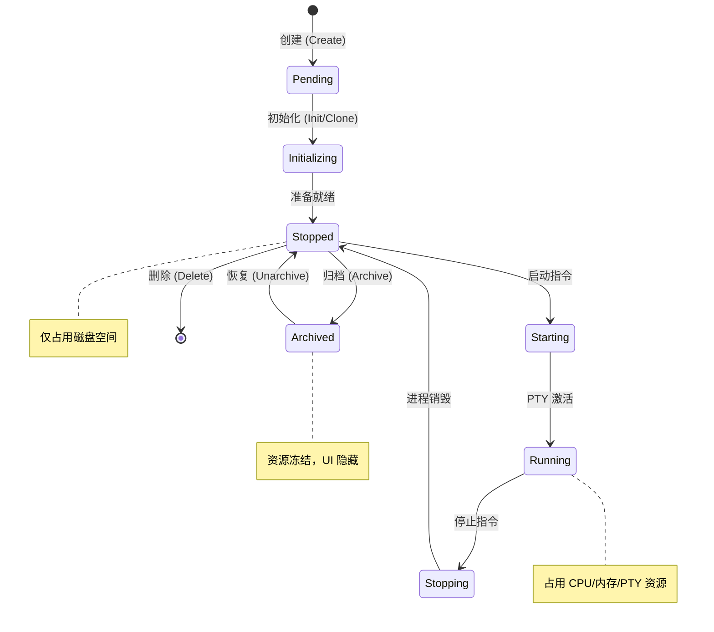

# 工作区生命周期

在 Atmos 的设计哲学中，**工作区 (Workspace)** 是承载开发者所有活动的最小原子单元。它不仅仅是一个磁盘目录，更是一个集成了进程空间、网络通道、版本控制状态和持久化配置的动态实体。理解工作区的生命周期，是深入掌握 Atmos 业务编排逻辑的关键。

## 核心模型：状态机驱动

Atmos 采用严格的状态机模型来管理工作区的行为。每一个状态都对应着特定的资源占用情况和可执行的操作集合。

### 状态定义与转换

#### 状态详解：
- **Pending**: 数据库记录已建立，但物理目录尚未准备好。
- **Initializing**: 正在执行耗时的初始化任务，如 Git 克隆或依赖预下载。
- **Stopped**: 工作区处于静默状态，没有活跃的进程，但随时可以启动。
- **Running**: 核心状态。至少有一个活跃的终端会话或后台服务正在运行。
- **Archived**: 逻辑删除状态。数据保留，但在主界面中隐藏，以减少视觉干扰。

## 核心实现：WorkspaceService

`WorkspaceService` 位于 `crates/core-service` 中，是管理生命周期的核心指挥官。它通过组合 `Infrastructure` 的持久化能力和 `Core Engine` 的执行能力来完成任务。

### 1. 创建与初始化流程

当用户请求创建一个新工作区时，`WorkspaceService` 会执行以下原子操作：

1. **参数校验**: 验证项目 ID 是否合法，工作区名称是否在项目内唯一。
2. **目录分配**: 调用 `Core Engine` 的 `FsGuard` 模块，在指定根目录下创建一个安全的、隔离的子目录。
3. **数据库持久化**: 写入 `WorkspaceModel` 记录，初始状态设为 `Pending`。
4. **异步初始化**: 触发一个后台任务执行 `git clone`。此时状态变为 `Initializing`。
5. **完成回调**: 初始化成功后，将状态更新为 `Stopped`，并向前端推送状态变更通知。

### 2. 启动与资源分配

启动工作区（Start）是一个资源密集型操作：

- **PTY 分配**: 为工作区分配第一个默认终端。
- **会话绑定**: 如果开启了持久化支持，会将 PTY 进程托管给 `Tmux`。
- **状态广播**: 通过 `WebSocketManager` 向所有关注该工作区的客户端广播 `Started` 事件。

### 3. 停止与资源回收

优雅地停止一个工作区（Stop）对于系统稳定性至关重要：

- **信号转发**: 向所有关联的 PTY 进程发送 `SIGTERM` 信号。
- **超时强制清理**: 如果进程在规定时间内未退出，则发送 `SIGKILL`。
- **连接断开**: 关闭所有与该工作区关联的实时数据流。
- **状态更新**: 确保数据库中的状态准确反映为 `Stopped`。

## 深度解析：并发与一致性

在多用户或高频操作场景下，`WorkspaceService` 必须处理复杂的并发问题。

### 锁机制与原子性
Atmos 利用 Rust 的 `tokio::sync::RwLock` 和数据库事务来确保状态转换的原子性。例如，在工作区从 `Starting` 转换到 `Running` 的过程中，系统会锁定该工作区的记录，防止重复启动。

### 孤儿资源清理
如果后端服务意外崩溃，重启后 `WorkspaceService` 会执行扫描任务：
- 检查数据库中标记为 `Running` 但实际没有对应系统进程的工作区。
- 自动将这些“僵尸”工作区的状态修正为 `Stopped`。
- 清理残留的临时文件和无效的 PTY 句柄。

## 关键源码分析

| 文件路径 | 核心职责 |
|:---|:---|
| `crates/core-service/src/service/workspace.rs` | 实现 `WorkspaceService`，包含所有状态转换逻辑 |
| `crates/infra/src/db/repo/workspace_repo.rs` | 封装 SQL 操作，提供类型安全的工作区查询与更新接口 |
| `crates/infra/src/db/entities/workspace.rs` | 定义工作区的数据库 Schema 和状态枚举 |
| `crates/core-engine/src/fs/mod.rs` | 提供物理目录的创建、删除和权限校验能力 |

## 总结

工作区的生命周期管理是 Atmos 业务逻辑中最复杂的部分。通过引入严格的状态机模型和完善的资源回收机制，Atmos 成功地将不稳定的底层进程管理转化为稳定、可预测的业务流程。这不仅提升了用户体验，也为系统的长期运行提供了保障。

## 下一步建议

- **[终端服务实现](./terminal.md)**: 了解工作区启动后，终端是如何进行数据交换的。
- **[PTY, Git 与文件系统](../core-engine/fs-git.md)**: 探索底层引擎如何支撑工作区的物理操作。
- **[WebSocket 系统设计](../../deep-dive/infra/websocket.md)**: 了解工作区状态是如何实时推送到前端的。
- **[数据库设计与迁移](../../deep-dive/infra/database.md)**: 查看工作区数据的存储结构。
