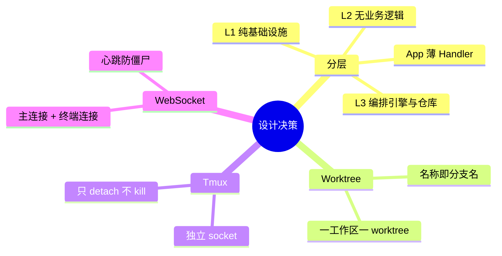

# 设计决策

本文记录 ATMOS 的关键架构与设计决策，包括分层划分、Tmux 持久化、Worktree 模型、Repository 模式等，以及相关权衡与替代方案。

## Overview

设计决策贯穿 L1/L2/L3/App 分层、工作区与 Git worktree 的映射、终端持久化方案、WebSocket 与 REST 的分工等。理解这些决策有助于在扩展或修改时保持一致性。

## Architecture

## 分层决策

- **L2 不依赖 L3**：引擎保持纯粹技术能力，便于复用与测试
- **L3 通过 Repo 访问 L1**：业务层不直接写 SQL，便于切换 ORM 或 mock
- **App Handler 薄**：参数提取与错误转换在 Handler，逻辑在 Service

## 工作区与 Worktree

- 每个工作区对应一个 Git worktree，路径 `~/.atmos/workspaces/{name}`
- 名称即分支名，避免分支与工作区名不一致带来的混乱
- 创建时先在 DB 预留 name，再异步创建 worktree，减少 API 阻塞

## Tmux 持久化

- 使用自定义 socket（`atmos`）与用户 Tmux 隔离
- 关闭 PTY 时只 detach，不 kill tmux window，重连可恢复历史
- 热重载时需 cleanup 遗留 client 会话，避免 PTY 设备泄漏

## WebSocket 双路由

- 主连接 `/ws` 处理业务请求（项目、工作区、Git、Fs）
- 终端连接 `/ws/terminal/:id` 专注 PTY 流，减少协议混合
- 心跳检测移除超时连接，防止资源泄漏

## Key Source Files

| File | Purpose |
|------|---------|
| `AGENTS.md` | 架构概览与决策树 |
| `crates/*/AGENTS.md` | 各层工作模式与约定 |

## Next Steps

- **[架构概览](../../getting-started/architecture.md)** — 分层与数据流
- **[核心概念](../../getting-started/key-concepts.md)** — 术语与心智模型
