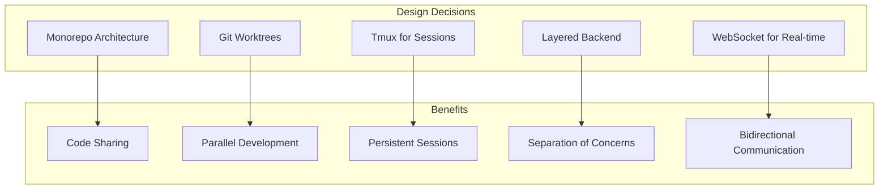
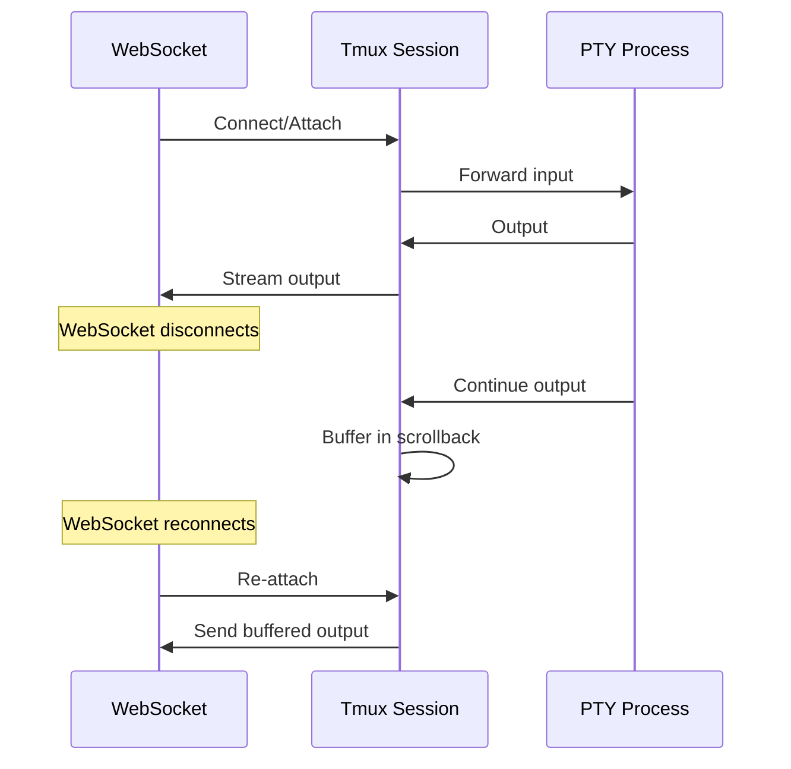
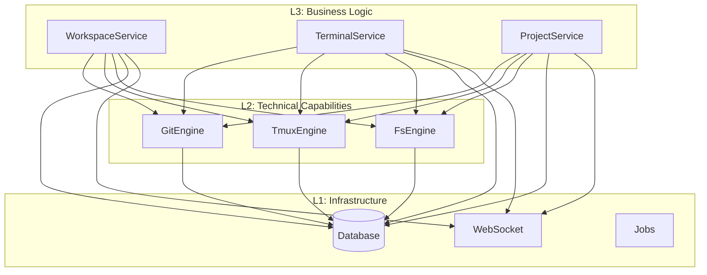

# Design Decisions

Building ATMOS required making several significant architectural choices. Each decision involved weighing trade-offs between different approaches, considering team size, performance requirements, developer experience, and long-term maintainability. This article documents the major design decisions and the reasoning behind them.

## Overview

The design philosophy behind ATMOS prioritizes **developer productivity** and **operational simplicity** over premature optimization. The system is designed for a small team (3-5 developers) building an AI-first workspace that needs to handle multiple concurrent terminal sessions, git worktree management, and real-time WebSocket communication.

Key design principles:
- **Local-first** - All data stored locally, no cloud dependencies
- **Stateless backend** - WebSocket state managed by frontend reconnection
- **Layered architecture** - Clear separation between infrastructure, capabilities, and business logic
- **Type safety** - Rust and TypeScript with strict configurations
- **Standard tools** - Use well-maintained libraries over custom implementations



## Decision 1: Monorepo Architecture

**Status**: ✅ Adopted (ADR-001)

### The Problem

Before adopting Monorepo, ATMOS components were scattered across multiple repositories:
- Web application (Next.js)
- Documentation site
- CLI tool (Rust)
- API server (Rust)
- Shared UI components

**Issues encountered**:
1. Code sharing required publishing npm packages
2. Dependency version conflicts (React 17 vs 18)
3. Cross-project refactoring required coordinating multiple PRs
4. CI/CD configuration duplicated across repos

### The Decision

Adopt a **Monorepo architecture** using:
- **Bun workspaces** for JavaScript/TypeScript packages
- **Cargo workspaces** for Rust crates
- **Just** as a unified task runner

### Directory Structure

```
atmos/
├── apps/                    # Deployable applications
│   ├── api/                # Rust API server
│   ├── web/                # Next.js web app
│   ├── cli/                # Rust CLI tool
│   ├── desktop/            # Tauri desktop app
│   └── docs/               # Documentation site
├── packages/               # Shared JS/TS packages
│   ├── ui/                 # @workspace/ui (shadcn/ui)
│   ├── shared/             # @atmos/shared
│   └── i18n/               # @atmos/i18n
├── crates/                 # Shared Rust crates
│   ├── infra/              # L1: Infrastructure
│   ├── core-engine/        # L2: Technical capabilities
│   └── core-service/       # L3: Business logic
└── docs/                   # Developer documentation
```

> **Source**: [docs/adr/001-monorepo.md](../../../../docs/adr/001-monorepo.md#L40-L66)

### Trade-offs

| Pros | Cons |
|------|------|
| Direct imports without publishing | Larger repository size |
| Atomic commits across projects | Slower Git operations |
| Unified dependency versions | Single entry point for access |
| Cross-project IDE refactoring | All code visible to everyone |
| Simplified CI/CD | Higher learning curve |

### Outcome

After implementation:
- ✅ Cross-project refactoring time reduced 60%
- ✅ New developer onboarding: 2 days → 0.5 days
- ✅ Shared component changes: 10 minutes (vs npm publish cycle)
- ⚠️ Repository size: 500MB (acceptable with modern hardware)

## Decision 2: Git Worktrees for Workspaces

### The Problem

Traditional git branch switching requires:
1. Stashing or committing uncommitted changes
2. Running `git checkout` to switch branches
3. Rebuilding dependencies
4. Losing context of previous work

This is disruptive when you need to context-switch between multiple features or review multiple PRs simultaneously.

### The Decision

Use **git worktrees** to create multiple working directories, each checked out to a different branch.

```rust
// Workspace creation creates a git worktree
pub async fn create_worktree(
    &self,
    repo_path: &str,
    branch_name: &str,
    worktree_path: &str,
) -> Result<()> {
    Command::new("git")
        .args(["worktree", "add", "-b", branch_name, worktree_path])
        .current_dir(repo_path)
        .output()
        .await?;

    Ok(())
}
```

> **Source**: [crates/core-engine/src/git/mod.rs](../../../../crates/core-engine/src/git/mod.rs#L41-L108)

### Benefits

- **Multiple branches active simultaneously** - Work on feature A while reviewing PR B
- **Instant context switching** - Just change directories
- **Isolated development environments** - Each workspace has its own node_modules
- **No stash/commit dance** - Uncommitted changes stay in their worktree
- **Fast workspace creation** - No need to clone entire repository

### Workspace Directory Structure

```
~/.atmos/workspaces/
├── feature-auth/
├── bugfix-crash/
├── refactor-api/
└── experiment-ui/
```

Each workspace is a git worktree linked to the main project repository.

### Trade-offs

| Benefit | Cost |
|---------|------|
| Parallel branch work | Disk space usage (full checkout per workspace) |
| No context switching | `git worktree prune` needed for cleanup |
| Isolated environments | Managing multiple working directories |

## Decision 3: Tmux for Terminal Persistence

### The Problem

WebSocket connections are inherently fragile. When a WebSocket drops:
- PTY processes are orphaned
- Terminal state is lost
- Running commands continue without visibility
- Scrollback history disappears

### The Decision

Use **tmux** as a persistent session layer between WebSocket and PTY:



### Implementation

Each terminal session creates a tmux window with a unique identifier:

```rust
pub async fn create_window(
    &self,
    session_name: &str,
    window_name: &str,
    working_dir: Option<&str>,
) -> Result<String> {
    Command::new("tmux")
        .args([
            "new-window",
            "-d",
            "-t", session_name,
            "-n", window_name,
            "-c", working_dir.unwrap_or(home),
        ])
        .output()
        .await?;

    // Get the pane TTY for PTY operations
    let pane_tty = self.get_pane_tty(session_name, window_name).await?;
    Ok(pane_tty)
}
```

> **Source**: [crates/core-engine/src/tmux/mod.rs](../../../../crates/core-engine/src/tmux/mod.rs#L335-L431)

### Configuration

```rust
pub struct TmuxConfig {
    pub socket_path: String,        // ~/.atmos/atmos.sock
    pub default_cols: u16,          // 120
    pub default_rows: u16,          // 30
    pub history_limit: usize,       // 10000 lines
    pub mouse_mode: bool,           // true
    pub allow_passthrough: bool,    // true (OSC sequences)
}
```

> **Source**: [crates/core-engine/src/tmux/mod.rs](../../../../crates/core-engine/src/tmux/mod.rs#L14-L30)

### Benefits

- **Persistent sessions** - Processes survive WebSocket disconnects
- **Scrollback history** - 10,000 lines preserved per pane
- **Multiple panes** - Support for split-pane layouts
- **Copy mode** - Built-in search and navigation
- **Mouse support** - Scroll and select naturally

### Trade-offs

| Benefit | Cost |
|---------|------|
| Survives reconnects | Requires tmux installation |
| Built-in scrollback | Session cleanup complexity |
| Split-pane support | Custom socket management |

## Decision 4: Layered Backend Architecture

### The Problem

As the codebase grew, business logic was becoming tightly coupled with low-level operations:
- Terminal logic mixed with PTY management
- Workspace logic mixed with git operations
- No clear boundaries between modules

### The Decision

Adopt a **3-layer architecture** with clear separation:



### Layer Responsibilities

| Layer | Purpose | Examples |
|-------|---------|----------|
| **L1: Infrastructure** | Foundation services | Database, WebSocket, Jobs, Cache |
| **L2: Core Engine** | Technical capabilities | Git, Tmux, File System, PTY |
| **L3: Core Service** | Business rules | Workspace CRUD, Terminal sessions |

### Benefits

- **Clear boundaries** - Each layer has specific responsibilities
- **Testability** - Lower layers can be tested independently
- **Reusability** - Engines can be used by multiple services
- **Dependency flow** -单向: Service → Engine → Infra

### Dependency Injection

The API layer creates services with proper dependency injection:

```rust
pub struct AppState {
    // Repositories (L1)
    pub project_repo: Arc<ProjectRepo>,
    pub workspace_repo: Arc<WorkspaceRepo>,

    // Engines (L2)
    pub git_engine: Arc<GitEngine>,
    pub tmux_engine: Arc<TmuxEngine>,
    pub fs_engine: Arc<FsEngine>,

    // Services (L3)
    pub workspace_service: Arc<WorkspaceService>,
    pub terminal_service: Arc<TerminalService>,
}
```

> **Source**: [apps/api/src/main.rs](../../../../apps/api/src/main.rs#L80-L100)

## Decision 5: WebSocket as Primary Transport

### The Problem

Traditional REST APIs have limitations for real-time applications:
- No server-initiated messages
- Polling required for updates
- No native terminal I/O streaming
- HTTP overhead for frequent updates

### The Decision

Use **WebSocket as the primary transport** for all client-server communication:

```typescript
// All API calls go through WebSocket
const response = await send<ProjectListResponse>('project_list', {});
const workspaces = await send<WorkspaceListResponse>('workspace_list', {});
const status = await send<GitStatusResponse>('git_get_status', { path });
```

> **Source**: [apps/web/src/hooks/use-websocket.ts](../../../../apps/web/src/hooks/use-websocket.ts#L258-L303)

### Message Protocol

```rust
pub enum WsMessage {
    Request { request_id: String, action: String, data: Value },
    Response { request_id: String, success: bool, data: Value },
    Error { request_id: String, code: String, message: String },
    Notification { event: String, data: Value },
}
```

### Request Correlation

Each request gets a unique UUID for response correlation:

```typescript
const requestId = uuidv4();
pendingRequests.set(requestId, { resolve, reject, timeout });
socket.send(JSON.stringify({ type: 'request', payload: { request_id: requestId, action, data } }));
```

### Benefits

- **Bidirectional** - Server can push notifications
- **Low overhead** - No HTTP headers after handshake
- **Native streaming** - Terminal output flows naturally
- **Type-safe** - Request/response correlation with TypeScript

### Trade-offs

| Benefit | Cost |
|---------|------|
| Real-time updates | More complex state management |
| Server push | Reconnection handling required |
| Efficient streaming | Load balancer complexity |

### Heartbeat System

To detect stale connections:

```rust
// Backend: Send ping every 10 seconds
const HEARTBEAT_INTERVAL: Duration = Duration::from_secs(10);

// Frontend: Respond with pong
ws.onmessage = (event) => {
  if (event.data === 'ping') {
    ws.send('pong');
  }
};
```

> **Source**: [apps/web/src/hooks/use-websocket.ts](../../../../apps/web/src/hooks/use-websocket.ts#L323-L342)

## Decision 6: Type-Safe Monorepo

### The Decision

Use **strict TypeScript** and **strict Rust** configurations:

```json
// tsconfig.json
{
  "compilerOptions": {
    "strict": true,
    "noUncheckedIndexedAccess": true,
    "exactOptionalPropertyTypes": true
  }
}
```

```toml
# Cargo.toml
[profile.release]
opt-level = 3
lto = true
codegen-units = 1
```

### Benefits

- **Compile-time safety** - Catch errors before runtime
- **IDE support** - Better autocomplete and refactoring
- **Self-documenting** - Types serve as documentation

## Key Source Files

| File | Purpose |
|------|---------|
| `docs/adr/001-monorepo.md` | Monorepo architecture decision record |
| `crates/core-engine/src/tmux/mod.rs` | Tmux integration for session persistence |
| `crates/core-engine/src/git/mod.rs` | Git worktree operations |
| `apps/api/src/main.rs` | Server startup and dependency injection |
| `apps/web/src/hooks/use-websocket.ts` | WebSocket client with request correlation |

## Next Steps

- **[Build System & Tooling](../build-system/index.md)** — Learn how these decisions are implemented in the build process
- **[Architecture Overview](../../getting-started/architecture.md)** — See the high-level system architecture
- **[WebSocket Service](../infra/websocket.md)** — Deep dive into WebSocket implementation
- **[Tmux Engine](../core-engine/tmux.md)** — Explore tmux integration details
