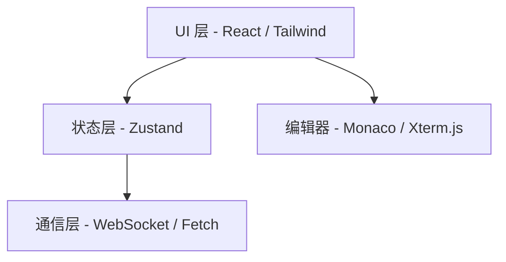

# 前端架构 (Web App)

Atmos 的前端是一个复杂的 IDE 级 Web 应用，旨在提供极致的开发体验。它不仅需要处理复杂的 UI 布局，还需要管理高频的实时数据流。

## 模块目标

- **IDE 体验**: 提供多面板、可拖拽、响应迅速的用户界面。
- **实时性**: 确保终端输出和系统状态变更能毫秒级呈现。
- **可维护性**: 通过模块化组件和清晰的状态管理应对日益增长的业务复杂度。

## 核心组件

本章节将详细解析前端的实现细节：

- **[Web 应用结构与状态管理](./web-app.md)**: 探索 Next.js 架构、Zustand 状态流以及 Xterm.js 的深度集成。

## 技术栈概览

## 核心挑战

1. **高频渲染**: 终端每秒可能产生数千行输出，如何保证 UI 不卡顿？
2. **复杂布局**: 多面板拖拽和缩放的实现。
3. **状态同步**: 确保前端状态与后端数据库状态始终一致。

## 下一步

- 深入了解前端实现：**[Web 应用结构与状态管理](./web-app.md)**。
- 了解后端如何支撑前端：**[架构概览](../../getting-started/architecture.md)**。
