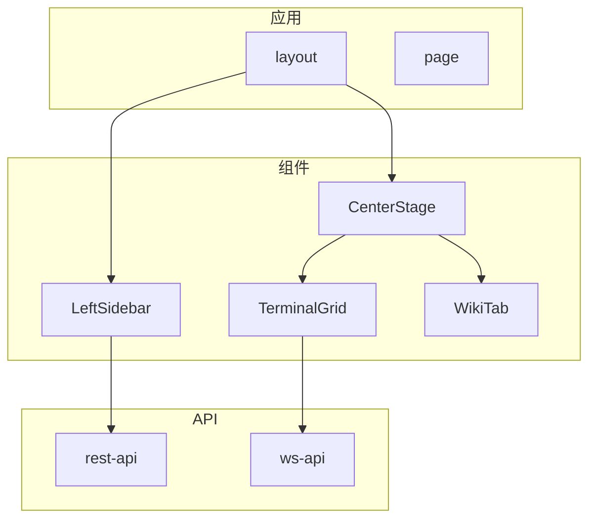
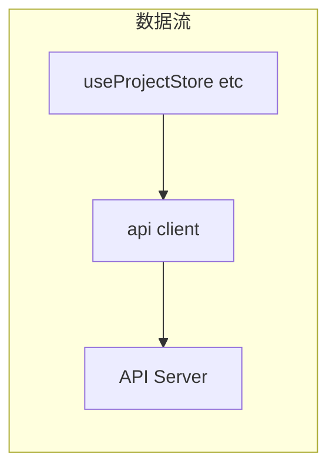

# 前端应用

前端应用是 ATMOS 的 Web UI，基于 Next.js 16 与 React 19，提供项目、工作区、终端、文件编辑、Wiki 等功能。本文概述应用结构、API 层、组件组织与状态管理。

## Overview

`apps/web` 使用 App Router，按 `[locale]` 支持国际化。API 调用集中在 `api/rest-api.ts` 与 `api/ws-api.ts`，类型定义与后端 DTO 对齐。组件分为布局（Header、Sidebar、CenterStage）、业务（Workspace、Terminal、Wiki）和通用 UI（来自 `@workspace/ui`）。

## Architecture

## 模块划分

| 目录 | 职责 |
|------|------|
| `app/` | 页面与布局 |
| `components/` | Web 专属组件 |
| `api/` | REST 与 WS 客户端 |
| `hooks/` | 自定义 hooks |
| `types/` | 类型定义 |

## Key Source Files

| File | Purpose |
|------|---------|
| `apps/web/src/app/[locale]/layout.tsx` | 根布局 |
| `apps/web/src/api/rest-api.ts` | REST 封装 |
| `apps/web/src/api/ws-api.ts` | WebSocket 封装 |

## Next Steps

- **[Web 应用架构](web-app.md)** — 页面结构、路由与组件树
