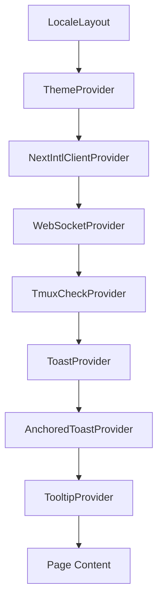

# Frontend Architecture

> **Reading Time**: 8 minutes
> **Level**: Intermediate
> **Last Updated**: 2025-02-11

## Overview

ATMOS features a modern, type-safe frontend built with Next.js 16, React 19, and TypeScript. The web application provides a rich IDE-like experience with integrated terminal emulation, code editing, and project management capabilities.

## Tech Stack

| Technology | Version | Purpose |
|------------|---------|---------|
| Next.js | 16.1.2 | React framework with App Router |
| React | 19.2.3 | UI library |
| TypeScript | 5.x | Type safety |
| Tailwind CSS | 4.x | Styling |
| Zustand | 5.0.10 | State management |
| xterm.js | 6.0.0 | Terminal emulation |
| Monaco Editor | 0.55.1 | Code editing |

## Project Structure

```
apps/web/
├── src/
│   ├── app/[locale]/           # Next.js App Router
│   ├── components/             # React components
│   │   ├── editor/            # Monaco editor wrappers
│   │   ├── layout/            # Layout components
│   │   ├── terminal/          # Terminal components
│   │   └── providers/         # Context providers
│   ├── hooks/                 # Custom React hooks
│   ├── api/                   # API clients
│   └── lib/                   # Utilities
└── package.json
```

## Provider Stack

The application uses a carefully designed provider stack that wraps all pages. This stack provides global state and functionality throughout the application.

```tsx
// Source: apps/web/src/app/[locale]/layout.tsx
export default async function LocaleLayout({ children, params }: Props) {
  return (
    <html lang={locale} suppressHydrationWarning>
      <body className={`${geistSans.variable} ${geistMono.variable} antialiased`}>
        <ThemeProvider attribute="class" defaultTheme="system" enableSystem>
          <NextIntlClientProvider messages={messages}>
            <WebSocketProvider>
              <TmuxCheckProvider>
                <ToastProvider position="bottom-right">
                  <AnchoredToastProvider>
                    <TooltipProvider>
                      {children}
                    </TooltipProvider>
                  </AnchoredToastProvider>
                </ToastProvider>
              </TmuxCheckProvider>
            </WebSocketProvider>
          </NextIntlClientProvider>
        </ThemeProvider>
      </body>
    </html>
  );
}
```

### Provider Order Matters

The provider nesting order is intentional:

1. **ThemeProvider** - Manages light/dark mode using next-themes
2. **NextIntlClientProvider** - Provides i18n translations
3. **WebSocketProvider** - Establishes and maintains WebSocket connection
4. **TmuxCheckProvider** - Verifies tmux installation and shows install dialog if needed
5. **Toast/AnchoredToast/TooltipProvider** - UI feedback components



## WebSocket Integration

The WebSocket layer is the backbone of real-time communication with the backend. It handles all backend interactions including file system operations, git commands, and project/workspace management.

### WebSocket Store

The `useWebSocketStore` (defined in `/apps/web/src/hooks/use-websocket.ts`) manages the WebSocket connection lifecycle:

```typescript
// Source: apps/web/src/hooks/use-websocket.ts
interface WebSocketStore {
  // State
  connectionState: ConnectionState;
  socket: WebSocket | null;
  pendingRequests: Map<string, PendingRequest>;
  eventListeners: Map<string, Set<(data: unknown) => void>>;

  // Configuration
  url: string;
  heartbeatInterval: number;      // 15 seconds
  reconnectInterval: number;       // 3 seconds
  requestTimeout: number;          // 30 seconds

  // Actions
  connect: () => void;
  disconnect: () => void;
  send: <T = unknown>(action: WsAction, data?: unknown) => Promise<T>;
  onEvent: (event: string, callback: (data: unknown) => void) => () => void;
}
```

### Auto-Reconnect Strategy

The WebSocket implements robust reconnection logic:

1. **Heartbeat**: Ping every 15 seconds to detect dead connections
2. **Auto-reconnect**: Attempt reconnection every 3 seconds after disconnect
3. **Visibility handling**: Reconnect when tab becomes visible
4. **Online detection**: Reconnect when browser detects network restoration

```typescript
// Source: apps/web/src/hooks/use-websocket.ts
const connect: () => {
  // Skip if already connected
  if (socket && (connectionState === 'connected' || connectionState === 'connecting')) {
    return;
  }

  set({ connectionState: 'connecting' });

  const ws = new WebSocket(url);

  ws.onopen = () => {
    console.log('[WebSocket] Connected');
    set({ connectionState: 'connected', socket: ws });
    get()._startHeartbeat();
  };

  ws.onclose = (event) => {
    console.log('[WebSocket] Disconnected:', event.code, event.reason);
    get()._stopHeartbeat();
    set({ connectionState: 'disconnected', socket: null });

    // Auto-reconnect on non-clean close
    if (!event.wasClean) {
      get()._scheduleReconnect();
    }
  };
}
```

### Request-Response Pattern

WebSocket uses a request-response pattern with UUID-based correlation:

```typescript
// Source: apps/web/src/hooks/use-websocket.ts
send: <T = unknown>(action: WsAction, data: unknown = {}): Promise<T> => {
  return new Promise((resolve, reject) => {
    const requestId = uuidv4();

    const request: WsRequest = {
      type: 'request',
      payload: {
        request_id: requestId,
        action,
        data,
      },
    };

    // Set timeout for request
    const timeout = setTimeout(() => {
      const pending = pendingRequests.get(requestId);
      if (pending) {
        pendingRequests.delete(requestId);
        pending.reject(new Error(`Request timeout: ${action}`));
      }
    }, requestTimeout);

    // Store pending request
    pendingRequests.set(requestId, {
      resolve: resolve as (data: unknown) => void,
      reject,
      timeout,
    });

    socket.send(JSON.stringify(request));
  });
}
```

## State Management with Zustand

ATMOS uses Zustand for global state management. Zustand was chosen for its simplicity and performance compared to Redux.

### Project Store

The `useProjectStore` manages projects and workspaces:

```typescript
// Source: apps/web/src/hooks/use-project-store.ts
interface ProjectStore {
  projects: Project[];
  activeWorkspaceId: string | null;
  isLoading: boolean;

  // Actions
  fetchProjects: () => Promise<void>;
  addProject: (data: ProjectData) => Promise<void>;
  deleteProject: (id: string) => Promise<void>;
  addWorkspace: (data: WorkspaceData) => Promise<void>;
  // ... more actions
}
```

Key features:
- **Optimistic updates**: UI updates immediately, API call happens in background
- **Error handling**: Toast notifications on success/failure
- **WebSocket integration**: Automatically waits for connection before making requests

### Terminal Store

The `useTerminalStore` manages terminal panes and layouts:

```typescript
// Source: apps/web/src/hooks/use-terminal-store.ts
interface TerminalStore {
  workspacePanes: Record<string, Record<string, TerminalPaneProps>>;
  workspaceLayouts: Record<string, MosaicNode<string> | null>;
  workspaceMaximizedIds: Record<string, string | null>;

  // Actions
  addTerminal: (workspaceId: string, title?: string) => string;
  splitTerminal: (workspaceId: string, id: string, direction: MosaicDirection) => void;
  removeTerminal: (workspaceId: string, id: string) => void;
  toggleMaximize: (workspaceId: string, id: string) => void;
}
```

Features:
- **Mosaic-based layouts**: Flexible tiling using react-mosaic-component
- **Backend sync**: Debounced saves to database (500ms)
- **Session ID regeneration**: Prevents race conditions when switching between workspaces

## Terminal Emulation with xterm.js

The terminal is powered by xterm.js, a fully-featured terminal emulator written in TypeScript.

### Terminal Features

```typescript
// Source: apps/web/src/components/terminal/Terminal.tsx
const Terminal = ({
  sessionId,
  workspaceId,
  tmuxWindowName,
  projectName,
  workspaceName,
  isNewPane,
  onSessionReady,
  onSessionClose,
  // ... more props
}: TerminalProps) => {
  // Initialize terminal with xterm.js
  const terminal = new XTerm({
    ...defaultTerminalOptions,
    theme: currentTheme,
    scrollback: noTmux ? 10000 : 0,  // tmux owns scrollback
  });
}
```

Key capabilities:
- **WebSocket PTY**: Real-time terminal I/O via WebSocket
- **tmux integration**: Attaches to tmux sessions for persistent shells
- **Addons**: Fit, WebLinks, Search, WebGL, Clipboard, Unicode11
- **Dynamic titles**: OSC 9999 sequences update tab titles based on running commands
- **Copy-mode support**: Scrollback navigation with click-to-copy

### Terminal Addons

```typescript
// Source: apps/web/src/components/terminal/Terminal.tsx
// Load essential addons
const fitAddon = new FitAddon();          // Auto-resize
const webLinksAddon = new WebLinksAddon(); // Clickable URLs
const searchAddon = new SearchAddon();    // Text search
const clipboardAddon = new ClipboardAddon(undefined, new SafeClipboardProvider());
const unicode11Addon = new Unicode11Addon(); // Extended Unicode

terminal.loadAddon(unicode11Addon);
terminal.unicode.activeVersion = "11";
terminal.loadAddon(fitAddon);
terminal.loadAddon(webLinksAddon);
terminal.loadAddon(searchAddon);
terminal.loadAddon(clipboardAddon);
```

## Code Editing with Monaco Editor

Monaco Editor (the same editor that powers VS Code) provides the code editing experience.

### BaseMonacoEditor Component

```typescript
// Source: apps/web/src/components/editor/BaseMonacoEditor.tsx
export const BaseMonacoEditor: React.FC<BaseMonacoEditorProps> = ({
  className,
  isReadOnly,
  options,
  beforeMount,
  onMount,
  theme,
  ...props
}) => {
  const handleEditorWillMount: BeforeMount = useCallback((monaco) => {
    // Define custom dark theme matching ATMOS design
    monaco.editor.defineTheme('atmos-dark', {
      base: 'vs-dark',
      inherit: true,
      rules: [],
      colors: {
        'editor.background': '#09090b',
        'editor.lineHighlightBackground': '#ffffff08',
        'editorLineNumber.foreground': '#4b5563',
        // ... more colors
      },
    });

    if (beforeMount) {
      beforeMount(monaco);
    }
  }, [beforeMount]);
}
```

Editor features:
- **Custom themes**: `atmos-dark` and light theme matching Tailwind palette
- **Validation disabled**: No error squiggles for cleaner viewing
- **Smooth scrolling**: Enhanced user experience
- **Bracket colorization**: Visual aid for code comprehension
- **Read-only mode**: For file viewing scenarios

## Layout System

The application uses react-resizable-panels for the main layout:

```typescript
// Source: apps/web/src/components/layout/PanelLayout.tsx
export function PanelLayout({
  leftSidebar,
  rightSidebar,
  centerStage,
}: PanelLayoutProps) {
  return (
    <PanelGroup
      autoSaveId="root-sidebar-layout"
      direction="horizontal"
      storage={storage}
      className="flex-1"
    >
      <Panel defaultSize={20} minSize={10} maxSize={30} collapsible>
        {leftSidebar}
      </Panel>

      <PanelResizeHandle />

      <Panel defaultSize={60} minSize={25}>
        {centerStage}
      </Panel>

      <PanelResizeHandle />

      <Panel defaultSize={20} minSize={10} maxSize={75} collapsible>
        {rightSidebar}
      </Panel>
    </PanelGroup>
  );
}
```

Features:
- **Collapsible sidebars**: Left (project tree) and right (details/properties)
- **Persistent sizing**: Layout saved to localStorage
- **Smooth transitions**: Animated collapse/expand
- **Resize handles**: Visual feedback with hover effects

## @workspace/ui Component Library

The UI components are extracted into a shared package (`@workspace/ui`) based on shadcn/ui.

### Package Structure

```
packages/ui/
├── src/
│   ├── components/
│   │   └── ui/          # shadcn/ui components
│   ├── lib/
│   │   └── utils.ts     # cn() utility
│   └── index.ts         # Public exports
└── package.json
```

### Component Exports

```typescript
// Source: packages/ui/src/index.ts
// UI Components
export * from "./components/ui/button";
export * from "./components/ui/card";
export * from "./components/ui/dialog";
export * from "./components/ui/toast";
// ... 40+ components

// Third Party Components
export * from "react-resizable-panels";
export * from "lucide-react";

// DnD Kit (Drag and Drop)
export * from "@dnd-kit/core";
export * from "@dnd-kit/sortable";
export * from "@dnd-kit/utilities";
export * from "@dnd-kit/modifiers";
```

This centralized import approach makes component usage clean:

```typescript
import { Button, Card, Dialog, toastManager } from "@workspace/ui";
```

## Internationalization

ATMOS supports multiple languages using next-intl:

```typescript
// Source: apps/web/src/app/[locale]/layout.tsx
export async function generateStaticParams() {
  return routing.locales.map((locale) => ({ locale }));
}

export default async function LocaleLayout({ children, params }: Props) {
  const { locale } = await params;

  // Validate locale
  if (!routing.locales.includes(locale as typeof routing.locales[number])) {
    notFound();
  }

  // Enable static rendering
  setRequestLocale(locale);

  // Load messages
  const messages = await getMessages();

  return (
    <html lang={locale} suppressHydrationWarning>
      {/* ... */}
      <NextIntlClientProvider messages={messages}>
        {/* ... */}
      </NextIntlClientProvider>
    </html>
  );
}
```

## API Layer

The frontend communicates with the backend through two primary API clients:

### WebSocket API

```typescript
// Source: apps/web/src/api/ws-api.ts
export const fsApi = {
  getHomeDir: async (): Promise<string> => { /* ... */ },
  listDir: async (path: string): Promise<FsListDirResponse> => { /* ... */ },
  readFile: async (path: string): Promise<FsReadFileResponse> => { /* ... */ },
  writeFile: async (path: string, content: string): Promise<FsWriteFileResponse> => { /* ... */ },
};

export const gitApi = {
  getStatus: async (path: string): Promise<GitStatusResponse> => { /* ... */ },
  commit: async (path: string, message: string): Promise<GitCommitResponse> => { /* ... */ },
  push: async (path: string): Promise<{ success: boolean }> => { /* ... */ },
};
```

### REST API

For HTTP-based operations (workspace layouts, tmux status):

```typescript
// Source: apps/web/src/api/rest-api.ts (inferred)
export const workspaceLayoutApi = {
  getLayout: async (workspaceId: string) => { /* ... */ },
  updateLayout: async (workspaceId: string, layout: string) => { /* ... */ },
};
```

## Key Design Decisions

1. **Zustand over Redux**: Simpler API, better performance, less boilerplate
2. **WebSocket-first**: All backend operations go through WebSocket for consistency
3. **Monaco over CodeMirror**: Better TypeScript integration, VS Code compatibility
4. **xterm.js**: Industry standard for web-based terminal emulation
5. **App Router**: Next.js 16's modern routing with improved performance

## Related Articles

- [Web Application Architecture](./web-app.md) - Deep dive into the web app structure
- [Build System & Tooling](../build-system/index.md) - How the frontend is built
- [Design Decisions](../design-decisions/index.md) - Architecture rationale

## Source Files

- `/apps/web/src/app/[locale]/layout.tsx` - Provider stack configuration
- `/apps/web/src/hooks/use-websocket.ts` - WebSocket store implementation
- `/apps/web/src/hooks/use-project-store.ts` - Project state management
- `/apps/web/src/hooks/use-terminal-store.ts` - Terminal layout management
- `/apps/web/src/components/terminal/Terminal.tsx` - xterm.js integration
- `/apps/web/src/components/editor/BaseMonacoEditor.tsx` - Monaco wrapper
- `/apps/web/src/api/ws-api.ts` - WebSocket API client
- `/packages/ui/src/index.ts` - UI component exports
