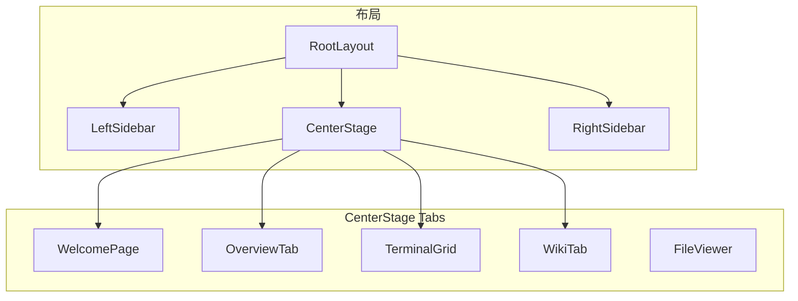
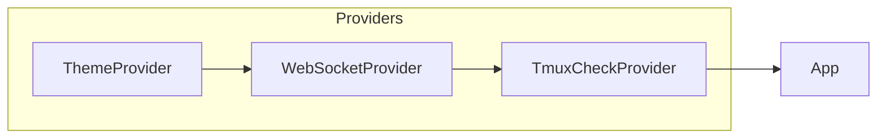
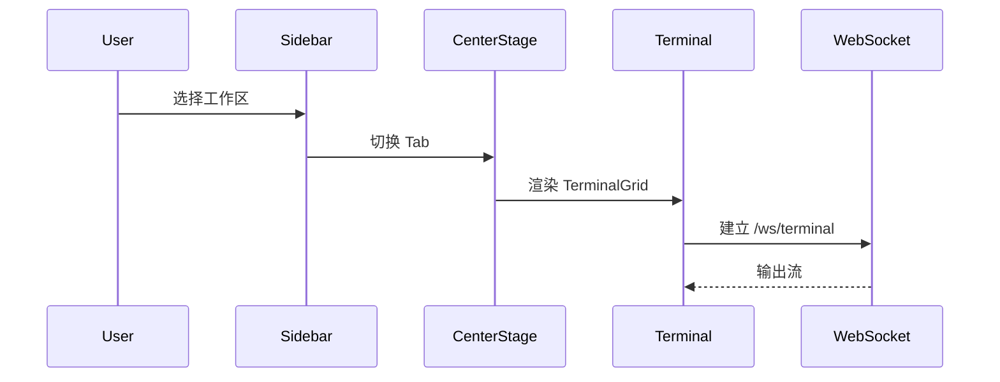

# Web 应用架构

本文深入介绍 ATMOS Web 应用的页面结构、布局组件、WebSocket Provider、状态管理（stores）以及与 `@workspace/ui` 的协作方式。

## Overview

应用采用三栏布局：左侧边栏（项目/工作区树）、中央主区域（Tab：欢迎页、工作区概览、终端、Wiki、编辑器）、可选的右侧边栏。WebSocket 通过 `WebSocketProvider` 在根布局注入，子组件通过 `useWebSocket` 访问。状态管理主要使用 zustand stores（`useProjectStore`、`useWorkspaceContext`、`useTerminalStore` 等）。

## Architecture

## 主题与语义色

AGENTS.md 要求使用语义 CSS 变量（`bg-background`、`text-muted-foreground` 等），避免硬编码颜色，确保 Light/Dark 模式一致。

## Key Source Files

| File | Purpose |
|------|---------|
| `apps/web/src/app/[locale]/layout.tsx` | 根布局、Provider |
| `apps/web/src/components/layout/CenterStage.tsx` | 中央 Tab 容器 |
| `apps/web/src/components/providers/websocket-provider.tsx` | WebSocket 注入 |
| `apps/web/src/hooks/use-project-store.ts` | 项目状态 |

## Next Steps

- **[终端服务](../core-service/terminal.md)** — 终端与后端的协作
- **[API 层](../api/index.md)** — REST 与 WS 端点
